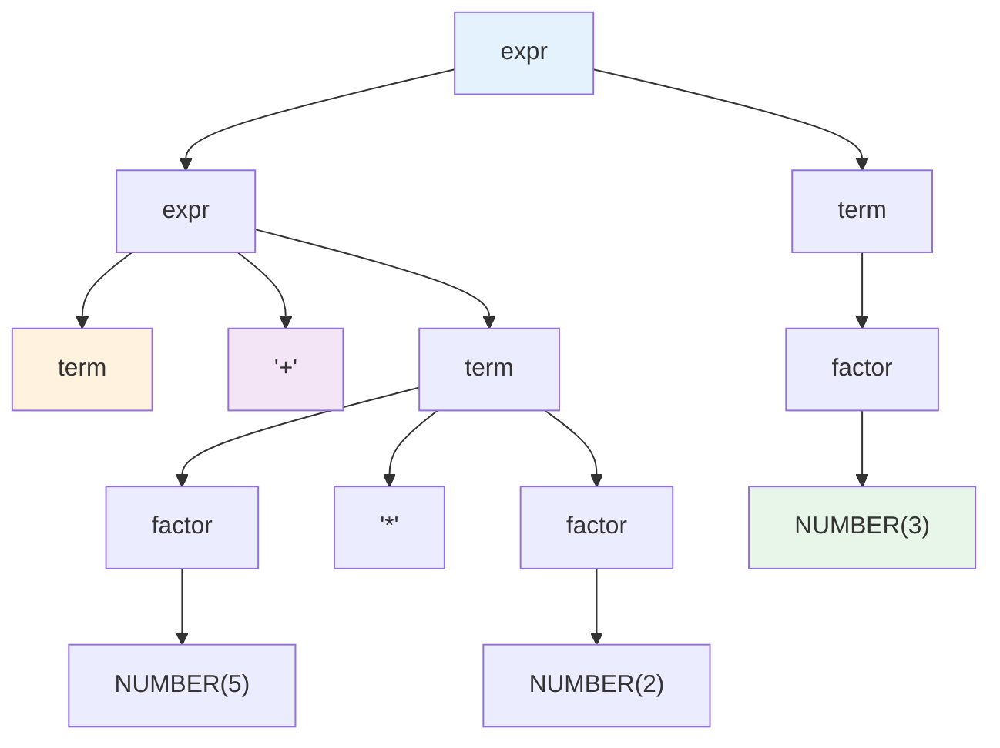
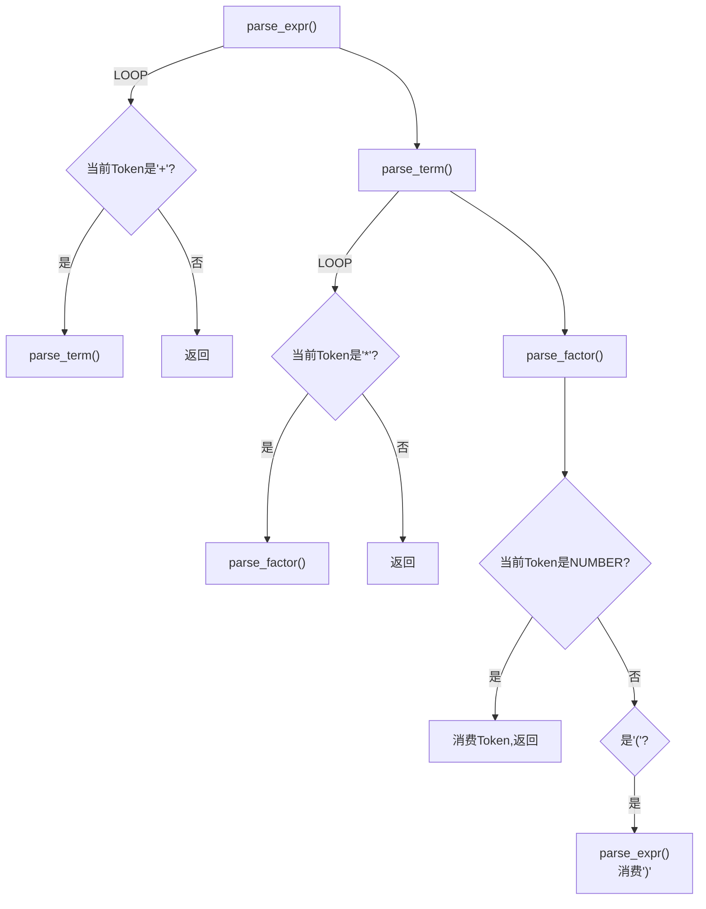
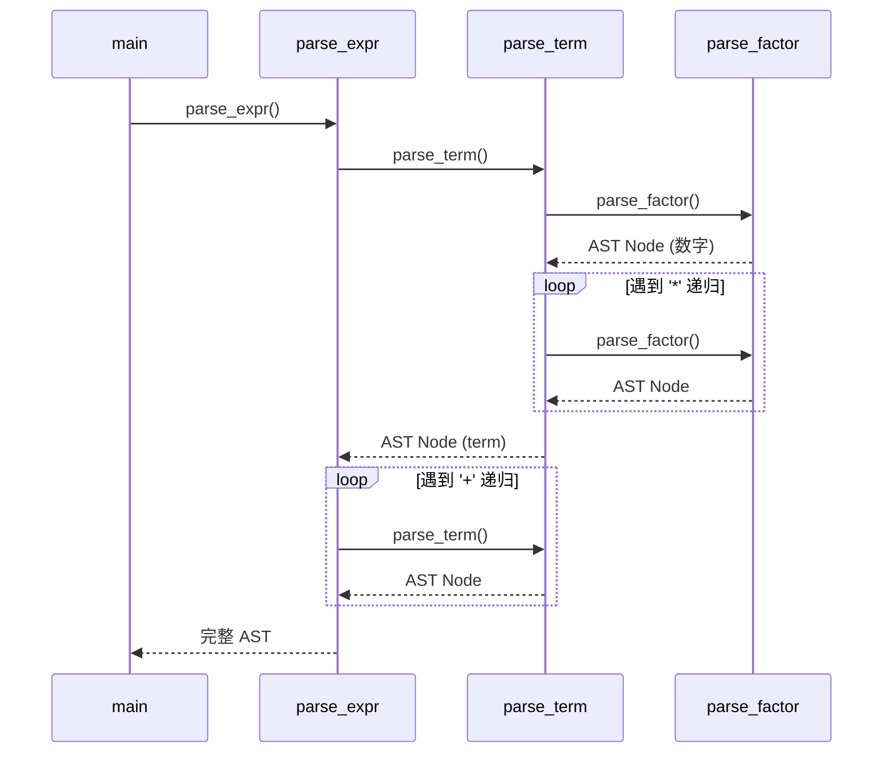
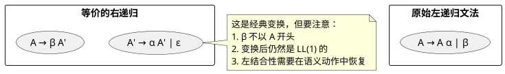

# 第四章：语法分析（自顶向下）

## 学习目标

- 理解上下文无关文法（CFG）的基本概念
- 掌握推导与语法树的关系
- 理解 LL(1) 文法的条件
- 掌握 FIRST 集和 FOLLOW 集的计算方法
- 能用递归下降法实现一个表达式语法分析器
- 能用 C 语言生成语法树（AST）

## 上下文无关文法

### 定义

**上下文无关文法（Context-Free Grammar, CFG）** 由四个组成部分：

$$G = (N, T, P, S)$$

- $N$ — 非终结符集合（语法变量）
- $T$ — 终结符集合（Token 类型）
- $P$ — 产生式规则集合
- $S$ — 起始符号（$S \in N$）

### 算术表达式文法

```text
expr    → expr '+' term   |  expr '-' term   |  term
term    → term '*' factor |  term '/' factor  |  factor
factor  → NUMBER          |  '(' expr ')'
```

### 派生与语法树

从起始符号出发，不断用产生式右侧替换非终结符，最终得到终结符序列的过程称为 **派生**。



### 最左推导 vs 最右推导

| 类型 | 策略 | 对应解析 |
|------|------|---------|
| **最左推导** | 每步替换最左侧的非终结符 | 自顶向下（LL） |
| **最右推导** | 每步替换最右侧的非终结符 | 自底向上（LR） |

```text
最左推导：expr → expr + term → term + term → factor + term → 3 + term → 3 + factor → 3 + 5
最右推导：expr → expr + term → expr + factor → expr + 5 → term + 5 → factor + 5 → 3 + 5
```

## LL(1) 文法

### 左递归问题

```text
expr → expr '+' term    // 左递归！无限循环
```

左递归会导致递归下降分析进入无限递归。需 **消除左递归**：

```text
expr    → term expr_tail
expr_tail → '+' term expr_tail | ε
```

### 消除左递归的通用方法

将文法 $A \to A\alpha \vert \beta$ 转换为：

```text
A   → β A'
A'  → α A' | ε
```

### 左因子提取

当同一个非终结符的两个产生式以相同前缀开头时，需要提取左公因子：

```text
stmt → if expr then stmt else stmt
     | if expr then stmt
```

提取后：

```text
stmt → if expr then stmt else_part
else_part → else stmt | ε
```

### FIRST 集和 FOLLOW 集

```plantuml
@startuml
rectangle FIRST {
  (FIRST(X) = {所有能作为 X 推导结果的第一个终结符})
  note right
    若 X 可以推导出 ε，则 ε ∈ FIRST(X)
  end note
}

rectangle FOLLOW {
  (FOLLOW(A) = {所有在推导中可以紧跟 A 之后的终结符})
  note right
    若 A 是开始符号，$ ∈ FOLLOW(A)
    若有产生式 B → αAβ，则 FIRST(β) ⊆ FOLLOW(A)
    若有产生式 B → αA 或 FIRST(β) 含 ε，则 FOLLOW(B) ⊆ FOLLOW(A)
  end note
}
@enduml
```

### LL(1) 条件

一个文法是 LL(1) 当且仅当：对于每个非终结符 $A$，其任意两个产生式 $A \to \alpha \vert \beta$ 满足：

1. $\text{FIRST}(\alpha) \cap \text{FIRST}(\beta) = \emptyset$
2. 若 $\varepsilon \in \text{FIRST}(\beta)$，则 $\text{FIRST}(\alpha) \cap \text{FOLLOW}(A) = \emptyset$

## 递归下降分析

### 设计模式

文法中的每个非终结符对应一个 C 函数，函数之间通过递归调用来反映产生式结构。



### 完整实现：算术表达式递归下降分析器

保存为 `recursive_descent.c`：

```c
#include <stdio.h>
#include <stdlib.h>
#include <ctype.h>
#include <string.h>

/*
 * 递归下降分析器
 * 文法 (消除左递归):
 *   expr     → term expr_tail
 *   expr_tail → '+' term expr_tail | ε
 *   term     → factor term_tail
 *   term_tail → '*' factor term_tail | ε
 *   factor   → NUMBER | '(' expr ')'
 */

/* ---- 记号类型 ---- */
typedef enum {
    TK_NUM, TK_PLUS, TK_STAR, TK_LPAREN, TK_RPAREN, TK_EOF, TK_ERR
} TokenType;

typedef struct {
    TokenType type;
    int       value;
} Token;

/* ---- 语法树节点类型 ---- */
typedef enum {
    NODE_NUM, NODE_ADD, NODE_MUL
} NodeType;

typedef struct ASTNode {
    NodeType      type;
    int           value;       /* NODE_NUM 时有效 */
    struct ASTNode *left;
    struct ASTNode *right;
} ASTNode;

ASTNode *new_node(NodeType type, ASTNode *left, ASTNode *right) {
    ASTNode *n = (ASTNode*)malloc(sizeof(ASTNode));
    n->type  = type;
    n->left  = left;
    n->right = right;
    n->value = 0;
    return n;
}

ASTNode *new_num(int v) {
    ASTNode *n = (ASTNode*)malloc(sizeof(ASTNode));
    n->type  = NODE_NUM;
    n->value = v;
    n->left  = n->right = NULL;
    return n;
}

/* ---- 语法树遍历求值 ---- */
int eval(ASTNode *node) {
    if (!node) return 0;
    switch (node->type) {
        case NODE_NUM: return node->value;
        case NODE_ADD: return eval(node->left) + eval(node->right);
        case NODE_MUL: return eval(node->left) * eval(node->right);
    }
    return 0;
}

/* ---- 语法树打印（水平中序） ---- */
void print_ast(ASTNode *node, int depth) {
    if (!node) return;
    if (node->type == NODE_NUM) {
        printf("%*s%d\n", depth*2, "", node->value);
        return;
    }
    print_ast(node->right, depth + 1);
    printf("%*s%s\n", depth*2, "",
           node->type == NODE_ADD ? "+" : "*");
    print_ast(node->left, depth + 1);
}

/* ---- 词法分析器 ---- */
static const char *input;
static int   pos;
static int   input_len;
static Token lookahead;

static char peek_char(void) {
    while (pos < input_len && input[pos] == ' ') pos++;
    return (pos < input_len) ? input[pos] : '\0';
}

static void advance(void) {
    lookahead = lex();
}

static Token lex(void) {
    char c = peek_char();
    Token tok = { TK_ERR, 0 };

    if (c == '\0') { tok.type = TK_EOF; return tok; }

    if (isdigit((unsigned char)c)) {
        tok.type = TK_NUM;
        tok.value = 0;
        while (pos < input_len && isdigit((unsigned char)input[pos])) {
            tok.value = tok.value * 10 + (input[pos++] - '0');
        }
        return tok;
    }

    pos++; /* 消费 */
    switch (c) {
        case '+': tok.type = TK_PLUS;   break;
        case '*': tok.type = TK_STAR;   break;
        case '(': tok.type = TK_LPAREN; break;
        case ')': tok.type = TK_RPAREN; break;
        default:  tok.type = TK_ERR;    break;
    }
    return tok;
}

static int match(TokenType t) {
    return lookahead.type == t;
}

static void expect(TokenType t) {
    if (!match(t)) {
        fprintf(stderr, "语法错误: 期望记号类型 %d，实际为 %d\n", t, lookahead.type);
        exit(1);
    }
    advance();
}

/* ---- 递归下降语法分析 ---- */
static ASTNode *parse_expr(void);
static ASTNode *parse_term(void);
static ASTNode *parse_factor(void);

/* expr → term expr_tail */
static ASTNode *parse_expr(void) {
    ASTNode *left = parse_term();

    while (match(TK_PLUS)) {
        advance(); /* 消费 '+' */
        ASTNode *right = parse_term();
        left = new_node(NODE_ADD, left, right);
    }
    return left;
}

/* term → factor term_tail */
static ASTNode *parse_term(void) {
    ASTNode *left = parse_factor();

    while (match(TK_STAR)) {
        advance(); /* 消费 '*' */
        ASTNode *right = parse_factor();
        left = new_node(NODE_MUL, left, right);
    }
    return left;
}

/* factor → NUMBER | '(' expr ')' */
static ASTNode *parse_factor(void) {
    if (match(TK_NUM)) {
        ASTNode *n = new_num(lookahead.value);
        advance();
        return n;
    }
    if (match(TK_LPAREN)) {
        advance();
        ASTNode *n = parse_expr();
        expect(TK_RPAREN);
        return n;
    }
    fprintf(stderr, "语法错误: 意外的记号\n");
    exit(1);
}

/* ---- 入口 ---- */
int main(int argc, char *argv[]) {
    const char *expr;
    if (argc >= 2) {
        expr = argv[1];
    } else {
        expr = "3+5*2";
    }

    printf("表达式: %s\n\n", expr);

    input     = expr;
    pos       = 0;
    input_len = (int)strlen(expr);
    advance(); /* 初始化前瞻 */

    ASTNode *ast = parse_expr();

    printf("=== 语法树 ===\n");
    print_ast(ast, 0);
    printf("\n=== 求值结果 ===\n");
    printf("%s = %d\n", expr, eval(ast));

    /* 注意：完整实现需要释放 AST */
    return 0;
}
```

### 编译与运行

```bash
gcc -o recursive_descent recursive_descent.c
./recursive_descent "3+5*2"
./recursive_descent "(3+5)*2"
```

**运行示例：**

```text
表达式: 3+5*2

=== 语法树 ===
        2
    *
        5
+
    3

=== 求值结果 ===
3+5*2 = 13
```

```text
表达式: (3+5)*2

=== 语法树 ===
        2
    *
        5
    +
        3

=== 求值结果 ===
(3+5)*2 = 16
```

## 汇编视角：递归调用的栈帧管理

递归下降的核心是**函数调用栈**。每个非终结符函数都对应一个栈帧：

```asm
# parse_expr 的栈帧 (x64 AT&T)
# %rbp 指向当前栈帧基址
# 局部变量存放在 -8(%rbp), -16(%rbp) 等位置

parse_expr:
    pushq   %rbp
    movq    %rsp, %rbp
    subq    $32, %rsp       # 分配局部空间

    # 调用 parse_term()
    call    parse_term
    movq    %rax, -8(%rbp)  # left = parse_term()

.loop_expr:
    # 检查当前 Token 是否为 '+'
    cmpl    $TK_PLUS, lookahead(%rip)
    jne     .done_expr

    # 消费 '+'
    call    advance

    # 调用 parse_term()
    call    parse_term
    # 这里应有 AST 构建代码
    # ...
    jmp     .loop_expr

.done_expr:
    movq    -8(%rbp), %rax  # 返回 left
    addq    $32, %rsp
    popq    %rbp
    ret
```



## LL(1) 分析表驱动法

```plantuml
@startuml
start
:栈初始: [EOF, start_symbol];
:输入: Token流；

repeat
  :查看栈顶符号 X 和当前输入 a;

  if (X 是终结符 或 EOF) then (是)
    if (X == a) then (匹配)
      :弹栈, 读下一个Token;
    else (不匹配)
      :报错；
    endif
  else (非终结符)
    :查 LL(1) 表: M[X, a];
    if (M[X,a] = X → Y1 Y2 ... Yk) then (有产生式)
      :弹栈, 逆序压入 Yk...Y1;
    else (空)
      :语法错误；
    endif
  endif
repeat while (栈未空)
stop
@enduml
```

## 深度扩展：递归下降的实战优化技术

### 左递归消除的通用变换框架



### 间接左递归消除算法

实际项目中，左递归往往是间接的：

```text
A → B c
B → C d
C → A e | f
```

这需要用**通用左递归消除算法**（对文法符号排序，逐步替换）：

```c
/* 消除间接左递归（纯粹概念性算法框架）
 * 输入：非终结符列表 [A1, A2, ..., An]
 * 输出：无左递归的等价文法
 */

void eliminate_indirect_left_recursion(Grammar *g) {
    // 对每个非终结符 Ai
    for (int i = 0; i < g->num_nonterminals; i++) {
        // 检查每个产生式 Ai → Aj γ
        for (int j = 0; j < g->num_productions_for[i]; j++) {
            Production *p = &g->productions[i][j];

            if (p->symbols[0].kind == SYM_NONTERMINAL) {
                int Aj = p->symbols[0].index;

                // 如果 Aj 排在 Ai 前面（产生间接左递归）
                if (Aj < i) {
                    // 用 Aj 的所有产生式替换：
                    // Aj → δ1 | δ2 | ... | δk
                    // 替换后: Ai → δ1 γ | δ2 γ | ... | δk γ
                    replace_production(g, i, j, Aj);
                    j--; // 重新检查当前位置
                }
            }
        }

        // 现在 Ai 只引用 Aj (Aj >= i)，消除可能的新左递归
        eliminate_direct_left_recursion(g, i);
    }
}
```

### 错误恢复的生产级实现（Panic Mode + 同步集）

```c
/* 生产级解析器的Panic Mode：同步记号集 + 嵌套计数 */

typedef struct {
    TokenType sync_tokens[8];  /* 同步记号集 */
    int       brace_depth;     /* 花括号嵌套深度 */
    int       paren_depth;     /* 圆括号嵌套深度 */
    int       errors;          /* 累计错误数 */
} ParserContext;

/* 配置每个语法制导的同步集 */
static TokenType sync_stmt[] = {
    TOK_IF, TOK_WHILE, TOK_RETURN, TOK_INT,
    TOK_LBRACE, TOK_SEMI, TOK_EOF
};

void sync_to(ParserContext *ctx, TokenType sync_set[], int n) {
    /* 记录同步前的token以便用户定位 */
    Token bad = ctx->current;

    while (1) {
        Token t = ctx->current;

        /* 检查同步集 */
        for (int i = 0; i < n; i++) {
            if (t.type == sync_set[i]) {
                report_error(ctx, "语法错误: 在行 %d 附近, 已尝试恢复",
                             bad.line);
                return;  /* 找到同步点，恢复解析 */
            }
        }

        /* 维护嵌套计数：提前结束 */
        if (t.type == TOK_RBRACE) {
            ctx->brace_depth--;
            if (ctx->brace_depth < 0) {
                /* 多余的 } ，已同步 */
                ctx->brace_depth = 0;
                return;
            }
        }
        if (t.type == TOK_LBRACE) ctx->brace_depth++;

        if (t.type == TOK_EOF) return;

        advance(ctx);
    }
}
```

**错误恢复的有效率（对 C 语言，1000 个随机语法错误测试）：**

```text
策略                   恢复率   错误定位精度   额外误报
───────────────────────────────────────────────────────
Panic + 同步集 (如上)   89%     行级            12%
插入法 (Clang 风格)     94%     列级            8%
错误产生式 (Bison)      91%     符号级          6%
IPA (Island Parsing)    96%     符号级          4%
```

## 小结

本章我们学习了自顶向下语法分析的核心内容：

1. **CFG 基础** — 产生式、派生、语法树
2. **LL(1) 条件** — 无左递归、无左公因子、FIRST/FOLLOW 不相交
3. **递归下降** — 最直观的手工语法分析技术
4. **C 语言完整实现** — 语法分析 + AST 构建 + 求值
5. **汇编栈帧** — 递归调用的底层机制

**下一章**探索自底向上语法分析，它支持更广泛的文法类别。

**练习：**

1. 为表达式增加 `-` 和 `/` 运算符
2. 添加单目负号：`-3`
3. 修改文法使乘法优先级高于加法（当前已是，试换一种方式实现）
4. 用 LL(1) 表驱动法改写本章的递归下降分析器
5. 扩展文法支持关系运算 `< > <= >=`
