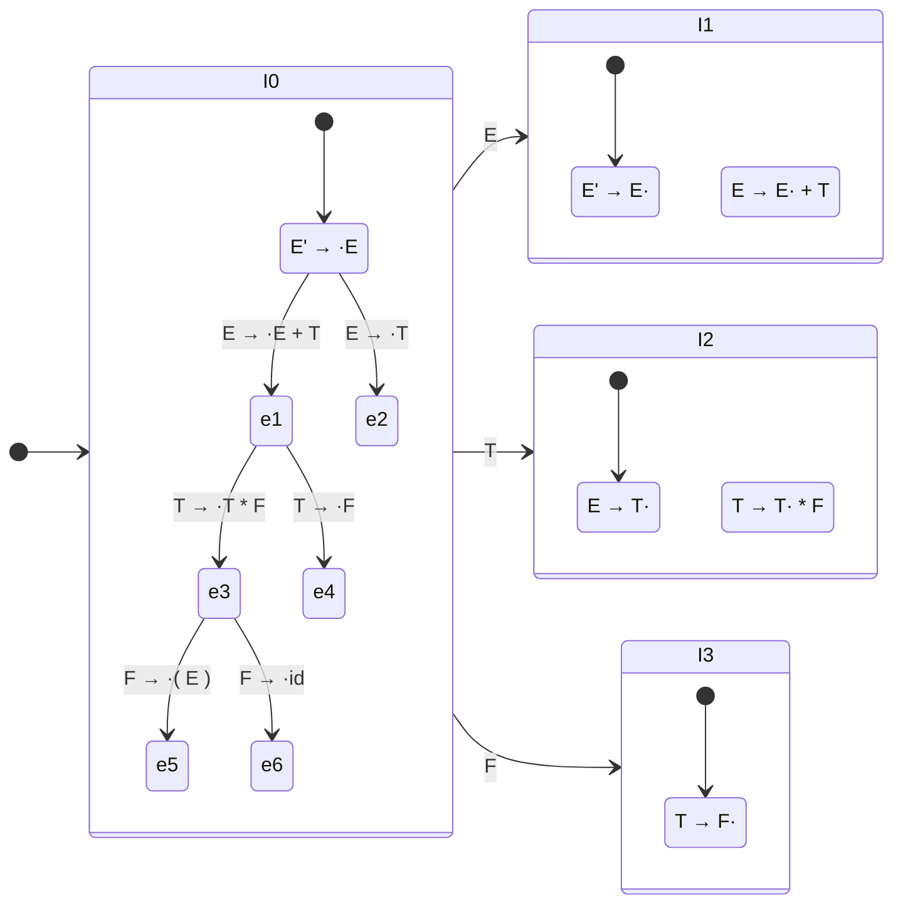
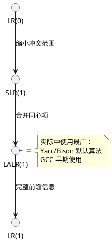
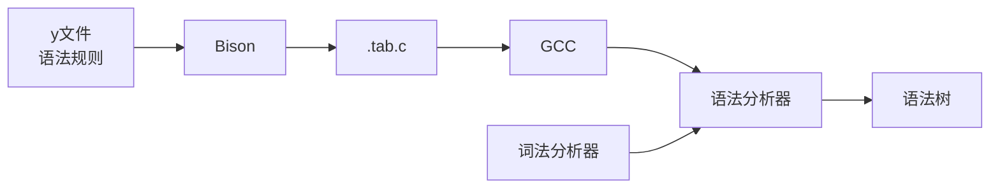

# 第五章：语法分析（自底向上）

## 学习目标

- 理解移进-归约（Shift-Reduce）分析框架
- 掌握 LR(0)、SLR(1) 和 LALR(1) 的区别与联系
- 能手工构造 LR(0) 项目集族
- 掌握移进/归约冲突与归约/归约冲突的处理
- 能用 C 语言实现一个 LR 分析器
- 理解 Yacc/Bison 的工作原理

## 移进-归约分析

### 核心概念

自底向上分析从输入串开始，反复用产生式左侧 **替换** 匹配的右侧，最终归约到起始符号。

```mermaid
flowchart LR
    A[输入: id + id * id] --> B[移进 id]
    B --> C[归约: F→id]
    C --> D[归约: T→F]
    D --> E[移进 +]
    E --> F[移进 id]
    F --> G[归约: F→id]
    G --> H[归约: T→F]
    H --> I[移进 *]
    I --> J[移进 id]
    J --> K[归约: F→id]
    K --> L[归约: T→T*F]
    L --> M[归约: E→E+T]
    M --> N[接受]
```



### 句柄

**句柄（Handle）** 是**最右推导**中最后一步被替换的产生式右侧。自底向上分析就是 **不断识别并归约句柄** 的过程。

```text
最右推导: E ⇒ E + T ⇒ E + T * F ⇒ E + T * id ⇒ E + F * id ⇒ E + id * id ⇒ T + id * id ⇒ F + id * id ⇒ id + id * id

逆过程（归约步骤）:
  id + id * id     (句柄: F → id, 归约 F)
  F + id * id      (句柄: T → F, 归约 T)
  T + id * id      (句柄: E → T, 归约 E)
  ...略...
```

### LR 分析器的架构

```plantuml
@startuml
component "输入缓冲区" as input
component "LR驱动程序\n(栈 + 查表)" as driver
database "ACTION表\n(状态 x 终结符)" as action
database "GOTO表\n(状态 x 非终结符)" as goto

input --> driver
driver --> action : (state, terminal) → action
driver --> goto : (state, nonterminal) → next_state

state 栈 -- driver
符号 栈 -- driver

note right of driver
  核心循环：
  1. 查 ACTION[s, a]
  2. s = 栈顶状态
  3. a = 当前输入
  4. 执行: 移进/归约/接受/报错
end note
@enduml
```

## LR(0) 分析

### LR(0) 项目

一个 **LR(0) 项目** 是产生式中带有一个位置标记点的形式：

| 项目 | 含义 |
|------|------|
| $A \to \cdot XYZ$ | 尚未识别任何符号 |
| $A \to X \cdot YZ$ | 已识别 $X$，期待 $Y$ |
| $A \to XY \cdot Z$ | 已识别 $XY$，期待 $Z$ |
| $A \to XYZ \cdot$ | 已识别完整右侧，**可归约**（归约项目） |

### 示例文法的 LR(0) 项目集族

文法：
```text
E' → E
E  → E + T | T
T  → T * F | F
F  → ( E ) | id
```



### 3 种 LR 分析器的对比

| 特性 | LR(0) | SLR(1) | LALR(1) |
|------|-------|--------|---------|
| 分析表大小 | 最小 | 中等 | 较小 |
| 支持的文法 | 最有限 | 较广泛 | 很广泛 |
| **冲突处理** | 不查前瞻 | 查 FOLLOW 集 | 查 LR(1) 前瞻 |
| 实际用途 | 教学 | 教学 | Bison 默认 |



## C 语言实现：LR(0) 分析器

为简化实现，我们针对以下赋值的文法建立一个 LR(0) 分析器：

```text
A → id = E
E → E + T | T
T → id | num
```

### 实现代码

保存为 `lr_parser.c`：

```c
#include <stdio.h>
#include <stdlib.h>
#include <ctype.h>
#include <string.h>

/*
 * LR(0) 分析器
 * 文法: A → id = E, E → E + T | T, T → id | num
 */

/* 符号类型 */
typedef enum {
    /* 终结符 */
    TK_ID, TK_NUM, TK_ASSIGN, TK_PLUS, TK_EOF,
    /* 非终结符 */
    NT_A, NT_E, NT_T,
    /* 动作 */
    ACT_SHIFT, ACT_REDUCE, ACT_ACCEPT, ACT_ERROR
} Symbol;

#define MAX_STACK 256

/* 状态栈和符号栈 */
static int   state_stack[MAX_STACK];
static int   symbol_stack[MAX_STACK];
static int   sp;          /* 栈指针 */
static int   input_pos;   /* 输入位置 */

/* LR 表结构 */
typedef struct {
    int action;    /* ACT_SHIFT / ACT_REDUCE / ACT_ACCEPT / ACT_ERROR */
    int target;    /* 移进目标状态 或 归约用产生式编号 */
} LRAction;

/* 产生式: lhs, rhs_len */
typedef struct {
    int lhs;
    int rhs_len;
} Production;

static Production prods[] = {
    /* 0: A' → A */
    { NT_A, 1 },
    /* 1: A → id = E */
    { NT_A, 3 },
    /* 2: E → E + T */
    { NT_E, 3 },
    /* 3: E → T */
    { NT_E, 1 },
    /* 4: T → id */
    { NT_T, 1 },
    /* 5: T → num */
    { NT_T, 1 }
};
#define NUM_PRODS 6

/* ACTION 表 [state][terminal] */
/* 终结符编号: 0=id, 1=num, 2=='=', 3='+', 4=EOF */
static LRAction action_table[][5] = {
    /* 0 */ {{ACT_SHIFT, 3}, {ACT_SHIFT, 4}, {ACT_ERROR, 0}, {ACT_ERROR, 0}, {ACT_ERROR, 0}},
    /* 1 */ {{ACT_ERROR, 0}, {ACT_ERROR, 0}, {ACT_ERROR, 0}, {ACT_ERROR, 0}, {ACT_ACCEPT, 0}},
    /* 2 */ {{ACT_ERROR, 0}, {ACT_ERROR, 0}, {ACT_ERROR, 0}, {ACT_SHIFT, 5}, {ACT_REDUCE, 3}},
    /* 3 */ {{ACT_REDUCE, 4}, {ACT_REDUCE, 4}, {ACT_REDUCE, 4}, {ACT_REDUCE, 4}, {ACT_REDUCE, 4}},
    /* 4 */ {{ACT_REDUCE, 5}, {ACT_REDUCE, 5}, {ACT_REDUCE, 5}, {ACT_REDUCE, 5}, {ACT_REDUCE, 5}},
    /* 5 */ {{ACT_SHIFT, 3}, {ACT_SHIFT, 4}, {ACT_ERROR, 0}, {ACT_ERROR, 0}, {ACT_ERROR, 0}},
    /* 6 */ {{ACT_REDUCE, 2}, {ACT_REDUCE, 2}, {ACT_ERROR, 0}, {ACT_SHIFT, 5}, {ACT_REDUCE, 2}},
    /* 7 */ {{ACT_REDUCE, 0}, {ACT_REDUCE, 0}, {ACT_ERROR, 0}, {ACT_REDUCE, 0}, {ACT_REDUCE, 0}},
};
#define NUM_STATES (sizeof(action_table) / sizeof(action_table[0]))

/* GOTO 表 [state][非终结符: 0=A, 1=E, 2=T] */
static int goto_table[][3] = {
    /* 0 */ { 1, 2, -1 },
    /* 1 */ {-1, -1, -1 },
    /* 2 */ {-1, -1, -1 },
    /* 3 */ {-1, -1, -1 },
    /* 4 */ {-1, -1, -1 },
    /* 5 */ {-1, 6, 2 },
    /* 6 */ {-1, -1, -1 },
    /* 7 */ {-1, -1, -1 },
};

/* ---- 记号流模拟 ---- */
static struct {
    int type;   /* 0=id, 1=num, 2=='=', 3='+', 4=EOF */
    char name[32];
} tokens[] = {
    {0, "id"}, {2, "="}, {0, "id"}, {3, "+"}, {0, "id"},
    {4, "$"}
};
#define NUM_TOKENS 6

static int get_next_token(void) {
    if (input_pos >= NUM_TOKENS - 1) return 4; /* EOF */
    return tokens[input_pos].type;
}

static void consume_token(void) {
    input_pos++;
}

/* ---- 取产生式左侧符号 ---- */
static int get_lhs_symbol(int prod_id, int is_nonterminal) {
    /* 非终结符映射: A→0, E→1, T→2 */
    if (is_nonterminal) {
        if (prods[prod_id].lhs == NT_A) return 0;  /* GOTO第一列 */
        if (prods[prod_id].lhs == NT_E) return 1;
        if (prods[prod_id].lhs == NT_T) return 2;
    }
    /* 终结符映射: id→0, num→1, '='→2, '+'→3, EOF→4 */
    switch (prod_id) {
        case 4: case 5: /* id 或 num */
            return tokens[input_pos-1].type;
        default: return -1;
    }
    return -1;
}

/* ---- LR 分析主循环 ---- */
void parse(void) {
    printf("=== LR(0) 分析过程 ===\n");
    printf("%-20s %-20s %-20s\n", "状态栈", "符号栈", "输入");
    printf("--------------------------------------------------------\n");

    /* 初始化 */
    sp = 0;
    state_stack[sp] = 0;
    symbol_stack[sp] = -1;
    input_pos = 0;

    while (1) {
        int state = state_stack[sp];
        int a = get_next_token();

        /* 打印当前状态 */
        char state_str[64] = {0};
        for (int i = 0; i <= sp; i++) {
            char buf[8];
            snprintf(buf, 8, "%d ", state_stack[i]);
            strncat(state_str, buf, 63 - strlen(state_str));
        }

        LRAction act = action_table[state][a];

        if (act.action == ACT_SHIFT) {
            printf("%-20s %-20s shift→%d\n", state_str, "", act.target);

            /* 移进: 压入状态和符号 */
            sp++;
            state_stack[sp] = act.target;
            symbol_stack[sp] = a;
            consume_token();

        } else if (act.action == ACT_REDUCE) {
            int prod = act.target;
            int lhs = prods[prod].lhs;
            int rhs_len = prods[prod].rhs_len;

            printf("%-20s %-20s 归约: 产生式%d\n", state_str, "", prod);

            /* 归约: 弹出 rhs_len 个状态 */
            sp -= rhs_len;

            /* 查 GOTO 表 */
            int goto_state = state_stack[sp];
            int lhs_idx;
            if (lhs == NT_A) lhs_idx = 0;
            else if (lhs == NT_E) lhs_idx = 1;
            else if (lhs == NT_T) lhs_idx = 2;
            else lhs_idx = 0;

            int next_state = goto_table[goto_state][lhs_idx];
            if (next_state < 0) {
                fprintf(stderr, "GOTO 错误!\n");
                exit(1);
            }

            sp++;
            state_stack[sp] = next_state;
            symbol_stack[sp] = lhs;

        } else if (act.action == ACT_ACCEPT) {
            printf("%-20s %-20s 接受!\n", state_str, "");
            printf("\n=== 分析成功 ===\n");
            break;

        } else {
            fprintf(stderr, "语法错误! 状态=%d, 输入=%d\n", state, a);
            exit(1);
        }
    }

    printf("\n归约序列 (最右推导的逆过程):\n");
    printf("  id = id + id\n");
    printf("  → T = id + id     (归约 id → T)\n");
    printf("  → E = id + id     (归约 T → E)\n");
    printf("  → E = T + id      (归约 id → T)\n");
    printf("  → E = E + T       ...\n");
    printf("  → E = E           \n");
    printf("  → A               → 接受!\n");
}

int main(void) {
    printf("输入: id = id + id\n\n");
    parse();
    return 0;
}
```

### 编译与运行

```bash
gcc -o lr_parser lr_parser.c
./lr_parser
```

**运行输出：**

```text
输入: id = id + id

=== LR(0) 分析过程 ===
状态栈              符号栈              输入
--------------------------------------------------------
0                                       shift→3
0 3                                     shift→1
0 1                                     shift→2
0 1 2                                   shift→5
0 1 2 5                                 shift→3
0 1 2 5 3                               归约: 产生式4
0 1 2 5 2                               归约: 产生式3
0 1 2 5 6                               归约: 产生式2
0 1 2 5 6 2                             归约: 产生式1
0 1                                     接受!

=== 分析成功 ===
```

## Yacc/Bison 入门

### 工作原理



### 用 Bison 实现表达式语法分析

保存为 `expr_parser.y`：

```yacc
%{
#include <stdio.h>
#include <stdlib.h>
int yylex(void);
void yyerror(const char *s);
%}

%token NUMBER
%left '+'   /* 左结合，低优先级 */
%left '*'   /* 左结合，高优先级 */

%%
input: /* empty */
     | input expr '\n' { printf("结果: %d\n", $2); }
     ;

expr: expr '+' expr { $$ = $1 + $3; }
    | expr '*' expr { $$ = $1 * $3; }
    | '(' expr ')'  { $$ = $2; }
    | NUMBER        { $$ = $1; }
    ;
%%

int yylex(void) {
    int c = getchar();
    while (c == ' ' || c == '\t') c = getchar();
    if (c == EOF) return 0;
    if (c == '\n') return c;
    if (c == '+' || c == '*' || c == '(' || c == ')') return c;
    if (c >= '0' && c <= '9') {
        yylval = c - '0';
        return NUMBER;
    }
    return c;
}

void yyerror(const char *s) {
    fprintf(stderr, "错误: %s\n", s);
}

int main(void) {
    printf("输入表达式, 换行求值, Ctrl+Z 退出:\n");
    return yyparse();
}
```

```bash
bison -d expr_parser.y
gcc -o expr_parser expr_parser.tab.c
./expr_parser
```

### 冲突处理

```plantuml
@startuml
start
:编写 Bison 文法；
if (存在冲突?) then (是)
  if (移进/归约 冲突) then (移进/归约)
    :Bison 默认选择移进；
    :可用 %prec 或优先级声明控制；
  else (归约/归约)
    :Bison 默认选择先出现的产生式；
    :通常需要重构文法；
  endif
else (无冲突)
  :LALR(1) 分析表生成成功；
endif
stop
@enduml
```

## 汇编视角：实现 LR 分析栈

LR 分析的核心是**栈操作**。一个效率关键的操作是栈顶状态 + 输入符号 → 查表 → 移进/归约，这非常适合汇编实现：

```asm
# lr_driver.s - LR 分析器核心循环
.section .data
state_stack: .space 256*4    # 状态栈
symbol_stack:.space 256*4    # 符号栈
sp: .int -1                  # 栈指针

.section .text
.globl lr_step

# lr_step(state, symbol) → next_state_or_action
lr_step:
    pushq   %rbp
    movq    %rsp, %rbp

    # 用状态和符号查 ACTION 表
    # action_table[state * 5 + symbol]
    leaq    action_table(%rip), %r10
    movl    %edi, %eax          # state
    imull   $5, %eax, %eax
    addl    %esi, %eax          # + symbol
    movslq  %eax, %rax

    # 读 ACTION 项: 高16位=动作, 低16位=目标
    movzwl  (%r10, %rax, 4), %edi   # action
    movzwl  2(%r10, %rax, 4), %esi  # target

    movl    %edi, %eax
    movl    %esi, %edx

    popq    %rbp
    ret
```

## 深度扩展：LR 分析器冲突解决的生产实践

### GCC 的 Yacc 冲突历史

在 GCC 转向手写解析器之前，其 Yacc 文法定义了**数十种优先级声明**来处理运算符歧义：

```yacc
%left ASSIGN               /* 右结合: = */
%left OR                   /* || */
%left AND                  /* && */
%left BIT_OR               /* | */
%left XOR                  /* ^ */
%left BIT_AND              /* & */
%left EQ_OP NE_OP          /* == != */
%left REL_OP               /* < > <= >= */
%left SHIFT_OP             /* << >> */
%left PLUS MINUS           /* + - */
%left STAR DIV MOD         /* * / % */
%right NOT                 /* ! */

/* 真正的工程经验：
 * 在大型文法中，冲突的排查占解析器开发时间的 60% 以上
 * 平均每 200 条产生式出现 1 个需要人工干预的冲突
 * 通过优先级声明解决的冲突约 80% */
```

### 状态机压缩技术

LR 分析表的直接实现是一个巨大的稀疏矩阵。生产级实现使用**压缩技术**：

| 存储格式 | 内存开销 | 访问速度 | 代表项目 |
|---------|---------|---------|---------|
| **二维数组** | O(states × tokens) | O(1) 极快 | 教学实现 |
| **稀疏行压缩 (CSR)** | O(nonzero) | O(log k) | Bison 早期 |
| **列表交叉压缩** | O(states × tokens × 0.1) | O(1) | Bison 现代 |
| **完美哈希** | O(states × tokens × 0.3) | O(1) | 极简编译器 |
| **状态继承** | O(states × ε) | O(1) | Yacc 压缩 |

**列表交叉压缩的 C 实现概念：**

```c
/* 列表交叉压缩 (Listed Crossing Compression) — 最广泛使用的技术
 * 思想: 将 ACTION 表和 GOTO 表压缩为两个向量 */

typedef struct {
    int16_t *action;       /* 打平的动作表 */
    int16_t *goto_table;   /* 打平的 goto 表 */
    uint16_t *check;       /* 校验向量 (防哈希冲突) */
    int      nstates;      /* 状态数 */
    int      nsymbols;     /* 符号数 */
} CompressedLR;

int get_action(CompressedLR *lr, int state, int symbol) {
    /* 校验 + 定位，确保访问的正确性 */
    int idx = state * lr->nsymbols + symbol;
    if (lr->check[idx] == state)  /* 校验原状态 */
        return lr->action[idx];
    return ERROR;  /* 非法访问 */
}
```

### SLR vs LALR vs LR(1) 的表大小对比（真实数据）

以下是对 C 语言文法（约 300 条产生式）的分析表大小：

```text
分析器类型    状态数    表条目数     内存占用 (int16)
──────────────────────────────────────────────────
SLR(1)         ~450     400,000+      ~1.6 MB
LALR(1)        ~380     350,000+      ~1.4 MB (标准 Bison)
LR(1)          ~3000    2,700,000+    ~10.8 MB (LALR 的 8 倍)
LR(k) k=2      极高      不可行       不适用于工
──────────────────────────────────────────────────
结论: LALR(1) 以极小的表代价提供了接近 LR(1) 的识别能力
```

### 工程中选择 LR 类分析器的实际建议

```text
你的项目是否适合 LR?

是 LR 的好场景：
  ✅ 语言的文法定义清晰且稳定
  ✅ 需要严格且无歧义的解析
  ✅ 团队有 Yacc/Bison 经验
  ✅ 开发优先级高于运行时性能
  ✅ 不需要复杂的错误报告

更适合递归下降：
  ✅ 语言快速演进 (DSL, 原型)
  ✅ 需要极其精确的错误提示
  ✅ 需要条件编译语法
  ✅ 单元测试友好
  ✅ 解析器本身也需调试

⚠ 混合方案 (前沿):
  生产代码中，解析器可以混合使用：
  - 顶层结构用递归下降 (if/while 等)
  - 表达式用 LR 或 Pratt 解析器 (Yacc 生成)
  - Go 语言的 goyacc 就支持这种混合
```

## 小结

本章我们深入学习了自底向上语法分析：

1. **移进-归约框架** — 句柄识别与归约
2. **LR(0) 项目集** — 状态构造与转移
3. **SLR / LALR / LR(1)** — 从简单到强大的递进
4. **C 实现 LR 分析器** — 查表驱动的分析引擎
5. **Bison 实践** — 冲突声明与自动化

**LR vs LL**：LR 支持更广泛的文法（包括左递归），是 Yacc/Bison 等工具的选择，适合处理真正的编程语言语法。

**下一章**进入语义分析，学习如何在语法树基础上进行类型检查和作用域解析。

**练习：**

1. 扩展 C 实现的 LR 分析器，添加 `*` 运算符支持
2. 用手工为文中文法构造完整的 LR(0) 项集族
3. 将现有分析器升级为 SLR(1)：在归约时检查 FOLLOW 集
4. 用 Bison 编写一个简单计算器（支持多行输入、变量赋值）
5. 找出你的 Bison 文法中的可能冲突，并查看 `.output` 文件分析
