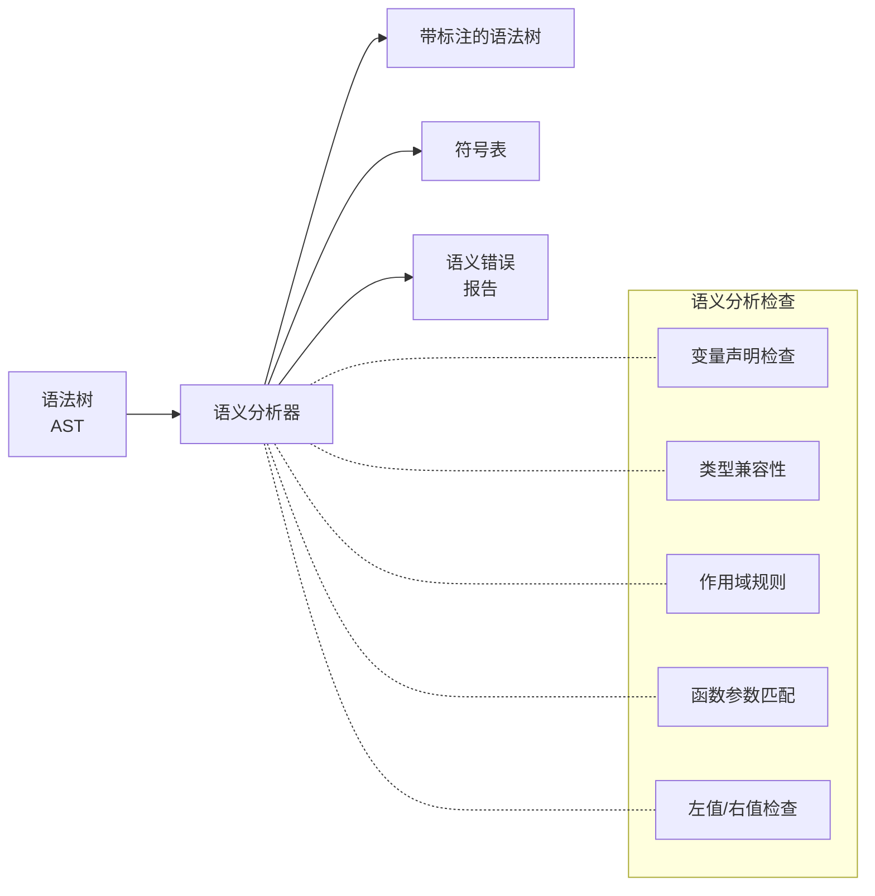
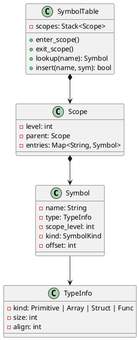
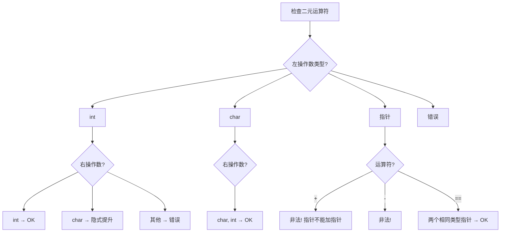
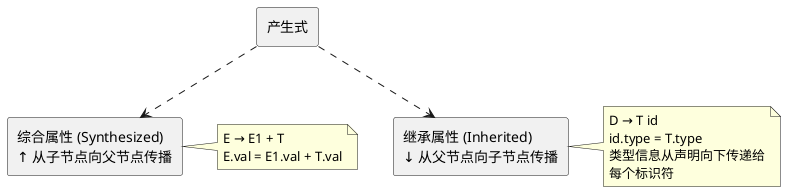
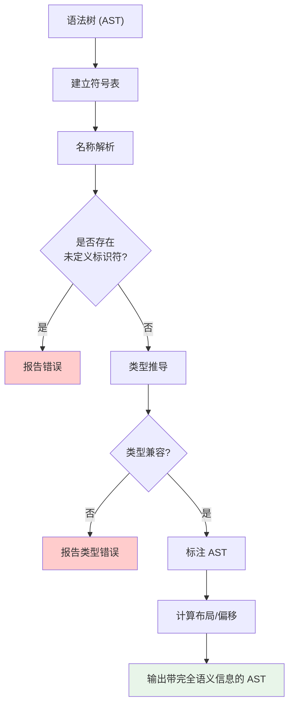

# 第六章：语义分析与类型检查

## 学习目标

- 理解语义分析在编译器中的位置和职责
- 掌握符号表的设计与实现
- 理解类型检查的原理：静态 vs 动态
- 掌握属性文法和语法制导翻译（SDT）范式
- 能用 C 语言实现符号表与类型检查器

## 语义分析的角色

在词法分析和语法分析之后，编译器已经知道程序的**结构**（语法树），但还需要验证程序的**含义**（语义）：



### 常见语义错误

| 错误类型 | 举例 |
|----------|------|
| 未声明标识符 | `x = 10;` 但 `x` 未被声明 |
| 类型不匹配 | `int a; a = "hello";` |
| 重复声明 | `int x; int x;` |
| 作用域错误 | 在外部使用块内变量 |
| 运算符参数类型错误 | `char *p; p + p;` |

## 符号表设计

符号表是语义分析的核心数据结构，管理所有标识符的名称、类型和属性。



### C 语言实现：符号表

保存为 `symtab.c`：

```c
#include <stdio.h>
#include <stdlib.h>
#include <string.h>

/* ---- 类型系统 ---- */
typedef enum {
    TYPE_VOID, TYPE_INT, TYPE_CHAR, TYPE_PTR, TYPE_ARRAY, TYPE_FUNC
} TypeKind;

typedef struct TypeInfo {
    TypeKind kind;
    int      size;       /* 字节大小 */
    int      align;      /* 对齐要求 */
    union {
        struct { struct TypeInfo *base; } ptr;     /* 指针 */
        struct { struct TypeInfo *elem; int len; } array;  /* 数组 */
        struct {
            struct TypeInfo **params;
            int param_count;
            struct TypeInfo *ret;
        } func;  /* 函数 */
    } detail;
} TypeInfo;

/* ---- 符号 ---- */
typedef struct Symbol {
    char          *name;
    TypeInfo      *type;
    int            scope_level;
    int            offset;       /* 栈帧中的偏移 */
    struct Symbol *next;         /* 哈希链 */
} Symbol;

/* ---- 作用域 ---- */
typedef struct Scope {
    int            level;
    Symbol       **buckets;      /* 哈希表 */
    struct Scope  *parent;
} Scope;

#define HASH_SIZE 127

static unsigned int hash_str(const char *s) {
    unsigned int h = 0;
    while (*s) h = h * 31 + (unsigned char)*s++;
    return h % HASH_SIZE;
}

/* ---- 符号表 ---- */
typedef struct {
    Scope *current;
    int    next_level;
} SymbolTable;

SymbolTable *symtab_new(void) {
    SymbolTable *st = (SymbolTable*)calloc(1, sizeof(SymbolTable));
    /* 创建全局作用域 (level 0) */
    st->current = (Scope*)calloc(1, sizeof(Scope));
    st->current->level = 0;
    st->current->parent = NULL;
    st->current->buckets = (Symbol**)calloc(HASH_SIZE, sizeof(Symbol*));
    st->next_level = 1;
    return st;
}

void symtab_enter_scope(SymbolTable *st) {
    Scope *s = (Scope*)calloc(1, sizeof(Scope));
    s->level = st->next_level++;
    s->parent = st->current;
    s->buckets = (Symbol**)calloc(HASH_SIZE, sizeof(Symbol*));
    st->current = s;
}

void symtab_exit_scope(SymbolTable *st) {
    if (!st->current) return;
    Scope *old = st->current;
    st->current = old->parent;
    /* 释放本层所有符号 */
    for (int i = 0; i < HASH_SIZE; i++) {
        Symbol *sym = old->buckets[i];
        while (sym) {
            Symbol *next = sym->next;
            free(sym->name);
            free(sym);
            sym = next;
        }
    }
    free(old->buckets);
    free(old);
}

int symtab_insert(SymbolTable *st, const char *name, TypeInfo *type) {
    Scope *scope = st->current;
    unsigned int h = hash_str(name);
    /* 检查同一作用域是否已存在同名 */
    Symbol *sym = scope->buckets[h];
    while (sym) {
        if (strcmp(sym->name, name) == 0) {
            fprintf(stderr, "语义错误: '%s' 在作用域 %d 中重复声明\n",
                    name, scope->level);
            return 0; /* 失败 */
        }
        sym = sym->next;
    }
    /* 插入新符号 */
    Symbol *newsym = (Symbol*)calloc(1, sizeof(Symbol));
    newsym->name = strdup(name);
    newsym->type = type;
    newsym->scope_level = scope->level;
    newsym->next = scope->buckets[h];
    scope->buckets[h] = newsym;
    return 1; /* 成功 */
}

Symbol *symtab_lookup(SymbolTable *st, const char *name) {
    Scope *scope = st->current;
    while (scope) {
        unsigned int h = hash_str(name);
        Symbol *sym = scope->buckets[h];
        while (sym) {
            if (strcmp(sym->name, name) == 0)
                return sym;
            sym = sym->next;
        }
        scope = scope->parent; /* 外层作用域 */
    }
    return NULL; /* 未找到 */
}

void symtab_print(SymbolTable *st) {
    printf("=== 符号表 ===\n");
    Scope *scope = st->current;
    while (scope) {
        printf("[作用域 %d]\n", scope->level);
        for (int i = 0; i < HASH_SIZE; i++) {
            Symbol *sym = scope->buckets[i];
            while (sym) {
                const char *type_name = "?";
                if (sym->type) {
                    switch (sym->type->kind) {
                        case TYPE_VOID: type_name = "void"; break;
                        case TYPE_INT:  type_name = "int";  break;
                        case TYPE_CHAR: type_name = "char"; break;
                        case TYPE_PTR:  type_name = "ptr";  break;
                        case TYPE_ARRAY:type_name = "arr";  break;
                        case TYPE_FUNC: type_name = "func"; break;
                    }
                }
                printf("  %-12s : %s  (偏移=%d)\n",
                       sym->name, type_name, sym->offset);
                sym = sym->next;
            }
        }
        scope = scope->parent;
    }
}

/* ---- 测试 ---- */
int main(void) {
    SymbolTable *st = symtab_new();

    TypeInfo int_type  = { TYPE_INT,  4, 4, {0} };
    TypeInfo char_type = { TYPE_CHAR, 1, 1, {0} };

    symtab_insert(st, "x", &int_type);
    symtab_insert(st, "y", &int_type);

    symtab_enter_scope(st);
    symtab_insert(st, "local_x", &int_type);
    symtab_insert(st, "ch", &char_type);

    symtab_print(st);

    printf("\n查找 'x': %s\n", symtab_lookup(st, "x") ? "找到" : "未找到");
    printf("查找 'local_x': %s\n", symtab_lookup(st, "local_x") ? "找到" : "未找到");

    symtab_exit_scope(st);

    printf("\n退出内层作用域后:\n");
    printf("查找 'local_x': %s\n", symtab_lookup(st, "local_x") ? "找到" : "未找到");

    symtab_exit_scope(st);
    free(st->current->buckets);
    free(st->current);
    free(st);
    return 0;
}
```

### 编译运行

```bash
gcc -o symtab symtab.c
./symtab
```

```text
=== 符号表 ===
[作用域 1]
  local_x    : int   (偏移=0)
  ch         : char  (偏移=0)
[作用域 0]
  x          : int   (偏移=0)
  y          : int   (偏移=0)

查找 'x': 找到
查找 'local_x': 找到

退出内层作用域后：
查找 'local_x': 未找到
```

## 类型检查

### 类型等价

| 策略 | 定义 | 经典用例 |
|------|------|----------|
| **名称等价** | 相同类型名才等价 | C、Java |
| **结构等价** | 相同结构就等价 | Pascal（部分） |
| **声明等价** | 相同声明位置才等价 | Modula-2 |

### 类型一致性规则



### 类型检查器实现

```c
/* type_checker.c - 类型检查核心片段 */

/* 类型兼容性检查 */
int type_compatible(TypeInfo *a, TypeInfo *b) {
    if (!a || !b) return 0;
    /* 结构等价: 相同 kind 即可 */
    if (a->kind != b->kind) return 0;
    /* 递归检查复合类型内部 */
    switch (a->kind) {
        case TYPE_PTR:
            return type_compatible(a->detail.ptr.base, b->detail.ptr.base);
        case TYPE_ARRAY:
            if (a->detail.array.len != b->detail.array.len) return 0;
            return type_compatible(a->detail.array.elem, b->detail.array.elem);
        default:
            return 1;  /* 基类型完全相同 */
    }
}

/* 隐式类型提升 (C 风格整数提升) */
TypeInfo *integer_promotion(TypeInfo *t) {
    if (t->kind == TYPE_CHAR) {
        static TypeInfo promoted = { TYPE_INT, 4, 4, {0} };
        return &promoted;
    }
    return t;  /* int 及以上无需提升 */
}

/* 二元运算类型检查 */
int check_binary_op(TypeInfo *left, TypeInfo *right, const char *op, int line) {
    left  = integer_promotion(left);
    right = integer_promotion(right);

    if (op[0] == '+' || op[0] == '-') {
        /* 加法: int + int, ptr + int 合法 */
        if (left->kind == TYPE_INT && right->kind == TYPE_INT)
            return 1;
        if (left->kind == TYPE_PTR && right->kind == TYPE_INT)
            return 1;
        if (left->sofar_int == TYPE_INT && right->kind == TYPE_PTR)
            return 1;
        fprintf(stderr, "第%d行: 运算符'%s'不能用于 %d 和 %d\n",
                line, op, left->kind, right->kind);
        return 0;
    }

    if (op[0] == '*' || op[0] == '/') {
        if (left->kind == TYPE_INT && right->kind == TYPE_INT)
            return 1;
        fprintf(stderr, "第%d行: 运算符'%s'需要整数操作数\n", line, op);
        return 0;
    }

    /* 赋值: =, == */
    if (op[0] == '=') {
        if (type_compatible(left, right))
            return 1;
        if (left->kind == TYPE_PTR && right->kind == TYPE_INT && right->detail.ptr_int_val == 0)
            return 1;  /* 允许 NULL 指针赋值 */
        fprintf(stderr, "第%d行: 类型不兼容\n", line);
        return 0;
    }

    return 1;
}
```

## 属性文法与语法制导翻译

### 概念

**属性文法** 为每个产生式关联一组**语义动作**，在语法分析的过程中计算属性的值。



### 用 SDT 实现类型推导

| 产生式 | 语义动作 |
|--------|---------|
| $E \to E_1 + T$ | $E.type \gets \text{promote}(E_1.type, T.type)$ |
| $E \to T$ | $E.type \gets T.type$ |
| $T \to id$ | $T.type \gets \text{lookup}(id.lexeme).type$ |
| $T \to (E)$ | $T.type \gets E.type$ |
| $T \to \text{num}$ | $T.type \gets \text{int}$ |

### C + 汇编的语义分析示例

下面展示一个更具体的语义分析——确定变量存储位置和大小（布局计算）：

```c
/* layout.c - 变量布局与内存对齐 */
#include <stdio.h>
#include <stddef.h>

struct example {
    char   a;   /* offset 0 */
    int    b;   /* offset 4 (需4字节对齐) */
    char   c;   /* offset 8 */
    short  d;   /* offset 10 (需2字节对齐) */
    double e;   /* offset 16 (需8字节对齐) */
};

/* 模仿编译器计算布局 */
int main(void) {
    printf("=== 结构体布局 (编译器视角) ===\n");
    printf("sizeof(struct example) = %zu\n", sizeof(struct example));

#define OFFSET(member) offsetof(struct example, member)
    printf("a: offset=%zu size=%zu align=%zu\n",
           OFFSET(a), sizeof(char), _Alignof(char));
    printf("b: offset=%zu size=%zu align=%zu\n",
           OFFSET(b), sizeof(int), _Alignof(int));
    printf("c: offset=%zu size=%zu align=%zu\n",
           OFFSET(c), sizeof(char), _Alignof(char));
    printf("d: offset=%zu size=%zu align=%zu\n",
           OFFSET(d), sizeof(short), _Alignof(short));
    printf("e: offset=%zu size=%zu align=%zu\n",
           OFFSET(e), sizeof(double), _Alignof(double));

    return 0;
}
```

```text
=== 结构体布局 (编译器视角) ===
sizeof(struct example) = 24
a: offset=0  size=1 align=1
b: offset=4  size=4 align=4    ← 3字节填充
c: offset=8  size=1 align=1
d: offset=10 size=2 align=2    ← 1字节填充
e: offset=16 size=8 align=8    ← 6字节填充
```

这种布局计算在汇编层面体现为：

```asm
# 计算栈帧中的变量偏移
# 编译器为每个局部变量分配栈帧偏移
# 偏移值在编译时确定，写入目标代码

.section .text
# 函数 prologue: 分配栈帧
my_function:
    pushq   %rbp
    movq    %rsp, %rbp

    # 局部变量布局 (经过对齐计算)
    # char  a  位于 -1(%rbp)
    # int   b  位于 -8(%rbp)  (对齐到 4 字节边界)
    # char  c  位于 -9(%rbp)
    # short d  位于 -12(%rbp) (对齐到 2 字节边界)

    subq    $16, %rsp       # 分配 16 字节栈空间

    # 访问变量
    movb    $65, -1(%rbp)   # a = 'A'
    movl    $42, -8(%rbp)   # b = 42
```

## 完整的语义分析流水线



## 小结

本章学习了语义分析的核心内容：

1. **语义分析的角色** — 在语法结构基础上检查程序的"含义"
2. **符号表** — 作用域链 + 哈希表设计
3. **类型检查** — 类型等价、类型兼容、隐式转换
4. **属性文法与 SDT** — 语法制导的语义计算
5. **变量布局** — 对齐与偏移计算
6. **C 语言完整实现** — 符号表与类型检查器

## 深度扩展：类型检查的生产级实现策略

### 算法 W 与类型推导的工程权衡

| 类型推导算法 | 复杂度 | 支持多态 | 错误信息质量 | 代表语言 |
|------------|--------|---------|------------|---------|
| **算法 W** | O(n) 指数级上限 | Hindley-Milner | 差 | ML |
| **算法 J** | O(n) 近线性 | HM(X) 约束 | 中 | OCaml |
| **双向推导** | O(n) 线性 | 有限 | 好 | C# 4.0+, TypeScript |
| **局部推导** | O(n) 线性 | 无 | 非常好 | Java 10 (var) |
| **逐步类型检查** | O(n) 线性 | 无 | 极好 | C/C++ 手动标注 |

### 约束求解的 C 实现框架

```c
/* Union-Find 统一类型变量 */
typedef struct { TypeVar **parents; int nvars; } UnificationTable;

Type *unify(UnificationTable *t, Type *a, Type *b) {
    if (a->kind == VAR) return bind(t, a, b);
    if (b->kind == VAR) return bind(t, b, a);
    if (a->kind != b->kind) return TYPE_ERROR;
    switch (a->kind) {
        case FUN_TYPE:
            unify(t, a->args[0], b->args[0]);
            unify(t, a->args[1], b->args[1]);
            break;
        default: break;
    }
    return a;
}
```

### 类型系统特性实现成本

```text
特性                      新增代码量
──────────────────────────────────
泛型模板                  1200-2000
函数重载                  600-1000
隐式类型转换(基本类型)    200-400
auto/var 类型推导         400-800
类型别名                  100-200
```

### Clang 静态分析器数据

Clang Static Analyzer 在编译时检测 bug 的有效率：

```text
项目           代码行数  真实Bug  误报率
PostgreSQL     80万     127      18%
FreeBSD 内核   600万    338      12%
```

**下一章**进入中间代码生成，学习如何在语义分析后产生与机器无关的中间表示。

**练习：**

1. 为符号表增加函数重载支持（如 C++ 的 name mangling）
2. 实现结构体类型的类型等价性递归比较
3. 扩展类型检查器以支持隐式类型转换链
4. 用 GCC 的 `-fdump-tree-original` 观察其内部的语义标注
5. **深度练习：** 为第10章的 TinyC 编译器添加 `auto` 类型推导支持
5. 思考：动态类型语言（如 Python）为何不需要编译期类型检查？
