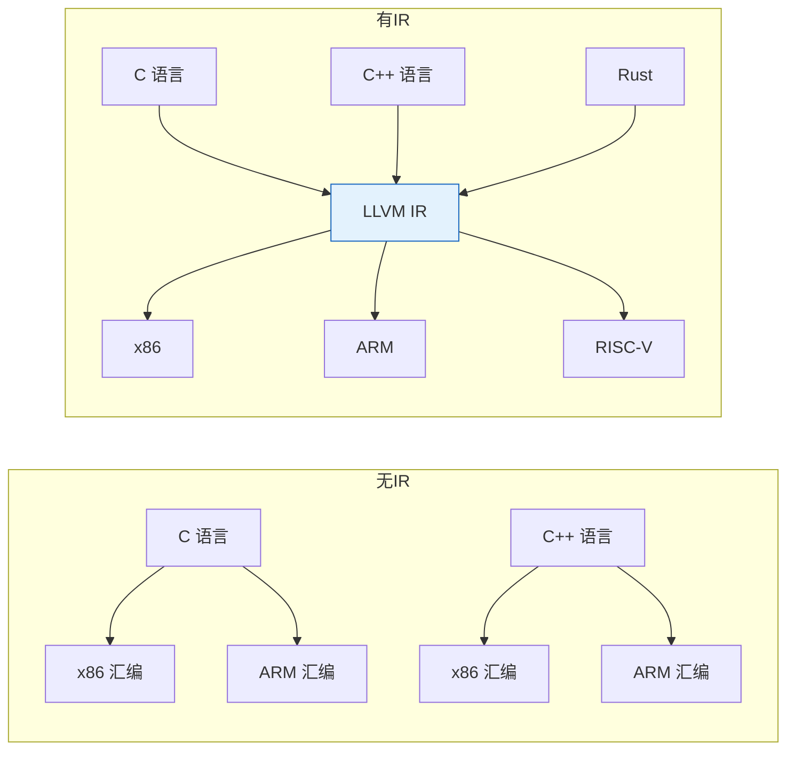
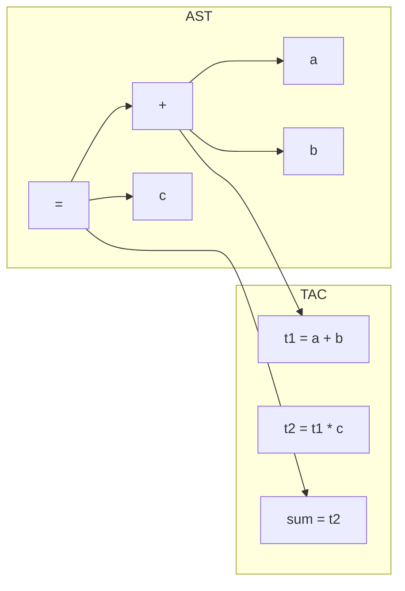
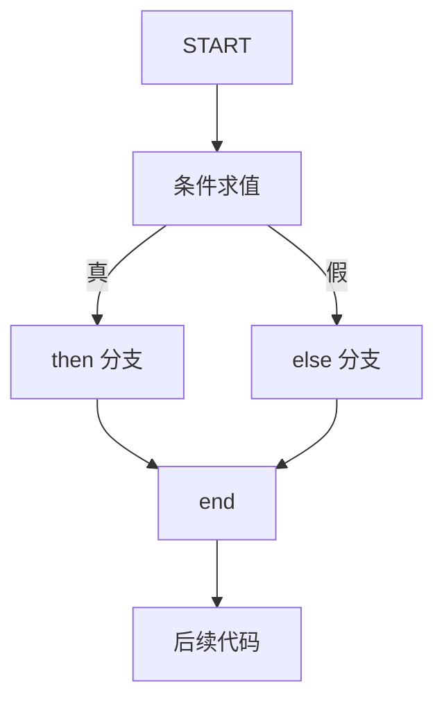
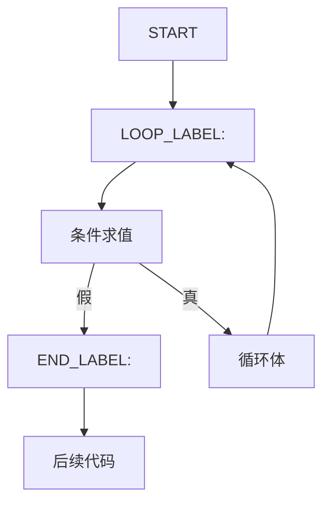
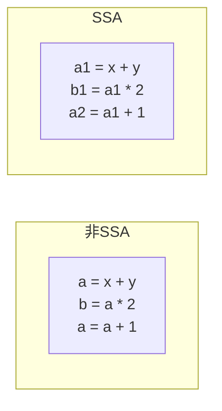
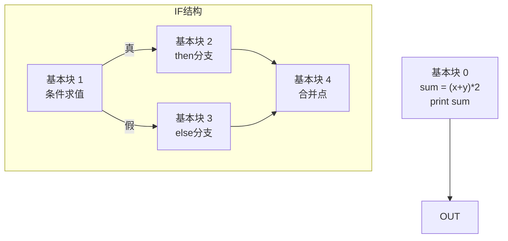

# 第七章：中间代码生成

## 学习目标

- 理解引入中间代码（IR）的设计动机
- 掌握三地址码（Three-Address Code）的表示与生成
- 理解控制流翻译：if-else、while 循环
- 了解 SSA（Static Single Assignment）形式
- 用 C 语言从 AST 生成三地址码
- 用汇编模拟基本块计算

## 为什么需要中间代码？



**核心收益：** 引入 IR 后，支持 M 种语言 × N 种架构只需 $M+N$ 个组件，而非 $M \times N$。

| 收益 | 说明 |
|------|------|
| **前端/后端解耦** | 前端只产生 IR，后端只消费 IR |
| **多语言共享优化** | 所有优化 pass 在 IR 层面通用 |
| **可移植性** | 一套 IR 适配多种目标架构 |
| **分析便利** | IR 形式简洁，便于数据流分析 |

## 三地址码（Three-Address Code, TAC）

### 定义

每条三地址码指令的形式为：`x = y op z`，其中 `x`、`y`、`z` 是地址（变量、常量或临时变量）。

### 常用指令类型

| 指令形式 | 含义 | 示例 |
|----------|------|------|
| `x = y op z` | 二元运算 | `t1 = a + b` |
| `x = op y` | 一元运算 | `t1 = -a` |
| `x = y` | 复制 | `x = temp` |
| `goto L` | 无条件跳转 | `goto L1` |
| `if x relop y goto L` | 条件跳转 | `if a < b goto L1` |
| `x = y[i]` | 数组访问 | `t1 = arr[index]` |
| `x[i] = y` | 数组赋值 | `arr[0] = 42` |
| `param x` | 传参 | `param a` |
| `call f, n` | 函数调用 | `call sum, 2` |
| `return x` | 返回值 | `return result` |

### 表达式翻译示例

```text
源程序: sum = (a + b) * c

三地址码：
    t1 = a + b
    t2 = t1 * c
    sum = t2
```



## C 语言实现：从 AST 生成三地址码

### 完整实现

保存为 `tac_gen.c`：

```c
#include <stdio.h>
#include <stdlib.h>
#include <string.h>
#include <ctype.h>

/*
 * 从 AST 生成三地址码 (TAC)
 * 支持的运算符: +, -, *, /
 * 支持 if-else 和 while 的控制流翻译
 */

/* ---- AST 节点类型 ---- */
typedef enum {
    AST_NUM, AST_ID, AST_ASSIGN, AST_BINOP,
    AST_IF, AST_WHILE, AST_BLOCK, AST_RETURN,
    AST_PRINT
} ASTKind;

typedef struct ASTNode {
    ASTKind kind;
    char    name[32];      /* 变量名 */
    int     value;         /* 数字值 */
    char    op;            /* 运算符 */
    struct ASTNode *left;
    struct ASTNode *right;
    struct ASTNode *cond;       /* if/while 条件 */
    struct ASTNode *then_body;  /* if body */
    struct ASTNode *else_body;  /* else body (可为 NULL) */
    struct ASTNode **stmts;     /* BLOCK 语句列表 */
    int     stmt_count;
} ASTNode;

/* ---- 辅助函数创建节点 ---- */
ASTNode *new_num(int v) {
    ASTNode *n = calloc(1, sizeof(ASTNode));
    n->kind = AST_NUM; n->value = v;
    return n;
}

ASTNode *new_id(const char *name) {
    ASTNode *n = calloc(1, sizeof(ASTNode));
    n->kind = AST_NUM; /* 临时 */
    strncpy(n->name, name, 31);
    return n;
}

ASTNode *new_binop(char op, ASTNode *l, ASTNode *r) {
    ASTNode *n = calloc(1, sizeof(ASTNode));
    n->kind = AST_BINOP; n->op = op;
    n->left = l; n->right = r;
    return n;
}

ASTNode *new_assign(const char *name, ASTNode *rhs) {
    ASTNode *n = calloc(1, sizeof(ASTNode));
    n->kind = AST_ASSIGN;
    strncpy(n->name, name, 31);
    n->left = rhs;
    return n;
}

/* ---- 三地址码结构 ---- */
typedef enum {
    TAC_LABEL, TAC_GOTO,
    TAC_IF_GOTO, TAC_IF_FALSE_GOTO,
    TAC_ASSIGN, TAC_BINOP, TAC_COPY,
    TAC_RETURN, TAC_PRINT, TAC_PARAM, TAC_CALL
} TACKind;

typedef struct TAC {
    TACKind kind;
    char    arg1[32];
    char    arg2[32];
    char    result[32];
    char    label[32];      /* 对于 TAC_LABEL */
    int     int_val;
    struct TAC *next;
} TAC;

static TAC *tac_head = NULL;
static TAC *tac_tail = NULL;
static int  temp_counter = 0;
static int  label_counter = 0;

static char *new_temp(void) {
    static char buf[32];
    snprintf(buf, 32, "t%d", temp_counter++);
    return buf;
}

static char *new_label(void) {
    static char buf[32];
    snprintf(buf, 32, "L%d", label_counter++);
    return buf;
}

static void emit(TAC *tac) {
    if (!tac_head) {
        tac_head = tac_tail = tac;
    } else {
        tac_tail->next = tac;
        tac_tail = tac;
    }
}

static TAC *make_tac_label(const char *label) {
    TAC *t = calloc(1, sizeof(TAC));
    t->kind = TAC_LABEL; strncpy(t->label, label, 31);
    return t;
}

static TAC *make_tac_goto(const char *label) {
    TAC *t = calloc(1, sizeof(TAC));
    t->kind = TAC_GOTO; strncpy(t->label, label, 31);
    return t;
}

static TAC *make_tac_if_goto(const char *cond_var, const char *label) {
    TAC *t = calloc(1, sizeof(TAC));
    t->kind = TAC_IF_GOTO;
    strncpy(t->arg1, cond_var, 31);
    strncpy(t->label, label, 31);
    return t;
}

static TAC *make_tac_binop(const char *result, const char *a1,
                            char op, const char *a2) {
    TAC *t = calloc(1, sizeof(TAC));
    t->kind = TAC_BINOP;
    strncpy(t->result, result, 31);
    strncpy(t->arg1, a1, 31);
    t->int_val = op;
    strncpy(t->arg2, a2, 31);
    return t;
}

static TAC *make_tac_assign(const char *result, const char *src) {
    TAC *t = calloc(1, sizeof(TAC));
    t->kind = TAC_COPY;
    strncpy(t->result, result, 31);
    strncpy(t->arg1, src, 31);
    return t;
}

/* ---- 递归代码生成 ---- */
/* 返回存放表达式结果的变量名 */
static char *gen_expr(ASTNode *node) {
    if (node->kind == AST_NUM) {
        char *t = new_temp();
        TAC *tac = calloc(1, sizeof(TAC));
        tac->kind = TAC_ASSIGN;
        snprintf(tac->result, 31, "%s", t);
        snprintf(tac->arg1, 31, "%d", node->value);
        emit(tac);
        return strdup(t);
    }

    if (node->kind == AST_BINOP) {
        char *left  = gen_expr(node->left);
        char *right = gen_expr(node->right);
        char *result = new_temp();
        emit(make_tac_binop(result, left, node->op, right));
        return strdup(result);
    }

    /* 标识符（简化：直接用变量名） */
    return strdup(node->name);
}

static void gen_stmt(ASTNode *node);

static void gen_block(ASTNode *node) {
    for (int i = 0; i < node->stmt_count; i++) {
        gen_stmt(node->stmts[i]);
    }
}

static void gen_stmt(ASTNode *node) {
    if (!node) return;

    switch (node->kind) {
        case AST_ASSIGN: {
            char *rhs = gen_expr(node->left);
            emit(make_tac_assign(node->name, rhs));
            free(rhs);
            break;
        }

        case AST_IF: {
            char *cond_tmp = gen_expr(node->cond);
            char *else_label = new_label();
            char *end_label = new_label();

            /* if (<cond> == 0) goto else_label */
            emit(make_tac_if_goto(cond_tmp, else_label));

            /* then 分支 */
            gen_block(node->then_body);
            emit(make_tac_goto(end_label));

            /* else 分支 */
            emit(make_tac_label(else_label));
            if (node->else_body)
                gen_block(node->else_body);

            emit(make_tac_label(end_label));
            break;
        }

        case AST_WHILE: {
            char *loop_label = new_label();
            char *end_label = new_label();

            emit(make_tac_label(loop_label));
            char *cond_tmp = gen_expr(node->cond);
            emit(make_tac_if_goto(cond_tmp, end_label));

            gen_block(node->then_body);
            emit(make_tac_goto(loop_label));
            emit(make_tac_label(end_label));
            break;
        }

        case AST_RETURN: {
            char *val = NULL;
            if (node->left) val = gen_expr(node->left);
            TAC *t = calloc(1, sizeof(TAC));
            t->kind = TAC_RETURN;
            if (val) strncpy(t->arg1, val, 31);
            emit(t);
            break;
        }

        case AST_PRINT: {
            /* print 语句 */
            char *val = gen_expr(node->left);
            TAC *t = calloc(1, sizeof(TAC));
            t->kind = TAC_PRINT;
            strncpy(t->arg1, val, 31);
            emit(t);
            break;
        }

        case AST_BLOCK:
            gen_block(node);
            break;

        default:
            break;
    }
}

/* ---- 打印三地址码 ---- */
void print_tac(void) {
    printf("=== 三地址码 (TAC) ===\n\n");
    int inst_no = 0;
    for (TAC *t = tac_head; t; t = t->next) {
        printf("%4d: ", inst_no++);
        switch (t->kind) {
            case TAC_LABEL:
                printf("%s:\n", t->label);
                break;
            case TAC_GOTO:
                printf("    goto %s\n", t->label);
                break;
            case TAC_IF_GOTO:
                printf("    if %s == 0 goto %s\n", t->arg1, t->label);
                break;
            case TAC_ASSIGN:
                printf("    %s = %s\n", t->result, t->arg1);
                break;
            case TAC_BINOP:
                printf("    %s = %s %c %s\n",
                       t->result, t->arg1, (char)t->int_val, t->arg2);
                break;
            case TAC_COPY:
                printf("    %s = %s\n", t->result, t->arg1);
                break;
            case TAC_RETURN:
                printf("    return %s\n", t->arg1);
                break;
            case TAC_PRINT:
                printf("    print %s\n", t->arg1);
                break;
            default:
                printf("    (未知指令)\n");
                break;
        }
    }
}

/* ---- 构建测试 AST ---- */
ASTNode *build_test_ast(void) {
    /*
     * int f(int a, int b) {
     *     int result;
     *     if (a > 0) {
     *         result = a + b;
     *     } else {
     *         result = a - b;
     *     }
     *     return result;
     * }
     *
     * 简化: result = (a + b) + 1
     * sum = (x + y) * 2
     */
    ASTNode *prog = calloc(1, sizeof(ASTNode));
    prog->kind = AST_BLOCK;
    prog->stmt_count = 3;
    prog->stmts = calloc(3, sizeof(ASTNode*));

    /* sum = (x + y) * 2 */
    prog->stmts[0] = new_assign("sum",
        new_binop('*',
            new_binop('+', new_id("x"), new_id("y")),
            new_num(2)));

    /* print sum */
    ASTNode *print = calloc(1, sizeof(ASTNode));
    print->kind = AST_PRINT;
    print->left = new_id("sum");
    prog->stmts[1] = print;

    /* return 0 */
    ASTNode *ret = calloc(1, sizeof(ASTNode));
    ret->kind = AST_RETURN;
    ret->left = new_num(0);
    prog->stmts[2] = ret;

    return prog;
}

int main(void) {
    ASTNode *ast = build_test_ast();
    gen_block(ast);
    print_tac();
    return 0;
}
```

### 编译运行

```bash
gcc -o tac_gen tac_gen.c
./tac_gen
```

**运行输出：**

```text
=== 三地址码 (TAC) ===

   0:     t0 = 2
   1:     t1 = x
   2:     t2 = y
   3:     t3 = t1 + t2
   4:     t4 = t3 * t0
   5:     sum = t4
   6:     t5 = sum
   7:     print t5
   8:     t6 = 0
   9:     return t6
```

## 控制流翻译

### if-else 翻译模板



**TAC 模板：**

```text
    求值条件，结果放入 cond_tmp
    if cond_tmp == 0 goto ELSE_LABEL
    <then 分支代码>
    goto END_LABEL
ELSE_LABEL:
    <else 分支代码>
END_LABEL:
```

### while 循环翻译模板



**TAC 模板：**

```text
LOOP_LABEL:
    求值条件，结果放入 cond_tmp
    if cond_tmp == 0 goto END_LABEL
    <循环体代码>
    goto LOOP_LABEL
END_LABEL:
```

## SSA (Static Single Assignment) 简介

### 核心思想

**每个变量只被赋值一次**。需要时引入 φ 函数来合并不同控制流路径的值。



### SSA 示例

```text
非 SSA 版本：
    x = a + b
    if (x < 10) goto L1
    x = x * 2
    goto L2
L1:
    x = x - 1
L2:
    y = x

SSA 版本：
    x1 = a + b
    if (x1 < 10) goto L1
    x2 = x1 * 2
    goto L2
L1:
    x3 = x1 - 1
L2:
    x4 = φ(x2, x3)    ← φ 函数选择来自哪个分支的值
    y1 = x4
```

### SSA 的优势

| 优势 | 解释 |
|------|------|
| **简化数据流分析** | 每个变量唯一定义点 |
| **便于优化** | 死代码消除、常量传播更简单 |
| **变量信息精确** | def-use 链隐含在变量版本中 |

## 深度扩展：SSA 形式的生产级实现考量

### SSA 构建的核心算法对比

| 算法 | 思路 | 时间复杂度 | φ 节点数量 | 代表项目 |
|------|------|-----------|-----------|---------|
| **标准转换** | 先插 φ 再重命名 | O(B+D) | 精确支配边界 | 经典教材 |
| **分裂版本** | 在每条汇合处插 φ | O(B) | 过多 φ | GCC 早期 |
| **GCM 精简** | 基于控制的 φ 位置 | O(B log B) | 最小化 φ | Julia 编译器 |
| **非循环 SSI** | Split 点插 σ | O(E) | 依赖边数 | 函数式语言 |

### 实际工程中的 φ 节点消除

生产环境中，φ 节点必须在寄存器分配前消除（除非硬件直接支持 φ，但 x86 不支持）：

```c
/* SSA 消解 (Deconstruct) 的三种策略 */

/* 策略 1: 插入拷贝指令（简单，但可能破坏关键边） */
void deconstruct_phi_simple(TAC *block) {
    for each phi in block->phis {
        for each incoming edge (pred, value) {
            // 在 pred 的末尾插入: result = value
            TAC *copy = new_tac(TAC_COPY);
            strcpy(copy->result, phi->result);
            strcpy(copy->arg1, value);
            insert_at_end(pred, copy);
        }
    }
    /* 问题: 如果 pred 有多个后继，会插入到所有后继之前 */
}

/* 策略 2: 关键边分裂（生产标准） */
void deconstruct_phi_critical_edge(TAC *block) {
    for each incoming edge (pred, value) {
        if (pred->num_successors > 1) {
            // 创建空基本块 split 在 pred 和 block 之间
            BasicBlock *split = new_basic_block();
            // 插入拷贝指令到 split 中
            insert_copy_at_end(split, phi->result, value);
            // 重定向边: pred → split → block
            redirect_edge(pred, split, block);
        }
    }
}

/* 策略 3: 并行拷贝（LLVM 方案） */
void deconstruct_phi_parallel(TAC *block) {
    // LLVM 在机器指令层处理并行拷贝
    // 使用挤压 (swizzle) 技术: 如果 A=B, B=C, 生成
    //   mov C, tmp
    //   mov B, C
    //   mov tmp, A
    // 而不是 A=B; B=C (会覆盖 B)
}
```

### TAC vs SSA vs CPS 的工程权衡量化

| 指标 | TAC (线性) | SSA (含 φ) | CPS (λ 风格) |
|------|-----------|-----------|-------------|
| **单次遍历优化实现** | 需额外数据流分析 | 天然实现（def-use） | 无需 φ 但闭包多 |
| **优化 Pass 平均行数** | 400-600 行 | 80-200 行 | 150-300 行 |
| **代码生成复杂度** | ★★ 简单 | ★★★ 需消解 | ★★★★ 复杂 |
| **调试友好性** | ★★★★★ | ★★★ | ★★ |
| **LLVM 实际使用** | 无 | LLVM IR (核心) | 某些实验分支 |

### 支配边界计算的工程实现

支配边界（Dominance Frontier）是 φ 插入位置的核心概念，其工程实现通常分两步：

```c
/* 1. 计算支配树 (Dominator Tree) */
void compute_dominators(CFG *cfg) {
    /* 经典的 Lengauer-Tarjan 算法 (1979):
     * 时间复杂度 O(E * α(N)) 近似线性
     * 思想: 深度优先搜索生成 DFS 序
     *       计算半支配者 (semi-dominator)
     *       链接-压缩找到直接支配者
     */

    int dfs_num[MAX_BLOCKS];
    int semi[MAX_BLOCKS];
    int idom[MAX_BLOCKS];

    dfs(cfg->entry, dfs_num);

    // 按 DFS 序逆序处理
    for (int i = cfg->nblocks - 1; i > 0; i--) {
        int v = dfs_order[i];
        for (each predecessor p of v) {
            int u = eval(p);
            if (semi[u] < semi[v])
                semi[v] = semi[u];
        }
        bucket[semi[v]].add(v);
        link(parent[v], v);

        for (each w in bucket[parent[v]]) {
            int u = eval(w);
            idom[w] = (semi[u] < semi[w]) ? u : parent[v];
        }
    }
}

/* 2. 从支配树计算支配边界 */
void compute_dominance_frontier(CFG *cfg, int idom[]) {
    for (int b = 0; b < cfg->nblocks; b++) {
        if (cfg->blocks[b]->num_predecessors <= 1)
            continue;

        for (each predecessor p of b) {
            int runner = p;
            while (runner != idom[b]) {
                add_to_frontier(runner, b);
                runner = idom[runner];
            }
        }
    }
}
```

> **工程提示：** Lengauer-Tarjan 算法在实践中足以处理百万基本块的 CFG。LLVM 同样使用此算法，但增加了路径压缩优化以应对极端退化情况。

## 汇编视角：基本块与局部优化

三地址码通常被组织为 **基本块（Basic Block）** 序列——最大化的顺序指令序列，只在入口进入、出口退出。

```asm
# 基本块示例（x64）
# 这个基本块计算 (x + y) * 2

basic_block_start:
    movl    x(%rip), %eax      # eax = x
    addl    y(%rip), %eax      # eax = x + y
    imull   $2, %eax, %eax     # eax = (x + y) * 2
    movl    %eax, sum(%rip)    # sum = eax
basic_block_end:
```



## 小结

本章我们学习了：

1. **IR 的设计动机** — 前后端解耦，多语言共享优化
2. **三地址码** — 编译器中最广泛的中间表示形式
3. **C 实现 TAC 生成器** — 从 AST 到线性指令序列
4. **控制流翻译** — if-else、while 循环的 TAC 模板
5. **SSA 形式** — 每个变量静态唯一赋值的现代 IR
6. **基本块划分** — 汇编层面的计算单元

**下一章**深入代码优化，学习如何在 IR 层面提升代码质量。

**练习：**

1. 为三地址码生成器增加 `switch-case` 控制流翻译
2. 实现基本块划分：根据跳转指令分割 TAC 序列
3. 将生成的三地址码转换为 SSA 形式
4. 比较 LLVM IR 与本章的三地址码的异同
5. 尝试用 `clang -emit-llvm -S` 观察 C 代码的 LLVM IR
