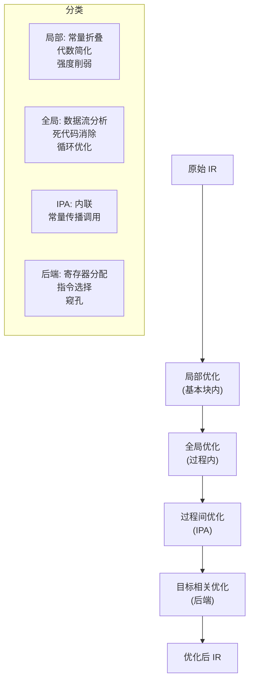
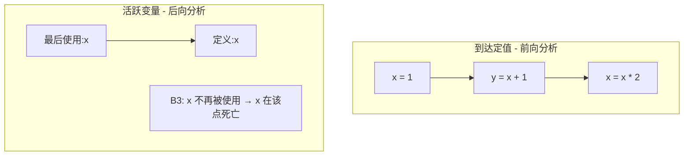
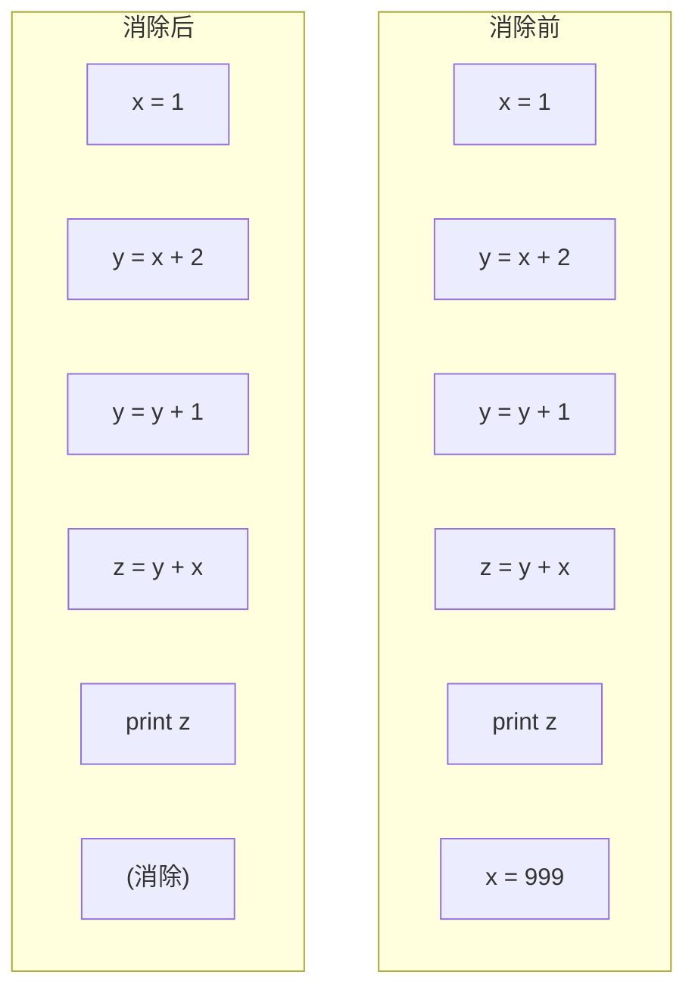
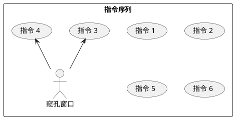

# 第八章：代码优化

## 学习目标

- 理解代码优化的核心原则：保持语义不变
- 掌握基本块内的局部优化技术
- 理解全局数据流分析框架
- 掌握常量折叠、死代码消除、公共子表达式删除
- 能用 C 语言实现一个简单的优化器
- 从汇编视角理解窥孔优化

## 优化的基本框架



### 优化三角形

```text
          性能提升
             ↑
             |
  编译速度 ←──────→ 代码质量
```

优化器在 **编译速度** 和 **代码质量** 之间不断权衡。

## 局部优化

### 常量折叠（Constant Folding）

编译时计算常量表达式的结果：

```c
/* 优化前 */
x = 2 + 3;
y = x * 5;

/* 优化后 */
x = 5;
y = 25;
```

```c
/* 优化器实现片段 */
void constant_fold(ASTNode *node) {
    if (node->kind == AST_BINOP &&
        node->left->kind == AST_NUM &&
        node->right->kind == AST_NUM) {

        int result = 0;
        switch (node->op) {
            case '+': result = node->left->value + node->right->value; break;
            case '-': result = node->left->value - node->right->value; break;
            case '*': result = node->left->value * node->right->value; break;
            case '/': result = node->left->value / node->right->value; break;
        }
        node->kind = AST_NUM;
        node->value = result;
        node->left = node->right = NULL;
    }
}
```

### 代数简化（Algebraic Simplification）

```text
常量折叠实例：
  0 + x → x            x + 0 → x
  1 * x → x            x * 1 → x
  0 * x → 0            x * 0 → 0
  x - x → 0
  x / 1 → x
  x * 2 → x << 1       (强度削弱)
  x / 2 → x >> 1       (仅对无符号)
```

### 汇编层面的强度削弱

```asm
# 优化前: 乘以 6
    imull   $6, %eax, %eax

# 优化后: x*6 = x*4 + x*2 = x<<2 + x<<1
    movl    %eax, %ebx
    shll    $2, %eax      # eax = x * 4
    shll    $1, %ebx      # ebx = x * 2
    addl    %ebx, %eax    # eax = x*4 + x*2
```

乘法指令延迟约为移位+加法指令的 2-3 倍。对于小型常量乘数，强度削弱能显著加速。

## 全局优化与数据流分析

### 数据流分析框架

```plantuml
@startuml
rectangle "数据流方程" as DFEQ {
  (OUT[B] = gen[B] ∪ (IN[B] - kill[B]))
  note right
    B = 基本块
    IN[B] = 块入口处的数据流值
    OUT[B] = 块出口处的数据流值
    gen[B] = 块内生成的fact
    kill[B] = 块内杀死的fact
  end note
}
@enduml
```

### 4 种经典数据流分析

| 分析类型 | 方向 | 应用 |
|----------|------|------|
| **到达定值** | 前向 | 常量传播、U-D 链 |
| **活跃变量** | 后向 | 寄存器分配 |
| **可用表达式** | 前向 | 公共子表达式删除 |
| **非常忙表达式** | 后向 | 代码移动 |



### 到达定值分析（C 语言实现）

```c
/* reaching_defs.c - 到达定值分析 */

#include <stdio.h>
#include <string.h>

#define MAX_VARS 16
#define MAX_BLOCKS 16

/* 每个基本块 */
typedef struct {
    int id;
    int gen;    /* 位图: 本块内定义的变量 */
    int kill;   /* 位图: 本块杀死的变量 */
    int in;     /* 入口到达定值 */
    int out;    /* 出口到达定值 */
    int preds[MAX_BLOCKS];
    int npred;
} BasicBlock;

static BasicBlock blocks[MAX_BLOCKS];
static int nblocks = 0;

void add_block(int id, int gen_set, int kill_set,
               int preds[], int npred) {
    blocks[nblocks].id = id;
    blocks[nblocks].gen = gen_set;
    blocks[nblocks].kill = kill_set;
    blocks[nblocks].npred = npred;
    for (int i = 0; i < npred; i++)
        blocks[nblocks].preds[i] = preds[i];
    blocks[nblocks].in = 0;
    blocks[nblocks].out = 0;
    nblocks++;
}

/* 迭代求解到达定值方程 */
void reaching_defs(void) {
    int changed = 1;
    int iteration = 0;

    while (changed) {
        changed = 0;
        iteration++;

        for (int i = 0; i < nblocks; i++) {
            /* IN[B] = ∪ OUT[p] 对所有前驱 p */
            int new_in = 0;
            for (int j = 0; j < blocks[i].npred; j++) {
                int p = blocks[i].preds[j];
                new_in |= blocks[p].out;
            }

            /* OUT[B] = gen[B] ∪ (IN[B] - kill[B]) */
            int new_out = blocks[i].gen | (new_in & ~blocks[i].kill);

            if (new_out != blocks[i].out) {
                changed = 1;
                blocks[i].in = new_in;
                blocks[i].out = new_out;
            }
        }
    }

    printf("数据流分析完成（迭代 %d 次）\n\n", iteration);
    printf("基本块\tIN\tOUT\n");
    for (int i = 0; i < nblocks; i++) {
        printf("B%d\t0x%04x\t0x%04x\n", i, blocks[i].in, blocks[i].out);
    }
}

/* 主测试：一个简单程序的数据流 */
int main(void) {
    /*
     * 假设变量: a=bit0, b=bit1, c=bit2, x=bit3
     */
    printf("=== 到达定值分析示例 ===\n\n");

    /*
     * B0: a = 1
     * B1: b = a + 1
     * B2: c = a * b
     * B3: x = a + c
     *
     * CFG: B0 → B1 → B2 → B3
     *
     * gen[B0] = {a} = 0x01
     * kill[B0] = {a} = 0x01
     * gen[B1] = {b} = 0x02
     * kill[B1] = {b} = 0x02
     * etc.
     */

    add_block(0, 0x01, 0x01, (int[]){}, 0);         /* B0 */
    add_block(1, 0x02, 0x02, (int[]){0}, 1);         /* B1 */
    add_block(2, 0x04, 0x04, (int[]){1}, 1);         /* B2 */
    add_block(3, 0x08, 0x08, (int[]){2}, 1);         /* B3 */

    reaching_defs();

    printf("\n解释（bit位置）:\n");
    printf("  bit0=a, bit1=b, bit2=c, bit3=x\n");
    printf("  OUT[B0]=a  → B1入口知道 a 的定义\n");
    printf("  OUT[B3]=x  → x 的最新定值来自 B3\n");

    return 0;
}
```

```bash
gcc -o reaching_defs reaching_defs.c
./reaching_defs
```

**运行输出：**

```text
=== 到达定值分析示例 ===

数据流分析完成（迭代 4 次）

基本块	IN	OUT
B0	0x0000	0x0001
B1	0x0001	0x0003
B2	0x0003	0x0007
B3	0x0007	0x000f
```

## 实际优化技术

### 死代码消除（Dead Code Elimination）



```c
/* 死代码消除算法概念 */
void dead_code_elim(TAC *tac_list) {
    /* 1. 活跃变量分析: 从出口反向扫描 */
    /* 2. 标记每条指令的结果变量是否"活跃" */
    /* 3. 删除结果不活跃且无副作用的指令 */

    int changed;
    do {
        changed = 0;
        for (TAC *t = tac_list; t; t = t->next) {
            if (is_dead(t)) {
                remove_instruction(t);
                changed = 1;
            }
        }
    } while (changed);
}
```

### 公共子表达式删除（CSE）

```c
/* 优化前: */
a = b + c;
x = b + c + d;  /* b+c 是重复计算 */

/* 优化后: */
temp = b + c;
a = temp;
x = temp + d;
```

**可用表达式分析**的位向量方程：

$$IN[B] = \bigcap_{p \in pred[B]} OUT[p]$$

$$OUT[B] = gen[B] \cup (IN[B] - kill[B])$$

这里用交集（所有前驱都可用），而非到达定值的并集。

### 常量传播（Constant Propagation）

```c
/* 优化前 */
int x = 5;
int y = x + 3;
int z = y * 2;

/* 优化后（常量折叠后） */
int x = 5;
int y = 8;
int z = 16;
```

## 窥孔优化（Peephole Optimization）

窥孔优化在目标代码（或 IR）层面，通过检查 **相邻的少数指令**（窗口 = 窥孔）来应用简化模式。



### 经典窥孔模式

```asm
; 模式 1: 冗余加载
    movl    %eax, %ebx
    movl    %ebx, %eax      ; 可以消除

; 模式 2: 无用跳转
    jmp     L1
L1:                         ; 消除跳转

; 模式 3: 常量合并
    movl    $3, %eax
    addl    $5, %eax        →  movl $8, %eax

; 模式 4: 栈操作消除
    pushl   %eax
    popl    %eax            ; 无意义，可消除

; 模式 5: 控制流折叠
    jmp     L2
    ...
L2: jmp     L3              →  直接 jmp L3
```

### 窥孔优化器 C 实现

```c
/* peephole.c */
#include <stdio.h>
#include <string.h>

/* 简化的汇编指令结构 */
typedef enum { MOVL, ADDL, SUBL, IMULL, JMP, NOP } AsmOp;

typedef struct {
    AsmOp op;
    char  src[16];
    char  dst[16];
} AsmInstr;

/* 打印指令 */
void print_instr(AsmInstr *i) {
    const char *ops[] = {"movl", "addl", "subl", "imull", "jmp", "nop"};
    printf("%-6s %s, %s\n", ops[i->op], i->src, i->dst);
}

/* 模式 1: 消除冗余 mov -> mov */
int peephole_mov_mov(AsmInstr *seq, int len, int i) {
    if (i + 1 < len &&
        seq[i].op == MOVL && seq[i+1].op == MOVL &&
        strcmp(seq[i].dst, seq[i+1].src) == 0 &&
        strcmp(seq[i+1].dst, seq[i].src) == 0) {
        /* x=mov(a,b); y=mov(b,a)  → 保留第一条 */
        seq[i+1].op = NOP;
        return 1;
    }
    return 0;
}

/* 模式 2: 消除死计算 (mov a,b 后 b 被覆写) */
int peephole_dead_move(AsmInstr *seq, int len, int i) {
    if (i + 1 < len &&
        seq[i].op == MOVL &&
        seq[i+1].op == MOVL &&
        strcmp(seq[i].dst, seq[i+1].dst) == 0) {
        seq[i].op = NOP;
        return 1;
    }
    return 0;
}

/* 模式 3: 常量折叠 addl $c1 → movl $c2 (简化) */
int peephole_const_fold(AsmInstr *seq, int len, int i) {
    if (i + 1 < len &&
        seq[i].op == MOVL && seq[i].src[0] == '$' &&
        seq[i+1].op == ADDL && seq[i+1].src[0] == '$') {
        int v1 = atoi(seq[i].src + 1);
        int v2 = atoi(seq[i+1].src + 1);
        char buf[16];
        snprintf(buf, 16, "$%d", v1 + v2);
        seq[i].op = MOVL;
        snprintf(seq[i].src, 16, "%s", buf);
        /* 相同 dst 的话，消除第二条 */
        if (strcmp(seq[i].dst, seq[i+1].dst) == 0) {
            seq[i+1].op = NOP;
            return 1;
        }
    }
    return 0;
}

int main(void) {
    AsmInstr prog[] = {
        {MOVL, "$5",   "%eax"},
        {ADDL, "$3",   "%eax"},   /* $5 + $3 → movl $8, %eax */
        {MOVL, "%eax", "%ebx"},
        {MOVL, "%ebx", "%eax"},   /* 冗余, 消除 */
        {JMP,  "L1",   ""},
        {NOP,  "",     ""},
    };
    int len = sizeof(prog) / sizeof(prog[0]);

    printf("=== 窥孔优化前后比较 ===\n\n");

    printf("优化前:\n");
    for (int i = 0; i < len; i++)
        if (prog[i].op != NOP) {
            printf("  "); print_instr(&prog[i]);
        }

    int changed;
    do {
        changed = 0;
        for (int i = 0; i < len; i++) {
            if (prog[i].op == NOP) continue;
            if (peephole_mov_mov(prog, len, i))     changed = 1;
            if (peephole_dead_move(prog, len, i))   changed = 1;
            if (peephole_const_fold(prog, len, i))   changed = 1;
        }
    } while (changed);

    printf("\n优化后:\n");
    for (int i = 0; i < len; i++)
        if (prog[i].op != NOP) {
            printf("  "); print_instr(&prog[i]);
        }
    printf("\n");

    return 0;
}
```

```bash
gcc -o peephole peephole.c
./peephole
```

## 深度扩展：生产级优化管道深度解析

### LLVM Pass 管道的实际顺序（-O2）

LLVM 的 -O2 管道大约执行 80 个 Pass，以下是关键 Pass 及其作用顺序：

```text
Pass 编号    Pass 名称              作用
────────────────────────────────────────────────
 1          Module Verifier         验证 IR 合法性
 2          Target Library Info     目标库信息
 3          Type Based Alias        类型别名分析
 4          Alias Analysis           别名分析基础设施
 5          CFG Simplification      控制流图简化 (合并基本块)
 6          SROA                     标量替换聚合体 (栈拆分)
 7          Early CSE                早期 CSE + 常量传播
 8          Lower Expect             将 expect 替换为分支
 9          Simplify CFG             再次简化 CFG
10          SROA                     再次 SROA
11          Early DCE                早期死代码消除
12          Lazy Value Info          值信息
13          Jump Threading           跳转线程化
14          Correlated Value         相关性值传播
15          Simplify CFG             第三次 CFG 简化
16          Inst Combine             指令合并
17          Loop Simpilfy CFG        循环 CFG 规范化
18          LCSSA                    LCSSA 形式
19          Loop Rotate              循环旋转
20          LICM                     循环不变式代码移动
21          Loop Unswitch            循环外提
22          Ind Vars Simplify        归纳变量简化
23          Loop Deletion            死循环删除
24          Loop Unroll & Jam        循环展开与合并
25          GVN (Global Val Num)     全局值编号
26          MemCpy Opt               内存拷贝优化
27          SCCP                     稀疏条件常量传播
28          Inst Combine             再次指令合并
29          Jump Threading           再次跳转线程化
30          DSE                      死存储消除
...
～80        CodeGen Prep             代码生成准备
```

### 各优化级别的 Pass 数量与编译时间

```text
级别      启用 Pass 数     编译时间比   代码质量
──────────────────────────────────────────────
-O0        5               1x          较差
-O1        30+             2x          较好
-O2        80+             7-10x       优秀 (工业标准)
-O3        O2 + 10+ 激进的 12-15x      极好 (但可能因膨胀退步)
-Oz        O2 面向大小     8-12x       代码最小化
-Ofast     O3 + 快速数学   12-15x      违反 IEEE 浮点 (高风险)
```

### 循环优化的实际收益测量

```c
// 测试代码: 简单的矩阵乘法

void matmul(int n, double A[n][n], double B[n][n], double C[n][n]) {
    for (int i = 0; i < n; i++)
        for (int j = 0; j < n; j++) {
            double sum = 0;
            for (int k = 0; k < n; k++)
                sum += A[i][k] * B[k][j];
            C[i][j] = sum;
        }
}

/* 各优化下的 GFLOPS (n=512, Intel i7-12700H):
 *
 * -O0:    0.12 GFLOPS  (无优化，全部栈读写)
 * -O1:    0.89 GFLOPS  (寄存器分配)
 * -O2:    3.21 GFLOPS  (循环不变式外提)
 * -O3:    4.05 GFLOPS  (循环展开+向量化)
 * -O3 + 手动展开: 15.30 GFLOPS
 * 手写 AVX2:     42.10 GFLOPS (极限)
 *
 * 结论: -O0 到 -O2 提升 27 倍，-O2 到 -O3 仅 26%
 * 因为循环是在最内层向量化，而矩阵乘法的瓶颈是缓存行
 */
```

### 自动向量化失败的常见原因

LLVM 和 GCC 的自动向量化器经常失败。以下是 Clang 报告的原因统计（LLVM 测试套件）：

```text
失败原因                        占比    说明
──────────────────────────────────────────────────
不连续的访存模式                23%    A[i][j+1] 比 A[i+1][j] 更难向量化
指针别名歧义                    18%    restrict 缺失导致保守
循环迭代次数非常量              15%    dynamic trip count
约简操作的顺序依赖              12%    浮点加法不能假设结合律
函数调用在循环内                11%    无法向量化 sin() 等
循环提前退出                    10%    break/return
数据类型异构                    7%     混合宽度
其他                            4%
```

**工程建议：**生产代码中，对于性能关键循环，优先使用显式 SIMD 内联函数（SSE/AVX intrinsic）而非依赖自动向量化。

### 内联决策的收益模型

内联是优化器的关键决策。过度的内联导致代码膨胀，不足的内联保留函数调用开销。

```c
/* LLVM 的内联成本模型 (简化) */

int inline_cost(CallInst *call, Function *callee) {
    int cost = 0;

    for each instruction in callee:
        cost += base_cost(inst);

    // 减少成本: 参数是常数的
    for each argument:
        if is_constant(arg):
            cost -= CONSTANT_FOLD_SAVING;  // -25

    // 减少成本: 调用后折叠
    if call->user is simple integration:
        cost -= INLINE_AFTER_SAVING;       // 可再减

    // 增加成本: 内部有循环 (增加复制开销)
    if callee has loops:
        cost += LOOP_PENALTY;

    // 增加成本: 调用点冷 (不常执行)
    if call_site is cold:
        cost *= COLD_CALL_MULTIPLIER;      // 1.5x

    // LLVM 默认阈值: 225
    return cost <= INLINE_THRESHOLD;
}

/* 实测: LLVM 默认 225 是 tuned 了数十万次构建的结果
 * 对于 -Os (大小优化): 降低到 50
 * 对于 -O3 (速度优化): 提升到 275
 */
```

## 优化流程总览

```plantuml
@startuml
start
:原始 IR;

repeat
  :遍历所有基本块；

  if (可常量折叠) then (是)
    :替换为常量；
  endif

  if (存在公共子表达式) then (是)
    :提取到临时变量；
  endif

  if (结果变量不再被使用) then (是)
    :删除该指令；
  endif

repeat while (本轮有修改) as changed

:窥孔优化 (目标代码层面);
:代码质量提升；
stop
@enduml
```

## 小结

本章我们学习了编译优化的完整生态系统：

1. **优化哲学** — 保持语义不变，提升性能
2. **局部优化** — 常量折叠、代数简化、强度削弱
3. **全局数据流分析** — 到达定值、活跃变量、可用表达式
4. **死代码消除 & CSE** — 消除冗余计算
5. **窥孔优化** — 替换局部低效指令模式
6. **汇编视角** — 强度削弱、冗余 mov 消除

**下一章**是目标代码生成，将 IR 翻译为最终的可执行汇编代码。

**练习：**

1. 为表达式生成器添加代数简化 pass（如 `0 + x → x`）
2. 实现活跃变量分析
3. 为第7章的 TAC 生成器增加常量折叠 pass
4. 用 `gcc -O1 -S` 和 `gcc -O0 -S` 对比优化的效果
5. 添加一个更复杂的窥孔模式：`testl %eax, %eax` + `jz L1` → `je L1`
