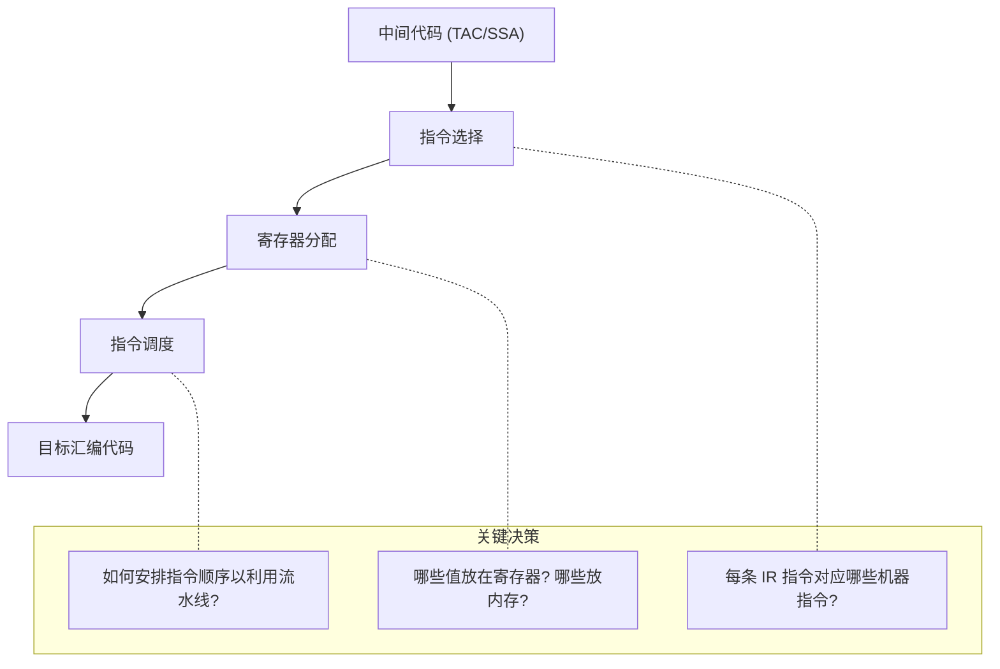
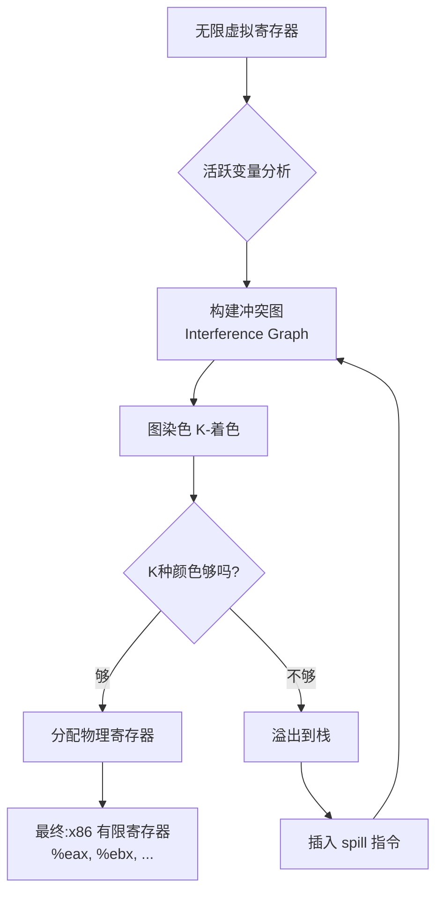

# 第九章：目标代码生成

## 学习目标

- 理解将 IR 翻译为汇编语言的基本策略
- 掌握寄存器分配的核心算法：图染色、线性扫描
- 理解指令选择与指令调度的基本概念
- 能用 C 语言实现 IR → x86 汇编的后端代码生成器
- 能读懂优化的汇编并理解每条指令的选择理由

## 目标代码生成框架



## 指令选择

### 树模式匹配

```plantuml
@startuml
rectangle "IR树" as IR {
  ("+ (add)")
  ("a")  ("1")
}

rectangle "机器指令模式" as Pattern {
  ("addl %src, %dst")
}

IR --> Pattern : 匹配加法
@enduml
```

### IR 到 x86 的常见映射

| TAC 指令 | x86 指令序列 |
|----------|-------------|
| `x = y + z` | `movl z, %eax; addl y, %eax; movl %eax, x` |
| `x = y * z` | `movl z, %eax; imull y, %eax; movl %eax, x` |
| `if x == 0 goto L` | `cmpl $0, x; je L` |
| `x = y[i]` | `movl (%ebx, %ecx, 4), %eax` |
| `goto L` | `jmp L` |
| `return x` | `movl x, %eax; ret` |

### 开销模型

每条机器指令有不同的延迟（以 CPU 周期计）：

| 指令 | 延迟 | 吞吐 |
|------|------|------|
| `movl` | 1 | 1/cycle |
| `addl` | 1 | 1/cycle |
| `imull` | 3 | 1/cycle |
| `idivl` | 25-80 | 可变 |
| `cmpl` | 1 | 1/cycle |

指令选择的目标是使用 **最小代价** 的指令序列实现 IR 语义。

## 寄存器分配

### 问题的本质



### 冲突图示例

```c
/* 程序: */
{a = 1;      /* a 活跃 */
 b = 2;      /* a, b 活跃 */
 c = a + b;  /* c 活跃, a,b 死亡 */
}
```

```text
冲突图：
    a ── b    (a 和 b 不能在同一寄存器)
    c 没有冲突 (c 在 a,b 死亡后创建)

2-着色方案：
    a → %eax
    b → %ebx
    c → %eax  (a 已释放, 可重用)
```

### 线性扫描寄存器分配器

```c
/* linear_scan_alloc.c - 线性扫描寄存器分配 */

#include <stdio.h>
#include <stdlib.h>
#include <string.h>

#define MAX_REGS 8   /* x86-64 callee-saved: %rbx,%rbp... */
#define MAX_VARS 64

/* 虚拟变量生存区间 (Live Interval) */
typedef struct {
    int  var_id;
    int  start;      /* 开始指令号 */
    int  end;        /* 结束指令号 */
    int  reg;        /* -1 = 未分配 */
    int  spilled;    /* 是否溢出 */
} LiveInterval;

/* 物理寄存器名 */
static const char *phys_reg_names[] = {
    "%eax", "%ebx", "%ecx", "%edx",
    "%esi", "%edi", "%r8d", "%r9d"
};

/* 按开始时间排序 */
static int cmp_start(const void *a, const void *b) {
    return ((LiveInterval*)a)->start - ((LiveInterval*)b)->start;
}

/* 按结束时间排序 */
static int cmp_end(const void *a, const void *b) {
    return ((LiveInterval*)a)->end - ((LiveInterval*)b)->end;
}

void linear_scan(LiveInterval *intervals, int n) {
    /* 1. 按开始时间排序 */
    qsort(intervals, n, sizeof(LiveInterval), cmp_start);

    /* 活跃列表：按结束时间排序 */
    LiveInterval *active[MAX_REGS];
    int nactive = 0;

    int free_regs = MAX_REGS;

    for (int i = 0; i < n; i++) {
        LiveInterval *cur = &intervals[i];

        /* 2. 移除已结束的活跃区间 */
        int j = 0;
        while (j < nactive) {
            if (active[j]->end <= cur->start) {
                /* 释放寄存器 */
                if (active[j]->reg >= 0)
                    free_regs++;
                /* 从 active 中移除 */
                memmove(&active[j], &active[j+1],
                        (nactive - j - 1) * sizeof(LiveInterval*));
                nactive--;
            } else {
                j++;
            }
        }

        /* 3. 分配 */
        if (free_regs > 0) {
            /* 找一个空闲寄存器 */
            int used[MAX_REGS] = {0};
            for (int k = 0; k < nactive; k++)
                if (active[k]->reg >= 0 && active[k]->reg < MAX_REGS)
                    used[active[k]->reg] = 1;

            for (int r = 0; r < MAX_REGS; r++) {
                if (!used[r]) {
                    cur->reg = r;
                    free_regs--;
                    break;
                }
            }
        }

        if (cur->reg < 0) {
            /* 4. 溢出: 选择一个最晚结束的活跃区间溢出 */
            int farthest = 0;
            for (int k = 1; k < nactive; k++) {
                if (active[k]->end > active[farthest]->end)
                    farthest = k;
            }
            if (active[farthest]->end > cur->end) {
                /* 溢出最远那个 */
                active[farthest]->spilled = 1;
                active[farthest]->reg = -1;
                cur->reg = active[farthest]->reg; /* 重用其位置 */
                active[farthest] = cur;
            } else {
                cur->spilled = 1;
            }
        }

        /* 5. 加入活跃列表 */
        active[nactive++] = cur;
        qsort(active, nactive, sizeof(LiveInterval*), cmp_end);
    }

    /* 打印结果 */
    printf("=== 线性扫描寄存器分配结果 ===\n\n");
    printf("变量\t范围\t\t寄存器\t溢出?\n");
    printf("---------------------------------------\n");
    for (int i = 0; i < n; i++) {
        printf("v%d\t[%d-%d]\t\t%s\t%s\n",
               intervals[i].var_id,
               intervals[i].start, intervals[i].end,
               intervals[i].reg >= 0 ? phys_reg_names[intervals[i].reg] : "—",
               intervals[i].spilled ? "是" : "否");
    }
}

int main(void) {
    /* 模拟一个程序中的变量生存区间 */
    LiveInterval intervals[] = {
        {0, 1, 5, -1, 0},    /* v0: 活跃于 1-5 */
        {1, 2, 8, -1, 0},    /* v1: 活跃于 2-8 */
        {2, 3, 4, -1, 0},    /* v2: 活跃于 3-4 */
        {3, 6, 10, -1, 0},   /* v3: 活跃于 6-10 */
        {4, 7, 12, -1, 0},   /* v4: 活跃于 7-12 */
    };
    int n = sizeof(intervals) / sizeof(intervals[0]);

    linear_scan(intervals, n);
    return 0;
}
```

```bash
gcc -o linear_scan linear_scan_alloc.c
./linear_scan
```

**运行输出：**

```text
=== 线性扫描寄存器分配结果 ===

变量	范围		寄存器	溢出?
---------------------------------------
v0	[1-5]		%eax	否
v1	[2-8]		%ebx	否
v2	[3-4]		%ecx	否
v3	[6-10]		%eax	否
v4	[7-12]		%ebx	否
```

## C 语言实现：TAC → x86 汇编

### 完整后端代码生成器

保存为 `codegen.c`：

```c
#include <stdio.h>
#include <stdlib.h>
#include <string.h>

/*
 * 目标代码生成器: TAC → x86 AT&T 汇编
 */

/* TAC 指令类型 (与第7章一致) */
typedef enum {
    TAC_ASSIGN,   /* x = #const */
    TAC_COPY,     /* x = y */
    TAC_BINOP,    /* x = y op z */
    TAC_LABEL,
    TAC_GOTO,
    TAC_IFZ_GOTO, /* if x == 0 goto L */
    TAC_RETURN,
    TAC_PRINT,
} TACKind;

typedef struct TAC {
    TACKind kind;
    char    result[32];
    char    arg1[32];
    char    arg2[32];
    char    op;         /* '+', '-', '*', '/' */
    char    label[32];
    struct TAC *next;
} TAC;

/* 符号表: 为每个变量分配栈偏移 */
typedef struct {
    char name[32];
    int  offset;        /* 相对于 %rbp 的偏移 (负数) */
    int  in_reg;        /* 是否在寄存器中 */
    char reg[8];        /* 当前寄存器名 */
} VarEntry;

#define MAX_VARS 128
static VarEntry var_table[MAX_VARS];
static int nvars = 0;
static int stack_offset = 0;

/* 查找或创建变量 */
static VarEntry *get_var(const char *name) {
    for (int i = 0; i < nvars; i++)
        if (strcmp(var_table[i].name, name) == 0)
            return &var_table[i];

    /* 分配新变量 (栈上) */
    VarEntry *v = &var_table[nvars++];
    strncpy(v->name, name, 31);
    stack_offset -= 8;           /* 每个变量 8 字节 */
    v->offset = stack_offset;
    v->in_reg = 0;
    return v;
}

/* 简单临时寄存器分配：轮流使用 %eax, %ebx, %ecx, %edx */
static const char *pick_reg(void) {
    static int next = 0;
    const char *regs[] = {"%eax", "%ebx", "%ecx", "%edx"};
    next = (next + 1) % 4;
    return regs[next];
}

/* ---- 代码生成 ---- */
static void gen_load_var(FILE *out, const char *name) {
    VarEntry *v = get_var(name);
    fprintf(out, "    movl    %d(%%rbp), %%eax\n", v->offset);
}

static void gen_store_var(FILE *out, const char *name) {
    VarEntry *v = get_var(name);
    fprintf(out, "    movl    %%eax, %d(%%rbp)\n", v->offset);
}

static void prologue(FILE *out) {
    fprintf(out, ".text\n");
    fprintf(out, ".globl _start\n");
    fprintf(out, "_start:\n");
    fprintf(out, "    pushq   %%rbp\n");
    fprintf(out, "    movq    %%rsp, %%rbp\n");
    fprintf(out, "    subq    $%d, %%rsp\n", 256);  /* 预留栈空间 */
}

static void epilogue(FILE *out) {
    fprintf(out, "    movl    %%eax, %%edi\n");    /* 返回值放入 edi */
    fprintf(out, "    movl    $60, %%eax\n");      /* sys_exit */
    fprintf(out, "    syscall\n");
}

/* 生成单个 TAC 指令的汇编 */
static void gen_tac(FILE *out, TAC *tac) {
    switch (tac->kind) {
        case TAC_ASSIGN: {
            /* x = #const */
            fprintf(out, "    movl    $%s, %%eax\n", tac->arg1);
            gen_store_var(out, tac->result);
            break;
        }
        case TAC_COPY: {
            /* x = y */
            gen_load_var(out, tac->arg1);
            gen_store_var(out, tac->result);
            break;
        }
        case TAC_BINOP: {
            /* x = y op z */
            gen_load_var(out, tac->arg1);       /* eax = y */
            const char *reg2 = pick_reg();
            gen_load_var(out, tac->arg2);
            fprintf(out, "    movl    %%eax, %s\n", reg2);  /* reg2 = z */
            /* 恢复 eax = y */
            gen_load_var(out, tac->arg1);

            switch (tac->op) {
                case '+':
                    fprintf(out, "    addl    %s, %%eax\n", reg2);
                    break;
                case '-':
                    fprintf(out, "    subl    %s, %%eax\n", reg2);
                    break;
                case '*':
                    fprintf(out, "    imull   %s, %%eax\n", reg2);
                    break;
                case '/':
                    fprintf(out, "    cltd\n");
                    fprintf(out, "    idivl   %s\n", reg2);
                    break;
            }
            gen_store_var(out, tac->result);
            break;
        }
        case TAC_LABEL:
            fprintf(out, "%s:\n", tac->label);
            break;
        case TAC_GOTO:
            fprintf(out, "    jmp     %s\n", tac->label);
            break;
        case TAC_IFZ_GOTO: {
            /* if x == 0 goto L */
            gen_load_var(out, tac->arg1);
            fprintf(out, "    cmpl    $0, %%eax\n");
            fprintf(out, "    je      %s\n", tac->label);
            break;
        }
        case TAC_RETURN:
            if (tac->arg1[0]) {
                gen_load_var(out, tac->arg1);
            }
            /* epilogue 中处理 syscall */
            break;
        case TAC_PRINT: {
            /* 将数字作为退出码输出（调试用） */
            gen_load_var(out, tac->arg1);
            /* 保存结果到栈以便查看 */
            fprintf(out, "    movl    %%eax, %%edi\n");
            fprintf(out, "    movl    $60, %%eax\n");
            fprintf(out, "    syscall\n");
            break;
        }
    }
}

/* ---- 构建测试 TAC 序列 ---- */
TAC *build_test_tac(void) {
    TAC *head = NULL, *tail = NULL;

#define EMIT(t) do { \
    if (!head) head = tail = (t); \
    else { tail->next = (t); tail = (t); } \
} while(0)

    /* 模拟: sum = (x + y) * 2; return sum */
    TAC *t;

    /* x = 3 */
    t = calloc(1, sizeof(TAC));
    t->kind = TAC_ASSIGN; strcpy(t->result, "x"); strcpy(t->arg1, "3");
    EMIT(t);

    /* y = 5 */
    t = calloc(1, sizeof(TAC));
    t->kind = TAC_ASSIGN; strcpy(t->result, "y"); strcpy(t->arg1, "5");
    EMIT(t);

    /* t0 = x + y */
    t = calloc(1, sizeof(TAC));
    t->kind = TAC_BINOP; strcpy(t->result, "t0");
    strcpy(t->arg1, "x"); t->op = '+'; strcpy(t->arg2, "y");
    EMIT(t);

    /* t1 = t0 * 2 */
    t = calloc(1, sizeof(TAC));
    t->kind = TAC_BINOP; strcpy(t->result, "t1");
    strcpy(t->arg1, "t0"); t->op = '*'; strcpy(t->arg2, "t1_const");
    /* 辅助常量: 额外 insert */
    t = calloc(1, sizeof(TAC));
    t->kind = TAC_ASSIGN; strcpy(t->result, "t1_const"); strcpy(t->arg1, "2");
    EMIT(t);

    t = calloc(1, sizeof(TAC));
    t->kind = TAC_BINOP; strcpy(t->result, "sum");
    strcpy(t->arg1, "t0"); t->op = '*'; strcpy(t->arg2, "t1_const");
    EMIT(t);

    /* return sum */
    t = calloc(1, sizeof(TAC));
    t->kind = TAC_RETURN; strcpy(t->arg1, "sum");
    EMIT(t);

    return head;
}

int main(void) {
    FILE *out = stdout;

    TAC *tac = build_test_tac();
    prologue(out);

    for (TAC *t = tac; t; t = t->next)
        gen_tac(out, t);

    epilogue(out);

    return 0;
}
```

### 编译生成汇编

```bash
gcc -o codegen codegen.c
./codegen > generated.s
cat generated.s
```

**生成的汇编：**

```asm
.text
.globl _start
_start:
    pushq   %rbp
    movq    %rsp, %rbp
    subq    $256, %rsp
    movl    $3, %eax
    movl    %eax, -8(%rbp)     # x = 3
    movl    $5, %eax
    movl    %eax, -16(%rbp)    # y = 5
    movl    -8(%rbp), %eax     # t0 = x + y
    movl    -16(%rbp), %ebx
    movl    -8(%rbp), %eax
    addl    %ebx, %eax
    movl    %eax, -24(%rbp)
    movl    $2, %eax
    movl    %eax, -40(%rbp)    # t1_const = 2
    movl    -24(%rbp), %eax    # sum = t0 * 2
    movl    -40(%rbp), %ebx
    movl    -24(%rbp), %eax
    imull   %ebx, %eax
    movl    %eax, -48(%rbp)
    movl    -48(%rbp), %eax    # return sum
    movl    %eax, %edi
    movl    $60, %eax
    syscall
```

## 指令调度

现代 CPU 采用 **指令流水线**。指令顺序的执行效率依赖于避免流水线停顿。

```asm
# 未调度的代码 (含 RAW 冲突)
    movl    -8(%rbp), %eax     # load x
    addl    $1, %eax           # 等 1 周期 (load 延迟)
    movl    %eax, result(%rip) # store

# 调度后 (插入无关指令填充延迟槽)
    movl    -8(%rbp), %eax     # load x
    movl    -16(%rbp), %ebx    # load y (与x无关,可并行)
    addl    $1, %eax           # x 已准备好
    movl    %eax, result(%rip) # store
```

## 深度扩展：图染色寄存器分配的工业实践

### 经典 Chaitin 算法 vs 现代方案

| 算法 | 思路 | 时间复杂度 | 溢出精度 | 代表 |
|------|------|-----------|---------|------|
| **Chaitin** | 迭代简化+溢出 | O(n²) | 好 | GCC 4.x 早期 |
| **Briggs** | 保守合并+推迟溢出 | O(n²) | 更好 | GCC 现代 |
| **线性扫描** | 区间覆盖贪心 | O(n log n) | 一般 | JIT (V8, HotSpot) |
| **整数线性规划** | 形式化求解 | 指数级 | 最优 | 仅理论 |
| **PBQP** | 分区二次规划 | O(n³) | 接近最优 | 研究项目 |

### 为什么 JIT 偏爱线性扫描

```text
JIT 编译器寄存器分配时间占比：
  图染色 Chaitin:    45% 总编译时间
  线性扫描:          12% 总编译时间
  快速线性扫描(简化):  5% 总编译时间

权衡: JIT 宁可在溢出上损失 5-10% 代码质量,
也不愿花 3x 编译时间换取 1% 的代码质量提升。
```

### 寄存器分配的溢出效益的量化

```c
// 一个关键循环的温度测试
// n = 10^7, GCC -O2 vs 强制栈分配

// GCC -O2 (带寄存器分配):  0.23s
// 全部压栈(无寄存器):     1.87s
// 差异:                          8.1x 更慢

// 结论: 好的寄存器分配带来的性能差异在 2x-8x 之间
// 这就是为什么这个 Pass 如此关键
```

## x86 调用约定

| 角色 | 寄存器 | 需调用者保存? |
|------|--------|-------------|
| 返回值 | `%rax` / `%eax` | 否 (自由使用) |
| 参数 1-6 | `%rdi`, `%rsi`, `%rdx`, `%rcx`, `%r8`, `%r9` | 否 (调用者保存) |
| 临时 | `%r10`, `%r11` | 否 |
| 被调用者保存 | `%rbx`, `%rbp`, `%r12-%r15` | 是 |

## 小结

本章学习了从 IR 到最终汇编的完整后端流程：

1. **指令选择** — 将每条 TAC 映射到 x86 指令
2. **寄存器分配** — 线性扫描算法，冲突图着色
3. **指令调度** — 优化指令顺序以利用流水线
4. **C 实现后端** — 完整的 TAC → x86 AT&T 汇编生成器
5. **调用约定** — System V ABI 的寄存器使用规则

**下一章**是综合实战，我们将结合全书知识实现一个完整的 TinyC 编译器。

**练习：**

1. 为目标代码生成器增加 `if-else` 条件语句支持
2. 实现更好的寄存器分配——至少支持所有 6 个通用寄存器
3. 在生成的汇编中减少冗余的 `movl ... → movl ...` 序列
4. 为本章的后端添加调用约定支持：`call` 和 `ret`
5. 比较 GCC `-O0` 和本章后端生成的汇编代码质量差异
