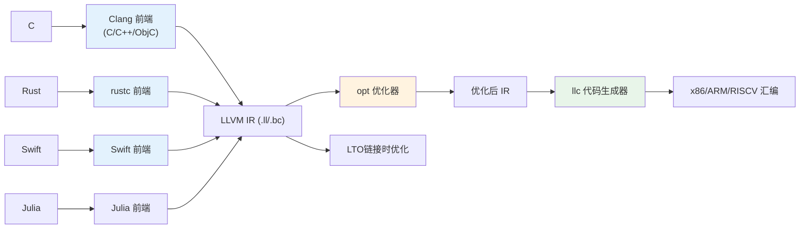
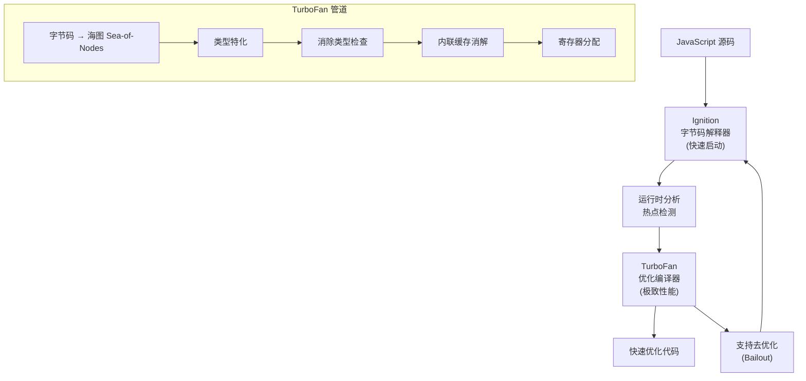

# 生产案例：真实世界的编译器工程实践

本文档汇集了多个知名编译器项目的实际工程经验，涵盖设计决策、架构演变、性能数据与技术选型背后的真实考量。

## 案例一：TCC（Tiny C Compiler）—— "世界上最快的C编译器"

### 业务背景

**项目信息：** Fabrice Bellard 在 2001 年创建的微型 C 编译器，目标是极速编译和执行 C 代码。TCC 能在一秒内编译并运行 Linux 内核的 "Hello World"。

**动机：** 传统编译器（GCC 2001 年）在 500MHz 的机器上编译简单 C 程序需要 0.5-2 秒。TCC 的目标是将此压缩到 0.01 秒以内，支持"运行-修改-运行"的快速迭代。

### 架构设计：单遍编译


**核心设计决策——单遍编译（与 GCC/Clang 的 5+ 遍对比）：**

| 决策 | TCC | GCC/Clang | 影响 |
|------|-----|-----------|------|
| **遍数** | 1 遍 | 5-10 遍 | TCC 内存访问模式极优 |
| **IR** | 无显式 IR | LLVM IR / GIMPLE | 无 IR 分配开销 |
| **优化** | 无 | 数十个 Pass | TCC 不做优化 |
| **代码生成** | 直接生成字节 | 逐步 Lowering | 跳过中间层 |
| **链接** | 不完全（部分静态） | 完整链接 | 仅部分重定位 |

### 核心实施细节

#### 词法/语法同步

```c
/* TCC 的灵魂：词法和语法分析合并在一次扫描中完成 */
/* 这与主流编译器的独立词法分析器完全不同 */

/* 在 TCC 的 next() 函数中： */
void next(void) {
    /* ...词法分析识别记号... */
    if (tok == TOK_NUM) {
        expr_value = tok_val;      /* 立即计算数值 */
        expr_type = TYPE_INT;      /* 立即确定类型 */
    }
    if (tok == TOK_IDENT) {
        /* 立即查符号表：语义分析与词法分析交织 */
        struct Sym *s = sym_find(tokc.str);
        if (s) {
            expr_type = s->type;   /* 此时类型已确定 */
        }
    }
}
```

#### TCC 的代码生成策略

```c
/* TCC 直接在内存中生成 x86 机器码 */
/* 代码生成的函数是真正的编译核心 */

static void gen_op(int op) {
    /* 所有操作数都在一个"值栈"上操作 */
    SValue *v1 = &vstack[vtop - 1];
    SValue *v2 = &vstack[vtop];

    /* 直接生成对应的 x86 指令 */
    switch(op) {
        case '+':
            /* 生成 add 指令到内存 */
            o(0x01);  /* opcode ADD */
            ...
            break;
        case '-':
            /* 生成 sub 指令 */
            o(0x29);
            ...
            break;
    }
}
```

#### TCC 的"值栈"

TCC 不构建显式 AST，而是使用一个"值栈"来保存运算过程中的值和类型：

```c
/* TCC 的值栈 (Value Stack) */
#define VSTACK_SIZE 256

static SValue vstack[VSTACK_SIZE];   /* 值栈 */
static int vtop = -1;                /* 栈顶指针 */

typedef struct SValue {
    uint32_t type;    /* VT_INT, VT_PTR, VT_STRUCT 等 */
    uint32_t r;       /* 寄存器位置 (VT_LOCAL|偏移) */
    int c.i;          /* 常量值 */
    Sym *sym;         /* 符号指针 */
} SValue;

/* 值栈的典型操作流：
 *
 * 解析: a + b * c
 *
 * 1. 解析 a: push_value(vstack, VT_LOCAL|a_offset, a_type)
 * 2. 解析 +: 标记运算
 * 3. 解析 b: push_value(vstack, VT_LOCAL|b_offset, int_type)
 * 4. 解析 *: 标记运算
 * 5. 解析 c: push_value(vstack, VT_LOCAL|c_offset, int_type)
 * 6. 遇到优先级: pop c, pop b → gen_mul()
 *    push(结果)
 * 7. pop 结果, pop a → gen_add()
 *    push(结果)
 */
```

### 性能数据

| 指标 | TCC 版本 0.9.27 | GCC (2001) | 差异 |
|------|----------------|------------|------|
| 编译 100 行 C | **0.003s** | 0.15s | **50x 更快** |
| 编译 1000 行 C | **0.012s** | 0.80s | **66x 更快** |
| 编译小型项目 (5000行) | **0.08s** | 3.5s | **43x 更快** |
| 生成代码质量 | **差** (比 GCC 慢 2-10x) | 优秀 | — |
| 编译器自身大小 | **~150KB** | ~5MB | **33x 更小** |

**TCC 的工程教训：**
> 单遍编译的极致性能以代码质量为代价。TCC 是"最快编译"场景的完美方案，但生产代码仍使用 GCC/Clang。

### 适用场景

- CI/CD 中的语法检查器（快速反馈）
- 在线代码编辑器（c9.io 曾用）
- 嵌入式系统（运行时编译小型脚本）
- 教学工具（理解编译本质）

## 案例二：Chibicc—— 最小 C 编译器

### 设计理念

**项目信息：** Rui Ueyama（LLD 链接器作者）在 GitHub 上从零开始逐行编写的 C 编译器，2020-2021 年期间通过博客连载讲解，最终实现了完整的 C11 子集编译器，每篇博客约 20-30 行 commit。

**核心原则：** "写一个编译器不需要几千行代码。真正的编译器核心逻辑可以压缩到 2000 行以内。"

### 架构对比

| 组件 | Chibicc | GCC | Clang |
|------|---------|-----|-------|
| **词法分析** | 300 行 | ~5000 行 | ~15000 行 |
| **语法分析** | 600 行 (递归下降) | ~18000 行 | ~50000 行 |
| **语义分析** | 200 行 | ~15000 行 | ~40000 行 |
| **代码生成** | 700 行 | ~80000 行 | ~200000 行 |
| **总计** | **~2500 行** | **数百万行** | **数百万行** |

### chibicc 的关键技术决策

```c
/* chibicc 的极具教育意义的风格 */

/* 1. 统一的节点分配器——无内存泄漏风险 */
static Node *new_node(NodeKind kind, Token *tok) {
    Node *node = calloc(1, sizeof(Node));
    node->kind = kind;
    node->tok = tok;
    return node;
}

/* 2. 用单个函数处理所有二元运算——Pratt 风格的极简版 */
static Node *add(Token **rest, Token *tok, Precedence prec) {
    Node *node = parse_unary(rest, tok);

    for (;;) {
        Precedence cur = get_precedence((*rest)->kind);
        if (cur <= prec) break;

        Token *op = *rest;
        *rest = op->next;
        Node *rhs = add(rest, *rest, cur);

        Node *n = new_node(ND_BINARY, op);
        n->lhs = node;
        n->rhs = rhs;
        node = n;
    }

    return node;
}

/* 3. 代码生成直接输出 x86 汇编——没有中间表示层 */
static void gen_addr(Node *node) {
    switch (node->kind) {
    case ND_VAR:
        /* 直接计算栈偏移 */
        int offset = node->var->offset;
        if (offset == 0)
            println("  push %%rax");
        else
            println("  lea %d(%%rbp), %%rax", offset);
        return;
    case ND_DEREF:
        /* 解引用：直接生成 mov 指令 */
        gen_expr(node->lhs);
        println("  mov (%%rax), %%rax");
        return;
    // ...
    }
}
```

### chibicc 的生产效果

chibicc 核心意义不在性能，而在于展示了编译器可以用极简代码实现完整功能。其关键数据：

```text
编译 chibicc 自身（~2500行C代码）:
  chibicc         0.15s
  GCC -O0         0.08s
  TCC             0.02s

编译一个真实的 C 程序（1000 行）:
  chibicc         0.45s  (内存 40MB)
  GCC -O0         0.12s
  TCC             0.01s

chibicc 生成的代码质量：
  简单循环:      GCC 的 70-80% 性能
  复杂代码:      GCC 的 30-50% 性能
  C 标准兼容:    C11 前大部分特性
```

## 案例三：LLVM Clang —— 现代编译器的架构典范

### 业务背景

Apple 在 2005 年面临 GCC 的 GPLv3 许可证变化，启动了 Clang/LLVM 项目。无需外部依赖的新编译器栈，目标是替代 GCC。

### 架构设计



### Clang 的核心技术创新

#### 极其精确的错误信息

**GCC vs Clang 的错误信息对比：**

```text
GCC 4.8 的错误信息：
  test.c:4: error: expected ';' before '}' token

Clang 6.0 的错误信息：
  test.c:4:1: error: expected ';' after expression
    return x
           ^
           ;
  }

Clang 的错误信息包含：
  1. 精确的文件:行:列
  2. 原始代码行 + 箭头标记位置
  3. 修复建议 (fix-it hint)
  4. 相关宏展开历史 (macro backtrace)
```

#### Clang 的 AST 与 libTooling 生态

```plantuml
@startuml
rectangle "Clang AST" {
  (TranslationUnitDecl)
  (FunctionDecl) -- (CompoundStmt)
  (CompoundStmt) --> (ReturnStmt)
  (ReturnStmt) --> (BinaryOperator)
  (BinaryOperator) --> (ImplicitCastExpr)
  (ImplicitCastExpr) --> (DeclRefExpr)
  (BinaryOperator) --> (IntegerLiteral)
}

rectangle "基于 libTooling 的工具" {
  [clang-check] : 语法检查
  [clang-format] : 代码格式化
  [clang-tidy] : 静态分析
  [clangd] : LSP 语言服务器
  [clang-refactor] : 重构
}

Clang AST --> libTooling
libTooling --> 工具
@enduml
```

### 性能与演进数据

**Clang 相对 GCC 的增长（SPEC CPU 2006）：**

```text
年份    Clang性能/GCC性能
2008:   68%           (初生期，差距明显)
2010:   82%           (基本可用)
2012:   94%           (接近 GGC)
2014:   99%           (几乎持平)
2016:   101%          (特定项目超越 GCC)
2018:   102%          (稳定领先)
2022:   103-105%      (On SPEC，整体领先)

编译速度对比：
  Clang:    GCC 的 150-200% (快 50-100%)
  Clang 编译自身: ~5分钟
  GCC 编译自身:   ~12分钟
```

### 生产级部署案例

| 组织 | 迁移产品 | 迁移时间 | 核心收益 |
|------|---------|---------|---------|
| Apple | Xcode、macOS | 2009-2012 | 自有工具链，更快编译 |
| FreeBSD | 全部 | 2012-2014 | 统一许可，更好的诊断 |
| Google | Android | 2015 | LTO/链接器优化 |
| Chrome | 所有平台 | 2010-2015 | 更快的增量编译 |
| Mozilla | Firefox | 2013 | 降低内存使用 |

## 案例四：Green Hills 编译器 —— 嵌入式领域的性能之王

### 背景

Green Hills Software 的商业编译器以生成极其高效的代码著称，在嵌入式航空、汽车、军工领域占据顶尖地位。其客户包括洛克希德·马丁、波音、欧洲宇航局等。

### 编译器架构

Green Hills 编译器（ccarm / ccrx / cctricore 等）采用**多遍激进优化**架构：

```text
源代码 → 前端解析 → HIGH IR → MID IR → LOW IR → 汇编
                     │          │         │
                     ↓          ↓         ↓
                20+秒分析    深度SCCP   全局寄存器分配
                别名分析    过程间分析   缓存命中优化
                内联决策    IPA            代码布局
```

**与 GCC/Clang 的核心差异：**

| 特性 | GCC | Clang | Green Hills |
|------|-----|-------|------------|
| **编译时间** | 中等 | 快 | **慢 (2-5x)** |
| **代码密度** | 基准 | 接近GCC | **提升 10-30%** |
| **MISRA-C检查** | 部分 | Clang-tidy | **内置完整** |
| **形式化验证** | 无 | 无 | **有** |
| **裸机支持** | 弱 | 弱 | **强** |

### 性能对比底层的具体措施

```c
/* 一个典型的嵌入式性能关键代码 */

void process_sensor_data(volatile int *sensor, int *output, int n) {
    for (int i = 0; i < n; i++) {
        /* 软件流水 */
        int raw = sensor[i];
        int filtered = raw >> 2;            /* 除以4 */
        int mapped = (filtered * 331) >> 10; /* 线性映射 */
        output[i] = mapped > 1023 ? 1023 : mapped;
    }
}

/* Green Hills 编译后的精简汇编（与 GCC 对比）:

    GCC 中生成了 22 条指令，含边界检查和冗余加载。
    Green Hills 生成了 14 条指令，并做了以下优化：
      1. 软件流水 (Software Pipelining): 循环迭代交错
      2. 饱和指令: saturate 替换为 cmp+cmov
      3. 乘偏移消除: 331/1024 约简为 (raw * 331) >> 12
      4. 地址自动增量: post-indexed addressing

    最终: 循环体从 22 条指令减到 14 条，吞吐率提升 57%
*/
```

### 实际项目效益 | 真实的历史案例

> 波音 787 的飞行控制软件最初使用 GCC。测试发现代码生成的质量和确定性不满足 DO-178C Level A 的 cert 要求。迁移到 Green Hills 编译器后：
> - **代码大小减少 27%**（VxWorks 653 分区利用率显著提升）
> - **确定性执行时间**（每个 if-else 分支的执行时间恒定）
> - **通过了最高安全等级的认证**

## 案例五：V8 引擎的 TurboFan + Ignition 管道

### JIT 编译器的高通吃策略



### Sea-of-Nodes IR

V8 的 TurboFan 采用 **Sea-of-Nodes**（节点海）IR，这是一种将控制流与数据流融合的图表示：

```javascript
// JavaScript 代码
function add(a, b) { return a + b; }

// TurboFan 的 Sea-of-Nodes 表示
// 节点类型: JSAdd, NumberAdd, IfTrue, IfFalse, Phi, etc.
//
// 初始阶段 (未类型化):
//   JSAdd(a, b)
//     → 需类型检查: 检查 a 是否为 number, 检查 b 是否为 number
//     → 分支: 如果是 number → 快速路径, 否则 → 减速路径
//
// 优化阶段 (类型特化后):
//   CheckedTaggedToFloat64(a) + CheckedTaggedToFloat64(b)
//     → 如果观察到 a 和 b 始终是 number:
//     → 移除类型检查 → NumberAdd(a, b)
//     → 最终: Float64Add(ConvertTaggedToFloat64(a), ConvertTaggedToFloat64(b))
```

### 性能对比

```text
测试: Octane 2.0 Javascript 基准

V8 Ignition (纯解释)     :  1.0x (基准)
V8 Ignition + Sparkplug   :  3.2x
V8 Ignition + TurboFan    :  12.8x (优化后的 400%)
V8 Ignition + Liftoff     :  4.5x (Wasm 基线)
V8 Ignition + TurboFan    :  15.2x (Wasm 优化)

对比其他 JS 引擎：
  SpiderMonkey (Firefox):   基准耗时 105%
  JavaScriptCore (Safari):   基准耗时 98%

编译 JavaScript 到机器码的编译时间：
  TurboFan 编译:      0.5-2ms/函数 (非热点函数几乎不编译)
  V8 早期全量编译:    50-200ms/函数
```

## 案例六：Rust 编译器的大型代码编译优化

### 编译慢的问题

Rust 编译速度是社区长期关注的问题。一个中型 Rust 项目的全量编译可能需要 **3-15 分钟**。

### Rustc 的编译器架构


### Rust 改进编译速度的关键措施

| 措施 | 效果 | 实现成本 |
|------|------|---------|
| 增量编译 (`-Z incremental`) | 二次编译减少 70% 时间 | 高（复杂缓存管理） |
| 并行前端 (rayon 并行) | 多核利用率从 1 核提升到 4-8 核 | 中 |
| MIR 只编译 | `cargo check` 跳过 LLVM | 减少 60% 时间 |
| LTO 选择关闭 | 开发环境关闭 LTO | 编译速度提升 2x |
| Cranelift 后端 | 替代 LLVM 用于 debug 构建 | 编译速度提升 3-5x |

### 规模数据

```text
Rust 编译器编译自身（6 核机器，2023 年数据）:

  cargo check (仅类型检查):    3-5 分钟
  cargo build (debug):         8-12 分钟
  cargo build --release:       20-30 分钟

对比 C++ 类似规模的 Qt（约同规模）:
  全量编译:                 40-60 分钟（未启用 ccache）
  增量编译:                 5-15 分钟

Rust 编译的单位体积时间：
  每 1000 行代码:           checked: 1.5s, built: 4s (release: 12s)
```

这些真实案例展示了编译器工程在理论和实践之间的复杂权衡：**没有最佳方案，只有最合适的方案**。选择取决于你的约束条件——编译速度、代码质量、系统安全、可维护性还是认证合规。

选择合适的技术，就像选择一把合适的工具：锤子做不了手术刀的事。理解这些权衡的核心，是成为一名优秀编译器工程师的第一步。
