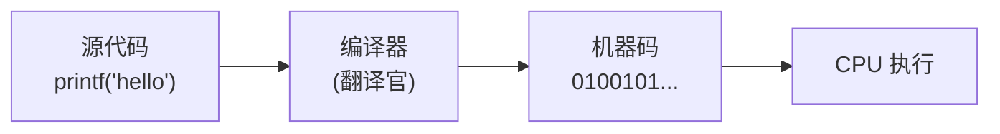
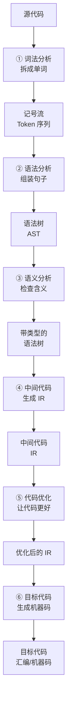
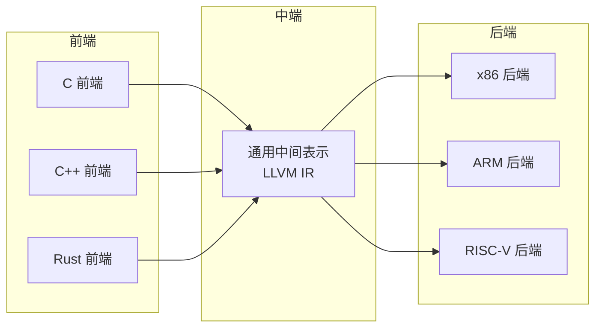

# 第1章：编译器到底是什么？

**用一句话说清楚**：编译器就像一个"翻译官"，把你的 C/Java 代码翻译成 CPU 能直接执行的机器指令。翻译的过程发生在程序运行**之前**，跟你写完文章后找专业翻译翻成英文是一个道理。

## 编译器的"工作现场"

想象你正在调试一个程序，输入了一个表达式 `3+5*2`，编译器拿到后会在内部做这样一件事：**理解"3+5*2"的结构，然后把它变成 CPU 能算的指令序列**。



看不懂上面代码没关系——你只需要记住编译器的核心工作很简单：**把人类写的程序 → 翻译成机器能执行的程序**。

### 编译 vs 解释：两个"翻译官"的区别

很多人分不清编译器和解释器，它们的核心区别在于**翻译的时间**：

| | **编译器（Compiler）** | **解释器（Interpreter）** |
|--|----------------------|------------------------|
| 翻译时机 | 执行之前全部翻译好 | 边执行边翻译 |
| 类比 | 请翻译把整本书翻成英文，然后看译本 | 请同声传译，一边听一边说 |
| 速度 | 翻译后执行快（因为已经是机器码） | 每次执行都要翻译，较慢 |
| 典型代表 | C/C++、Rust、Go | Python、JavaScript、Ruby |

> 💡 **一个形象的对比**：编译就像做饭——先把菜全切好备好（编译阶段），然后大火快炒（执行阶段）。解释就像吃火锅——边涮边吃，不用提前准备，但吃起来会慢一些。

## 编译器内部的"流水线"

编译不是一步到位的，它在内部有一条清晰的流水线。这条流水线大致分 **6 个阶段**：



**用日常语言来理解这6个阶段：**

1. **词法分析** — 相当于读完一句话后，先分出"词"：`我`、`爱`、`北京`、`天安门`
2. **语法分析** — 检查词的排列是否符合语法：`我 爱 北京` ✅，`爱我 北京` ❌
3. **语义分析** — 检查意思是否正确：`我 吃 北京` — 语法对但"吃北京"不合理，编译器会报类型错误
4. **中间代码生成** — 把源代码转换成一种"通用语言"，不依赖具体 CPU 型号
5. **代码优化** — 想办法让生成的代码跑得更快、占内存更少
6. **目标代码生成** — 最终翻译成具体 CPU 能执行的机器指令

> 🧪 看不明白没关系，后面每一章会详细展开一个阶段。

### 前端与后端：编译器的"分工"

编译器工程师常把 6 个阶段分成"前端"和"后端"：

- **前端**（阶段 1-3）：只跟**语言**有关——C语言有自己的前端、Java有自己的前端
- **中端**（阶段 4-5）：跟**语言和CPU都无关**——中间的"通用语言"
- **后端**（阶段 6）：只跟**CPU**有关——x86处理器有自己的后端、ARM有另一个后端

这种划分有个极大的好处：**想支持新的语言？只需写前端；想支持新的CPU？只需写后端。**



> 💡 假设有 3 种语言、3 种 CPU：没有 IR 需要写 3×3=9 个组件；有了 IR 只需写 3+3=6 个。

### 单遍 vs 多遍编译

编译器有两种"工作模式"：

| 特性 | **单遍编译** | **多遍编译** |
|------|------------|------------|
| 做法 | 从头到尾只扫描一遍，直接出结果 | 扫描多遍，每遍做一件事 |
| 速度 | ⚡ 极快 | 🐢 较慢 |
| 代码质量 | 一般（没法回头优化） | 优秀（可以反复打磨） |
| 内存占用 | 低 | 较高 |
| 代表 | TCC (Tiny C Compiler) | GCC、LLVM (Clang) |

> 🧪 **一个有趣的对比**：编译 100 行 C 代码，TCC 只要 **0.003 秒**，GCC 需要约 **0.1 秒**。但 TCC 生成的代码运行速度只有 GCC 优化后的 1/3 到 1/10。

## 🛠️ 动手实验：200 行代码写一个"微型编译器"

最好的学习方式就是动手。下面用 200 行 C 代码，实现一个**将算术表达式编译成 x64 汇编**的微型编译器。

> 这个实验会让你亲身体验"源代码 → 分析 → 生成代码"的完整流程。读完代码你会惊讶地发现：编译器的核心并不神秘。

### 完整代码

```c
#include <stdio.h>
#include <stdlib.h>
#include <ctype.h>
#include <string.h>

/*
 * Tiny Expression Compiler
 * 功能：将算术表达式（如 3+5*2）编译为 x64 汇编
 * 支持：数字, +, *, (, )
 *
 * 内部有三个组件：
 *   ① 词法分析器 (Lexer) — 把表达式拆成 Token（数字/运算符/括号）
 *   ② 语法分析器 (Parser) — 把 Token 组织成运算树
 *   ③ 代码生成器 (CodeGen) — 遍历运算树输出汇编
 */

/* === ① 词法分析器 (Lexer) === */
typedef enum {
    TOK_NUMBER, TOK_PLUS, TOK_STAR, TOK_LPAREN, TOK_RPAREN, TOK_EOF, TOK_ERROR
} TokenKind;

typedef struct {
    TokenKind kind;
    int       value;         /* 数字的值 */
} Token;

static const char *g_src;    /* 当前输入位置 */
static Token       g_lookahead;    /* "预读"的当前 Token */
static int         g_reg_count;    /* 寄存器编号计数器 */
static FILE       *g_out;         /* 输出汇编文件 */

/* 取下一个 Token */
static Token next_token(void) {
    Token tok = { TOK_ERROR, 0 };
    while (*g_src && isspace((unsigned char)*g_src)) g_src++;
    if (*g_src == '\0') { tok.kind = TOK_EOF; return tok; }
    if (isdigit((unsigned char)*g_src)) {
        tok.kind = TOK_NUMBER;
        tok.value = 0;
        while (isdigit((unsigned char)*g_src))
            tok.value = tok.value * 10 + (*g_src++ - '0');
        return tok;
    }
    switch (*g_src) {
        case '+': tok.kind = TOK_PLUS;   g_src++; break;
        case '*': tok.kind = TOK_STAR;   g_src++; break;
        case '(': tok.kind = TOK_LPAREN; g_src++; break;
        case ')': tok.kind = TOK_RPAREN; g_src++; break;
        default:  tok.kind = TOK_ERROR;  break;
    }
    return tok;
}
static void advance(void) { g_lookahead = next_token(); }
static int  peek(TokenKind k) { return g_lookahead.kind == k; }
static void error(const char *msg) { fprintf(stderr, "错误: %s\n", msg); exit(1); }

/* === ③ 代码生成器 (针对汇编) === */
static int alloc_reg(void) { return g_reg_count++; }

static void emit_load(int reg, int val) {
    fprintf(g_out, "    movl    $%d, %%r%d\n", val, reg);
}
static void emit_add(int dst, int src1, int src2) {
    fprintf(g_out, "    movl    %%r%d, %%r%d\n", src1, dst);
    fprintf(g_out, "    addl    %%r%d, %%r%d\n", src2, dst);
}
static void emit_mul(int dst, int src1, int src2) {
    fprintf(g_out, "    movl    %%r%d, %%r%d\n", src1, dst);
    fprintf(g_out, "    imull   %%r%d, %%r%d\n", src2, dst);
}

/* === ② 语法分析器 (递归下降) + 代码生成 === */

/* 文法定义（用"文法"描述表达式结构）：
 *   expr  → term { '+' term }    意思是"expr 是一个或多个 term 用 + 连接"
 *   term  → factor { '*' factor } "term 是一个或多个 factor 用 * 连接"
 *   factor → NUMBER | '(' expr ')' "factor 是数字或括号括起来的 expr"
 */

static int parse_expr(void);  // 前向声明
static int parse_term(void);
static int parse_factor(void);

/* expr → term { '+' term } */
static int parse_expr(void) {
    int reg1 = parse_term();
    while (peek(TOK_PLUS)) {
        advance();
        int reg2 = parse_term();
        int reg_result = alloc_reg();
        emit_add(reg_result, reg1, reg2);
        reg1 = reg_result;
    }
    return reg1;
}

/* term → factor { '*' factor } */
static int parse_term(void) {
    int reg1 = parse_factor();
    while (peek(TOK_STAR)) {
        advance();
        int reg2 = parse_factor();
        int reg_result = alloc_reg();
        emit_mul(reg_result, reg1, reg2);
        reg1 = reg_result;
    }
    return reg1;
}

/* factor → NUMBER | '(' expr ')' */
static int parse_factor(void) {
    if (peek(TOK_NUMBER)) {
        int reg = alloc_reg();
        emit_load(reg, g_lookahead.value);
        advance();
        return reg;
    }
    if (peek(TOK_LPAREN)) {
        advance();
        int reg = parse_expr();
        if (!peek(TOK_RPAREN)) error("缺少右括号");
        advance();
        return reg;
    }
    error("意外的记号");
    return -1;
}

/* === 汇编框架输出 === */
static void emit_prologue(void) {
    fprintf(g_out, "# 由微型编译器生成\n.text\n.globl _start\n_start:\n");
    fprintf(g_out, "    pushq   %%rbp\n    movq    %%rsp, %%rbp\n");
}
static void emit_epilogue(int result_reg) {
    fprintf(g_out, "    movl    %%r%d, %%edi\n", result_reg);
    fprintf(g_out, "    movl    $60, %%eax\n    syscall\n");
}

/* === 入口 === */
int main(int argc, char *argv[]) {
    if (argc < 2) {
        fprintf(stderr, "用法: %s \"表达式\" [输出文件.s]\n", argv[0]);
        fprintf(stderr, "示例: %s \"3+5*2\" out.s\n", argv[0]);
        return 1;
    }
    const char *outfile = (argc >= 3) ? argv[2] : "out.s";
    g_out = fopen(outfile, "w");
    if (!g_out) { perror("fopen"); return 1; }

    g_src = argv[1];
    g_reg_count = 0;
    advance();

    emit_prologue();
    int result_reg = parse_expr();   /* 语法分析 + 代码生成同时发生 */
    emit_epilogue(result_reg);

    fclose(g_out);
    printf("编译完成 → %s\n", outfile);
    printf("表达式: %s\n", argv[1]);
    return 0;
}
```

### 运行它！

```bash
# 编译这个微型编译器
gcc -o tiny_cc tiny_expr_compiler.c

# 用它编译 "3+5*2"
./tiny_cc "3+5*2" out.s

# 看看生成的汇编
cat out.s
```

**你将会看到这样的输出：**

```asm
# 由微型编译器生成
.text
.globl _start
_start:
    pushq   %rbp
    movq    %rsp, %rbp
    movl    $3, %r0        # 加载数字 3
    movl    $5, %r1        # 加载数字 5
    movl    $2, %r2        # 加载数字 2
    movl    %r1, %r3       # r3 = r1 (5)
    imull   %r2, %r3       # r3 = r3 * r2 (5*2=10)
    movl    %r0, %r4       # r4 = r0 (3)
    addl    %r3, %r4       # r4 = r4 + r3 (3+10=13)
    movl    %r4, %edi      # 结果放入 edi（退出码）
    movl    $60, %eax      # sys_exit
    syscall
```

> 💡 看到 `3+5*2` 了吗？乘法先算（5*2=10），再加 3，结果是 13。这正是乘法优先级高于加法的体现——在编译器内部通过 `parse_expr()` 调用 `parse_term()` 的嵌套结构自然实现了这一点，而不是写了一个"优先级表"。

### 深入理解这个例子

这个微型编译器虽然只有 200 行，但它已经包含了编译器的三大组件：

| 组件 | 对应代码 | 作用 |
|------|---------|------|
| **词法分析器** | `next_token()` 函数 | 把 "3+5*2" 拆成 Token：[NUMBER(3), PLUS, NUMBER(5), STAR, NUMBER(2)] |
| **语法分析器** | `parse_expr/term/factor` | 按"文法"规则，把 Token 组织成运算逻辑 |
| **代码生成器** | `emit_load/add/mul` | 为每个运算输出对应的汇编指令 |

**注意**：这里词法分析和语法分析是"边读边生成"的（单遍编译），没有显式构建语法树。后面第4章会展示如何构建语法树（AST）。

## 编译器工具链一览

构建编译器的工具有很多种选择：

| 方法 | 适合场景 | 学习价值 |
|------|---------|---------|
| ✅ **手写 C 代码** | 理解原理、教学、小型 DSL | ★★★★★ |
| 🔧 Flex + Bison | 词法/语法分析器自动生成 | ★★★★ |
| 🏭 LLVM 框架 | 工业级编译器开发 | ★★★★ |
| 📖 GCC 参考 | 对照学习、查看优化结果 | ★★★★ |

> **学习建议**：如果你是初学者，**强烈建议从手写 C 代码开始**——自己实现每个阶段，才能真正理解编译器的工作方式。等熟悉了原理，再用工具做更复杂的东西。

## 📝 本章小结

| 核心概念 | 一句话解释 |
|---------|-----------|
| **编译器** | 在程序运行前，把高级语言翻译成机器码的程序 |
| **6阶段流水线** | 词法分析→语法分析→语义分析→中间代码→优化→目标代码 |
| **前端/后端** | 前端管语言，后端管 CPU，中间用 IR 连接 |
| **单遍 vs 多遍** | 单遍快但代码质量差，多遍慢但能深度优化 |
| **你的第一个编译器** | 200 行 C 代码就能实现表达式到汇编的编译 |

### 🏋️ 动手练习

1. **为这个微型编译器增加减法和除法**（提示：`-` 和 `/` 的解析逻辑与 `+`、`*` 类似）
2. **查看 GCC 的汇编输出**：在终端运行 `echo 'int f(int x){return x+2;}' | gcc -S -xc -o - -`
3. **思考题**：为什么像 Python 这样的语言不直接编译成机器码？（答案提示：跨平台、动态类型、REPL体验）

> 下一章我们深入学习词法分析——看看编译器是怎么把"一长串字符"拆成"有意义的单词"的。
