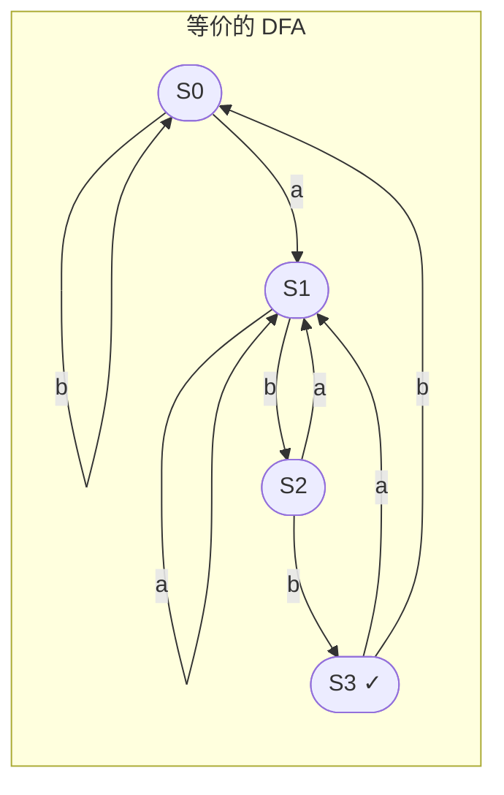

# 第3章：正则表达式与有限自动机

**用一句话说清楚**：正则表达式描述"一个词长什么样"，有限自动机则是一种"识别算法"——看到一串字符，判断它是否符合正则描述的模式。Flex 本质上就是**把正则转成自动机**。

## 正则表达式：给词法分析"画像"

正则表达式是描述字符串模式的"速记语言"。词法分析器中，我们需要用正则来描述每个 Token 的"长相"：

| Token 类型 | 正则表达式 | 匹配例子 |
|-----------|-----------|---------|
| 数字 | `[0-9]+` | 42, 0, 999 |
| 标识符 | `[a-zA-Z_][a-zA-Z0-9_]*` | `foo`, `_temp`, `x` |
| 关键字 | `int` \| `return` \| `if` | 就是这些词本身 |
| 注释 | `//[^\n]*` | `// 这是一行注释` |

> 💡 **核心思路**：先写出每个 Token 类型的正则，然后用工具（或自己写代码）把这些正则转成可执行的识别器。

## 有限自动机：正则的执行引擎

有限自动机（Finite Automaton）是一个"状态机"——它只有有限个状态，根据输入的字符在不同状态间跳转。有两种类型：

### NFA（非确定有限自动机）

- 同一输入可能跳到**多个**状态
- 可以有 ε（空）转换——不收字符就能跳转
- 就像在迷宫里有多个岔路，你不知道该走哪条

### DFA（确定有限自动机）

- 同一输入只能跳到**确定的**一个状态
- 没有 ε 转换
- 就像单行道，路径清晰唯一

```mermaid
flowchart LR
    subgraph NFA 示例: 识别(a|b)*abb
        start -->[q0] -- a/b -->[q0]
        [q0] -- ε -->[q1]
        [q1] -- a -->[q2]
        [q2] -- b -->[q3]
        [q3] -- b -->[q4]
        [q4] -->[接受]
    end
```



### NFA → DFA 转换（子集构造法）

DFA 比 NFA 执行速度快，所以 Flex 等工具会先构建 NFA，然后**用子集构造法**转成 DFA。

> 💡 **子集构造法的直观理解**：NFA 状态的"集合" → DFA 的"单个状态"。比如 NFA 可以同时在 {q1, q2, q3} 三个状态，那 DFA 就把这"三个状态的集合"看成一个新状态 S1。

**通用算法步骤**：

```c
// 伪代码：NFA → DFA
DFAState nfa_to_dfa(NFA &nfa) {
    // 1. 起点 = ε_closure(NFA的初始状态)
    Set start = epsilon_closure({nfa.start_state});

    // 2. 用 BFS 扩展 DFA 状态
    Queue<Set> worklist;
    Map<Set, DFAState> visited;
    worklist.push(start);
    visited[start] = new_DFA_state();

    while (!worklist.empty()) {
        Set current = worklist.pop();
        for each symbol c {
            // 3. 对每个字符，找 NFA 的"可达状态集合"
            Set next = epsilon_closure(move(current, c));
            if (!visited.contains(next)) {
                visited[next] = new_DFA_state();
                worklist.push(next);
            }
            // 4. 添加 DFA 转换边
            add_transition(visited[current], c, visited[next]);
        }
    }
    return visited[start];
}
```

## 正则引擎的实战选择

在真正的编译器中，你会遇到各种情况——有些适合"确定性"的 DFA，有些需要"非确定性"的 NFA。关键是在**性能**和**灵活性**之间做权衡：

| 引擎类型 | 速度 | 内存 | 功能 | 代表 |
|---------|------|------|------|------|
| **DFA (确定性)** | 极快 O(n) | 较大 | 有限（无回溯、无捕获组） | Flex、Go regexp2 |
| **Thompson NFA** | 快 O(n) | 较小 | 有限（模拟 NFA 执行） | RE2 |
| **回溯 (Pike VM)** | 可能 O(2ⁿ) | 小 | 完整（捕获组、前瞻后顾） | PCRE, Python `re`, Perl |

> 🚨 **警告**：回溯引擎在面对精心构造的输入（如 `aaaaaaaaac` 匹配 `(a|aa|aaa)*c`）时可能出现**灾难性回溯**（ReDoS 攻击），导致程序卡死。DFA/Thompson NFA 没有这个问题。

```c
/* 生产级编译器建议：
 * - 词法分析用 DFA（手写或 Flex 生成）
 * - 语法分析后生成的"小正则"用 DFA
 * - 用户输入的搜索用 DFA 或带超时的回溯引擎
 * - 绝对不要让用户在词法分析器输入中触发回溯！
 */
```

### 应对 ReDoS 的策略

```c
// 方案1：用 DFA 替代回溯
regex_t dfa_regex;
if (regcomp(&dfa_regex, pattern, REG_EXTENDED)) {
    // 如果库自动使用 DFA，就没有 ReDoS 风险
}

// 方案2：加超时保护（如果必须用回溯）
#include <signal.h>
void timeout_handler(int sig) {
    fprintf(stderr, "正则匹配超时！可能是 ReDoS 攻击\n");
    exit(1);
}
signal(SIGALRM, timeout_handler);
alarm(2);    // 2秒超时
if (regexec(&regex, input, 0, NULL, 0) == 0) { ... }
alarm(0);    // 取消超时
```

## 词法分析的"大图"：所有知识如何连接

```
你写一条正则： [0-9]+
                ↓
     正则 → 解析成语法树 (AST)
                ↓
     将 AST 转成 NFA (Thompson 构造法)
                ↓
     子集构造法将 NFA 转成 DFA
                ↓
     DFA 状态最小化 (减少状态数)
                ↓
     生成查表驱动的词法分析器代码
```

**这个流程隐藏在日常使用的 Flex 背后**——你写 `.l` 文件时，Flex 就在内部做上面这些事。

## 📝 本章小结

| 概念 | 一句话理解 |
|------|-----------|
| **正则表达式** | 描述字符串"样子"的 DSL |
| **NFA** | 可以有多个可能路径的状态机（难实现，好构造） |
| **DFA** | 每个输入只有唯一路径的状态机（好实现，难构造） |
| **NFA→DFA** | 用子集构造法把"模糊"变成"确定" |
| **选择策略** | 编译器的词法分析用 DFA，用户输入搜索用带保护的 NFA |

### 🏋️ 动手练习

1. 手动画一个识别 C 语言整数（十进制+十六进制）的 DFA
2. 用 Python 实现子集构造法的核心逻辑
3. 试一下：`time echo 'print("hello")' | grep -P '(a|b)*c'` 和 `time echo 'aaaaaaaaac' | grep -P '(a|aa|aaa)*c'` 看看速度差异

> 理解了这个底层机制，词法分析对你就不再是魔法了。下一章进入语法分析——编译器开始从"拆词"进入"理解句子结构"的阶段。
