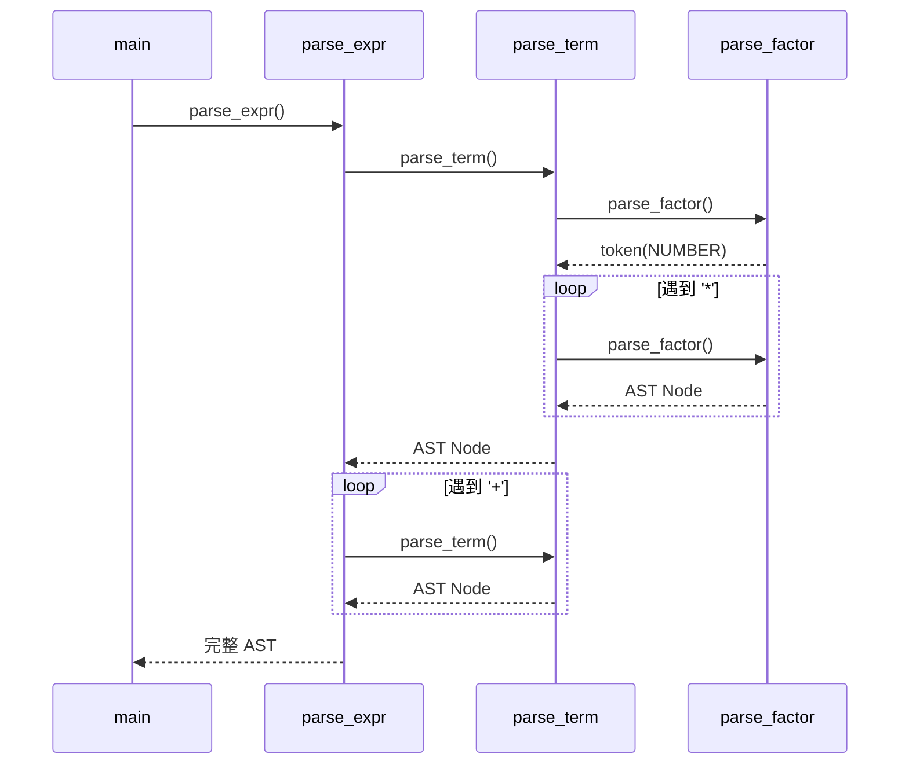
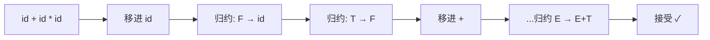
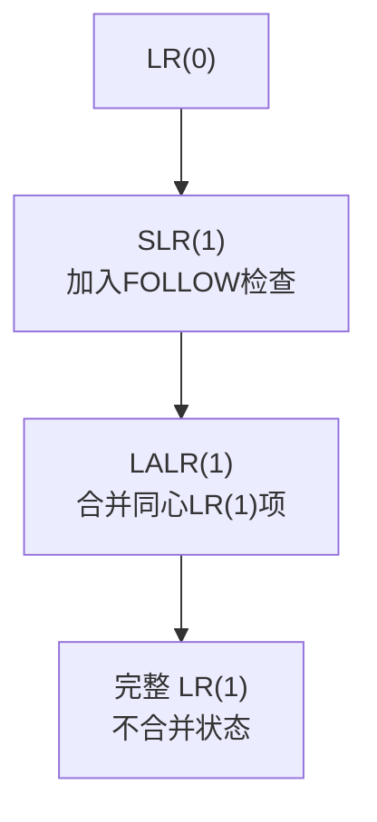

# 第4章：语法分析——编译器如何"理解句子"

**用一句话说清楚**：词法分析给你一堆"单词"（Token），语法分析则检查这些单词的排列是否符合"语法规则"。你想："我 爱 编程" ✅，但"爱 我 编程" ❌——语法分析就是做这个判断，同时还能理解句子的结构。

## 问题的本质

语法分析有两个核心任务：
1. **判断 Token 序列是否符合文法**——如果输入 `int int a;`，两个 `int` 连在一起不符合 C 语法，应当报错
2. **构建语法树（AST）**——把线性 Token 序列变成树状结构，让后续阶段理解"表达式的计算顺序"、"if 语句的条件和分支体"

### 什么是文法？

文法就是一组**产生式规则**，描述了 Token 可以怎么排列。以算术表达式为例：

```text
expr   → expr '+' term | expr '-' term | term
term   → term '*' factor | term '/' factor | factor
factor → NUMBER | '(' expr ')'
```

> 💡 **解读**：`expr → expr '+' term` 的意思是"一个加法的表示是：一个表达式 + 一个项"。这正是为什么 C 语言里 `3+5*2` 会先算乘法——因为 `term`（乘法）嵌套在 `expr`（加法）内部。

```
          expr
        /   |   \
     expr  '+'  term
       |       /   |   \
     term    term '*' factor
       |       |        |
    factor   factor   NUMBER(2)
       |        |
    NUMBER(3) NUMBER(5)
```

**两种推导方法：**

| 推导类型 | 策略 | 对应分析器 |
|---------|------|-----------|
| **最左推导** | 每次都先展开最左边的非终结符 | 自顶向下（LL）——本章上半部分 |
| **最右推导** | 每次都先展开最右边的非终结符 | 自底向上（LR）——本章下半部分 |

## [上篇] 自顶向下分析：递归下降法

## 核心思想

**递归下降**是最好理解的方法——**文法中的每个非终结符都对应一个函数**。函数之间通过递归调用反映文法的层级结构。

比如这个文法：
```text
expr   → term { '+' term }
```

对应的 C 代码就是：
```c
ASTNode* parse_expr() {
    ASTNode *left = parse_term();       // 先解析一个 term
    while (peek('+')) {                 // 如果后面跟着 '+'
        advance();                      // 消费 '+'
        ASTNode *right = parse_term();  // 再解析下一个 term
        left = new_node(NODE_ADD, left, right);  // 合并成加法节点
    }
    return left;
}
```

**任何对编译原理感到无从下手的人，都建议从递归下降开始**——它直观、可控、能看到代码在做什么。

### 三个关键问题

| 问题 | 解决 |
|------|------|
| **左递归**：`expr → expr '+' term` 调用自身 → 无限循环 | 消除左递归：`expr → term { '+' term }` |
| **公共前缀**：两个产生式以相同字符开头 → 不确定选哪个 | 提取左因子 |
| **FIRST/FOLLOW 冲突**：两个产生式可能匹配相同 Token | 重构文法为 LL(1) |

### 消除左递归

左递归是递归下降的"敌人"——`parse_expr()` 第一行就调用自己，死循环。

通用消除公式：
```
A → Aα | β    →    A → βA'
                    A' → αA' | ε
```

示例：把 `expr → expr + term | term` 改成：
```
expr → term expr_tail
expr_tail → + term expr_tail | ε
```

> 💡 **直观理解**：原来是"一个表达式加上另一个表达式..."，改成了"先解析一个 term，然后循环检查后面还有没有 + term"。

### FIRST 集和 FOLLOW 集

为了让递归下降分析器知道"什么时候该选哪个产生式"，需要计算两个集合：

| 集合 | 含义 | 作用 |
|------|------|------|
| **FIRST(α)** | 从 α 能推导出的**第一个 Token** 构成的集合 | 决定用哪个产生式开始解析 |
| **FOLLOW(A)** | 在推导中**紧跟 A 之后**的 Token 构成的集合 | 决定什么时候 A 可以结束（读到 ε） |

> 💡 初学者不需要手算 FIRST/FOLLOW——写递归下降时，直觉就是：看看当前 Token 是什么，然后选对应的分支。如果两个分支以相同 Token 开头，才需要算这两个集合。

## 完整实现：算术表达式 + 语法树

下面的代码将 Token 序列解析成语法树（AST），然后可以打印树结构和求值。完整的可编译代码已在第1章出现过，这里展示核心的解析逻辑：

```c
/* 递归下降分析器核心 */

/* 打印语法树（水平格式：右子树在上，左子树在下） */
void print_ast(ASTNode *node, int depth) {
    if (!node) return;
    if (node->type == NODE_NUM) {
        printf("%*s%d\n", depth*2, "", node->value);  // 缩进表示深度
        return;
    }
    print_ast(node->right, depth + 1);
    printf("%*s%s\n", depth*2, "",
           node->type == NODE_ADD ? "+" : "*");
    print_ast(node->left, depth + 1);
}
```

运行 `3+5*2` 的语法树输出：

```
        2
    *
        5
+
    3
```

> 💡 看出优先级了么？`5` 和 `2` 先通过 `*` 连接（在树中位置更靠下），然后再和 `3` 通过 `+` 连接。语法树的**深度**反映了**优先级**——越深优先级越高。

### 汇编视角：递归调用的栈帧

递归下降之所以"递归"，是因为它利用了程序本身的函数调用栈：



每个非终结符函数占用一个栈帧，递归深度对应表达式嵌套深度。**这就是为什么深度递归会导致栈溢出**——栈帧也是内存，用完了就没了。

## LL(1) 表驱动法

如果你不想写手写递归下降，可以用一张"分析表"来做：

```
            当前输入 Token
    ┌─────┬─────┬─────┬─────┬─────┐
    │ id  │  +  │  *  │  (  │  )  │
├───┼─────┼─────┼─────┼─────┼─────┤
│ E │ E→T │     │     │ E→T │     │
│   │  E' │     │     │  E' │     │
├───┼─────┼─────┼─────┼─────┼─────┤
│ E'│     │E'→  │     │     │E'→ε │
│   │     │+TE' │     │     │     │
├───┼─────┼─────┼─────┼─────┼─────┤
│ T │ T→F │     │     │ T→F │     │
│   │  T' │     │     │  T' │     │
├───┼─────┼─────┼─────┼─────┼─────┤
│ T'│     │T'→ε │T'→  │     │T'→ε │
│   │     │     │*FT' │     │     │
├───┼─────┼─────┼─────┼─────┼─────┤
│ F │ F→id│     │     │F→E  │     │
│   │     │     │     │  )  │     │
└───┴─────┴─────┴─────┴─────┴─────┘
```

算法很简单：维护一个栈，查表决定是"展开"（替换栈顶非终结符）还是"匹配"（消费输入 Token）。

## [下篇] 自底向上分析：LR 分析法

## 核心思想

如果说递归下降是"从根长叶子"，那 LR 分析就是"从叶子归约成根"——从输入 Token 开始，不断把匹配的右侧**归约**（reduce）成左侧的非终结符，直到归约成起始符号。



### 核心概念：句柄

**句柄（Handle）**是最右推导中最后一步被替换的产生式右侧。LR 分析的本质就是：**不断找到句柄，然后把它归约回左侧非终结符**。

## LR(0)、SLR(1)、LALR(1)、LR(1) 的关系

| 类型 | 前瞻信息 | 处理冲突的能力 | 表大小 | 实际使用 |
|------|---------|---------------|--------|---------|
| **LR(0)** | 无前瞻 | 最弱 | 最小 | 教学演示 |
| **SLR(1)** | FOLLOW 集 | 中等 | 中等 | 教学 |
| **LALR(1)** | LR(1) 前瞻合并 | 很强 | 较小 | **最常用**（Yacc/Bison） |
| **LR(1)** | 完整前瞻 | 最强 | 极大 | 极少（表太大） |



> 💡 **工程建议**：LALR(1) 是"甜点"——以接近 SLR 的表大小提供了接近 LR(1) 的识别能力。这就是为什么 Bison 默认使用 LALR(1)。

## 移进-归约冲突的解决

LR 分析中最常遇到的问题：当前是"移进"（读下一个 Token）还是"归约"（把栈顶归约成非终结符）？

```yacc
if x  { ... }          ← 遇到 else 时，归约还是移进？
     if y { ... } else { ... }
     ^
     这里！还有 else 等待处理
```

这就是著名的**悬空 else 问题**。解决办法：

| 策略 | 效果 |
|------|------|
| **默认移进**（Bison 默认） | else 匹配最近的 if（C/Java 的行为） |
| **归约优先** | else 匹配最远的 if |
| **优先级声明** `%nonassoc THEN ELSE` | 显式指定 |

## 汇编视角：LR 分析栈实现

LR 分析器核心是一个**状态栈 × 符号栈 × 查表**的循环，非常适合用汇编实现：

```asm
# LR 驱动核心（概念代码）
lr_step:
    # state = state_stack[sp]
    # a = lookahead token
    # action = action_table[state][a]

    cmpl    $SHIFT, action_type(%rax)
    je      do_shift

    cmpl    $REDUCE, action_type(%rax)
    je      do_reduce

do_shift:
    sp++
    state_stack[sp] = action_target
    token_stack[sp] = a
    advance_input()
    ret

do_reduce:
    prod_len = productions[prod_num].rhs_len
    sp -= prod_len
    # ... 查 GOTO 表 ...
    sp++
    state_stack[sp] = goto_target
    ret
```

### LR 表压缩：从庞大矩阵到可部署形态

C 语言文法的 LR 分析表（约 300 条产生式）|：

| 格式 | 内存 | 访问速度 |
|------|------|---------|
| 二维数组 | ~1.6 MB | O(1) |
| 列表交叉压缩 | ~0.3 MB | O(1) |
| 稀疏行压缩 | ~0.2 MB | O(log k) |

## 解析器策略选择指南

### 什么时候用递归下降？

| 条件 | 推荐度 |
|------|-------|
| 语言在快速迭代 | ★★★★★ |
| 需要精确的错误提示 | ★★★★★ |
| 需要条件编译语法 | ★★★★★ |
| 解析器需要调试 | ★★★★★ |
| 你是初学者 | ★★★★★ |

### 什么时候用 LR（Yacc/Bison）？

| 条件 | 推荐度 |
|------|-------|
| 文法稳定且明确 | ★★★★★ |
| 团队有 Yacc 经验 | ★★★★★ |
| 不需要复杂错误报告 | ★★★★ |
| 开发效率优先于运行时性能 | ★★★★ |

### 混合方案（业界前沿）

生产级编译器经常**混合使用**两种方法：

```c
// 顶层结构用递归下降
static ASTNode* parse_if_stmt(void) { ... }
static ASTNode* parse_while_stmt(void) { ... }

// 表达式部分用 LR/Pratt（由 Yacc 生成）
ASTNode* expr = parse_expression_with_pratt(0);
```

## 📝 本章小结

| 概念 | 一句话理解 |
|------|-----------|
| **文法** | 描述 Token 排列规则的"配方" |
| **递归下降** | 每个语法成分写一个 C 函数，最简单直观 |
| **LR 分析** | 用查表驱动，支持更复杂的文法 |
| **左递归** | 解析器一上来就调用自己，死循环，必须消除 |
| **句柄** | 下一次应该被归约的产生式右侧 |
| **LALR(1)** | 实践中使用最广的 LR 变体（Bison 默认） |

### 🏋️ 动手练习

1. 为第1章的微型编译器增加括号支持 `( )`（提示：在 factor 函数中添加括号分支即可）
2. 为表达式中添加减法和除法，并用语法树确认左结合性
3. 用 `bison -v` 生成你的文法的 `.output` 文件，查看其中是否有冲突
4. 手动画出 `(3+5)*2` 的语法树，和 `3+5*2` 的对比

> 下一章进入语义分析——在语法结构的基础上，检查"程序的意思"是否合理。
