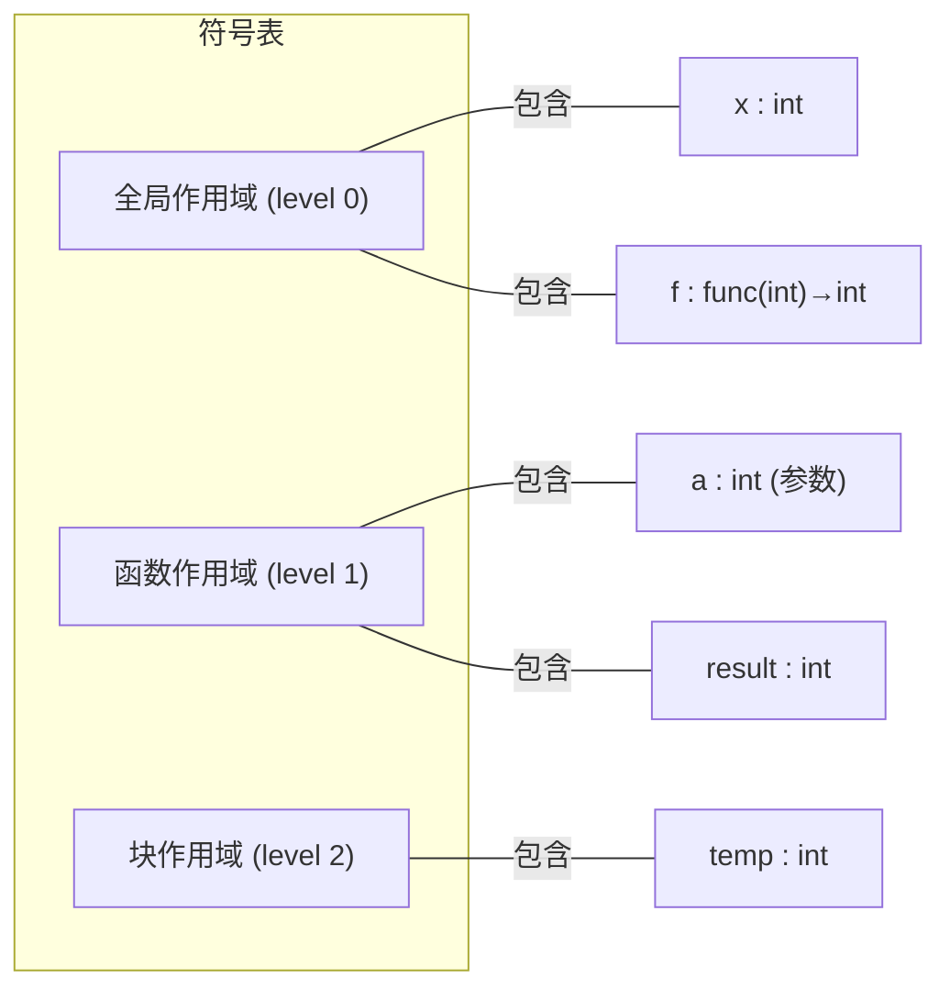

# 第5章：语义分析与类型检查

**用一句话说清楚**：语法分析说"你这句话结构是对的"，语义分析说"但你说的话没道理"——`"hello" * 3.14` 语法上没问题但语义上不合理，编译器要报"类型错误"。

## 语义分析在做什么？

语法分析之后，编译器已经得到了程序的**结构**（AST），但还不知道程序的**含义**。

**语义分析的核心职责：**

| 检查项 | 违规例子 | 错误信息 |
|--------|---------|---------|
| **变量声明检查** | `x = 10;` 但 x 未被声明 | "未声明的标识符 'x'" |
| **类型兼容性** | `int a; a = "hello";` | "不能将 'char*' 赋值给 'int'" |
| **重复声明** | `int x; int x;` | "重复定义 'x'" |
| **作用域规则** | 在外部使用块内变量 | "'temp' 未在此作用域中声明" |
| **函数参数匹配** | `printf(42)` 但期望的是格式化字符串 | "参数类型不匹配" |
| **左值检查** | `3 = x;` | "赋值运算符左侧需要可修改的左值" |

## 符号表："编译器的小本本"

符号表就像编译器随身带的"小本本"，记录着每个变量/函数的名字、类型、作用域等信息。

### 设计思路



**核心数据结构**：每个作用域是一个哈希表，多个作用域连成**作用域链**。

```c
/* 核心 API */
void   enter_scope();     // 进入新作用域（遇到 { 时）
void   exit_scope();      // 退出作用域（遇到 } 时）
Symbol* lookup(name);     // 从当前作用域向上查找
int    insert(name, type);// 在当前作用域插入（失败表示重复声明）
```

### 作用域链的查找规则

```c
Symbol* symtab_lookup(SymbolTable *st, const char *name) {
    Scope *scope = st->current;
    while (scope) {
        unsigned int h = hash(name) % HASH_SIZE;
        Symbol *sym = scope->buckets[h];
        while (sym) {
            if (strcmp(sym->name, name) == 0)
                return sym;         // 找到最先出现的那一个
            sym = sym->next;
        }
        scope = scope->parent;      // 没找到，向外层找
    }
    return NULL;                    // 所有作用域都没有 → 未声明
}
```

> 💡 这就是为什么内层变量可以"遮蔽"外层变量——`int x=1; { int x=2; print(x); }` 会输出 2。

## 类型检查

### 类型等价：两种思考方式

| 策略 | 含义 | 语言 |
|------|------|------|
| **名称等价** | 类型名相同才算等价 | `typedef int feet;` 后 `feet` 和 `int` 是不同类型 |
| **结构等价** | 内部结构相同就算等价 | 两个 `struct {int x; int y;}` 结构相同就算同一类型 |

```c
/* 结构等价检查的实现 */
int type_compatible(TypeInfo *a, TypeInfo *b) {
    if (!a || !b) return 0;
    if (a->kind != b->kind) return 0;
    switch (a->kind) {
        case TYPE_PTR:
            return type_compatible(a->detail.ptr.base,
                                   b->detail.ptr.base);
        case TYPE_ARRAY:
            if (a->detail.array.len != b->detail.array.len)
                return 0;
            return type_compatible(a->detail.array.elem,
                                   b->detail.array.elem);
        default:
            return 1;  // 基本类型相同
    }
}
```

### 隐式类型转换

C 语言的"整数提升"（integer promotion）规则——`char` 和 `short` 参与运算前会自动转成 `int`：

```c
/* C 风格的整数提升：char/short → int */
TypeInfo *integer_promotion(TypeInfo *t) {
    if (t->kind == TYPE_CHAR || t->kind == TYPE_SHORT) {
        static TypeInfo promoted = { TYPE_INT, 4, 4, {0} };
        return &promoted;
    }
    return t;
}
```

> 💡 这就是为什么 C 语言中 `char c = 'A';` 可以和 `int i = 65;` 直接比较——char 被自动提升了。

## 属性文法与语法制导翻译

**属性文法** = 文法 + 属性计算规则。它为每个产生式附加"语义动作"，在语法分析过程中计算属性。

| 属性类型 | 传播方向 | 示例 |
|---------|---------|------|
| **综合属性** | 子节点 → 父节点 | `E.val = E1.val + T.val` 值从子节点向上传 |
| **继承属性** | 父节点 → 子节点 | `id.type = T.type` 类型信息向下传 |

### C 代码中的属性计算示例：结构体布局

编译器需要计算结构体每个成员的偏移量——这本质上是语义分析的一部分：

```c
struct example {
    char   a;   /* offset 0, 大小1, 对齐1 */
    int    b;   /* offset 4 (需4字节对齐) ← 3字节填充！ */
    char   c;   /* offset 8, 大小1, 对齐1 */
    short  d;   /* offset 10(需2字节对齐)← 1字节填充！ */
    double e;   /* offset 16(需8字节对齐)← 6字节填充！ */
};
```

编译器计算后告诉你：这个结构体占 **24 字节**，而不是直觉上的 1+4+1+2+8=16。

### 汇编视角：变量偏移

```asm
# 每个局部变量的偏移在编译时就算好了
my_function:
    pushq   %rbp
    movq    %rsp, %rbp
    subq    $16, %rsp     # 分配 16 字节栈空间

    # 变量访问都用 rbp 偏移
    movb    $65, -1(%rbp)   # char a = 'A'
    movl    $42, -8(%rbp)   # int  b = 42 (有填充)
```

## 类型推导的工程权衡

如果语言支持"类型自动推导"（如 `auto x = 3 + 5`），实现成本如下：

| 类型推导算法 | 复杂度 | 支持多态 | 错误信息质量 | 代表语言 |
|------------|--------|---------|------------|---------|
| **算法 W** | 指数级上限 | Hindley-Milner | ❌ 差 | ML |
| **双向推导** | O(n) 线性 | 有限 | ✅ 好 | C# 4.0+、TypeScript |
| **局部推导** | O(n) 线性 | 无 | ✅ 非常好 | Java `var` |
| **逐步检查** | O(n) 线性 | 无 | ✅ 极好 | C/C++ 手动标注 |

## 📝 本章小结

| 概念 | 一句话理解 |
|------|-----------|
| **语义分析** | 检查程序"意思"是否合理，比如类型是否匹配 |
| **符号表** | 编译器"小本本"，记录变量/函数的名、类型、作用域 |
| **作用域链** | 内层→外层一层层找变量，内层可以"遮蔽"外层 |
| **属性文法** | 在语法分析的每个步骤计算"附加信息"（如值、类型） |
| **整数提升** | char/short 参与运算时自动转 int |

### 🏋️ 动手练习

1. 为符号表增加 `enum` 类型支持
2. 实现结构体类型的"结构等价"比较
3. 用 `gcc -fdump-tree-original` 观察编译器语义标注后的 AST

> 下一章进入中间代码生成——把 AST 转成一种"通用语言"，让编译器前端和后端可以解耦工作。
