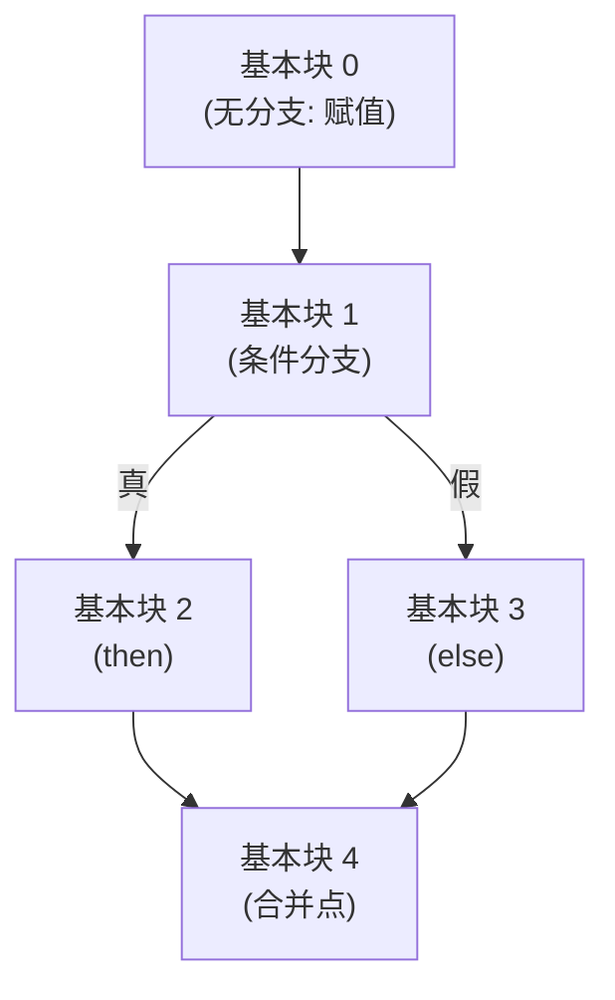

# 第6章：中间代码生成——编译器的"通用语"

**用一句话说清楚**：中间代码（IR）就像是编译器的"世界语"——前端把各种高级语言翻译成 IR，后端把 IR 翻译成各种 CPU 的机器码。有了 IR，支持 3 种语言 × 3 种 CPU 只需 3+3=6 个组件，而不是 9 个。

## 为什么需要中间代码？

```mermaid
flowchart LR
    subgraph 无IR：9个组件
        C1["C"] --> X86["x86"]
        C2["C"] --> ARM["ARM"]
        C3["C++"] --> X86
        C4["C++"] --> ARM
        C5["Rust"] --> X86
        C6["Rust"] --> ARM
        C1_2["C"] --> RISC["RISC-V"]
        C3_2["C++"] --> RISC
        C5_2["Rust"] --> RISC
    end
```

```mermaid
flowchart LR
    subgraph 有IR：6个组件
        A["C"] --> IR["LLVM IR"]
        B["C++"] --> IR
        C["Rust"] --> IR
        IR --> D["x86"]
        IR --> E["ARM"]
        IR --> F["RISC-V"]
    end
```

**核心收益：**

| 收益 | 原因 |
|------|------|
| **多语言共享优化** | 所有语言都转成 IR，优化器只需一套 |
| **可移植性** | 一套 IR 适配 N 种 CPU |
| **形式简洁** | IR 比 AST 简单，便于数据流分析 |

## 三地址码（Three-Address Code, TAC）

三地址码是最常见的 IR 形式。每条指令的结构：

```
result = arg1 op arg2
```

> 💡 叫"三地址码"是因为每条指令最多涉及**三个地址**（两个操作数 + 一个结果）。

### 指令类型速查

| 指令形式 | 例子 |
|---------|------|
| `x = y op z` 二元运算 | `t1 = a + b` |
| `x = op y` 一元运算 | `t1 = -a` |
| `x = y` 复制 | `x = temp` |
| `goto L` 无条件跳转 | `goto L1` |
| `if x relop y goto L` 条件跳转 | `if a < b goto L1` |
| `x = y[i]` 数组读 | `t1 = arr[idx]` |
| `x[i] = y` 数组写 | `arr[0] = 42` |
| `param x; call f, n` 函数调用 | `call sum, 2` |
| `return x` 返回 | `return result` |

### 从 AST 到 TAC

```text
源代码: sum = (a + b) * c

AST:        =
          /   \
        +      c
       / \
      a   b

TAC:    t1 = a + b
        t2 = t1 * c
        sum = t2
```

> 💡 注意每行 TAC 只做**一件事**。`(a+b)*c` 包含加法和乘法两件事，所以需要两行 TAC。这就是"三地址码"简化分析的核心——每行都是最小操作单元。

## 控制流翻译：if-else 和 while

### if-else 的 TAC 模板

```text
源代码：
    if (a > 0) {
        result = a + b;
    } else {
        result = a - b;
    }

TAC:
        t1 = a > 0            # 计算条件
        if t1 == 0 goto L_ELSE   # 假 → else
        t2 = a + b            # then 分支
        result = t2
        goto L_END            # 跳过 else
L_ELSE:
        t3 = a - b            # else 分支
        result = t3
L_END:
        # 继续...             # 合并点
```

### while 的 TAC 模板

```text
源代码：
    while (i < n) {
        sum = sum + i;
    }

TAC:
L_LOOP:
        t1 = i < n            # 计算条件
        if t1 == 0 goto L_END    # 假 → 退出
        t2 = sum + i          # 循环体
        sum = t2
        goto L_LOOP           # 跳回开头
L_END:
        # 继续...
```

## SSA 形式：现代编译器的"黄金标准"

**SSA（Static Single Assignment）** 的核心规则：**每个变量在程序中只被赋值一次**。

```text
非 SSA：               SSA：
    a = x + y              a1 = x + y
    b = a * 2              b1 = a1 * 2
    a = a + 1     →        a2 = a1 + 1   ← a 的新"版本"
```

> 💡 为什么要这么做？因为「每个变量只赋值一次」意味着：只要看到 `a1`，就知道它的值一定是 `x + y` 的结果，绝不会被覆盖。**数据流分析一下子就简单了——不用猜变量的值，直接看定义就行。**

### φ 函数：控制流汇合点的"接线员"

当两个分支都修改了同一个变量时，SSA 需要 φ 函数来在汇合点"选择"正确版本：

```text
SSA 版本：
    x1 = a + b
    if (x1 < 10) goto L1
    x2 = x1 * 2
    goto L2
L1:
    x3 = x1 - 1
L2:
    x4 = φ(x2, x3)          ← 从 L1 来则 x4=x3，从 L2 来则 x4=x2
    y1 = x4
```

φ 函数是**概念性的**——真正的硬件没有 φ 指令。在生成最终机器码前，编译器会把它替换成实际的数据搬移指令。

### SSA 的优势

| 优势 | 解释 |
|------|------|
| **dead code elimination** | 如果 `a1 = x+y` 后面没人用 `a1`，直接删除，比非 SSA 简单得多 |
| **常量传播** | 如果 `a1 = 42`，所有使用 `a1` 的地方直接替换成 42 |
| **def-use 链** | 每个变量定义和使用自然关联，无需额外数据结构 |

### SSA 构建示例代码

```c
// SSA 构建的核心：计算支配边界 → 插入 φ → 重命名变量

// 1. 计算支配树（Lengauer-Tarjan 算法，1979 年）
//    时间复杂度 O(E * α(N))，实践中可以处理百万基本块

// 2. 计算支配边界（φ 插入位置）
void compute_dominance_frontier(int idom[]) {
    for (int b = 0; b < nblocks; b++) {
        for (each predecessor p of b) {
            int runner = p;
            while (runner != idom[b]) {
                // 把 b 加入 runner 的支配边界
                frontier[runner].add(b);
                runner = idom[runner];
            }
        }
    }
}
```

## 基本块

TAC 通常被组织成**基本块（Basic Block）**——无分支的连续指令序列：

```text
基本块 0:            基本块 1 (条件):     基本块 2 (then):
    t0 = a + b          t2 = x < y          t4 = a * 2
    t1 = t0 * c          if t2 goto L1       t5 = b + 3
    sum = t1                                 goto L2
                        基本块 3 (else):
                            t6 = a - 1
                            t7 = b + 5
L2:
基本块 4 (合并):
    t8 = φ(...)
```



> 💡 **基本块规则**：只能从入口进、从出口出，内部不能有分支。这样分析基本块时，可以假设：进了基本块就一定会顺序执行完所有指令。

## 📝 本章小结

| 概念 | 一句话理解 |
|------|-----------|
| **IR（中间代码）** | 前后端之间的"通用语"，让 3+3=6 而不是 3×3=9 个组件 |
| **TAC（三地址码）** | 每行只做一件事的指令格式，便于分析和优化 |
| **基本块** | 连续的、无分支的指令序列，分析的基本单位 |
| **SSA** | 每个变量只赋值一次，用 φ 函数处理分支汇合 |
| **φ 函数** | 控制流汇合点的"选择器"，最终会被消除 |

### 🏋️ 动手练习

1. 把第 1 章的微型编译器改成先生成 TAC，再从 TAC 生成汇编
2. 为 TAC 生成器增加 `switch-case` 控制流翻译
3. 用 `clang -emit-llvm -S mycode.c` 观察 C 代码的 LLVM IR

> 下一章进入代码优化——有了 IR 这个好"原料"，编译器开始想办法让程序更快。
