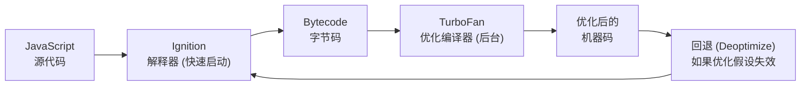

# 第11章：生产案例——真实世界中的编译器

**用一句话说清楚**：前面的章节讲了"通用知识"，这一章是"工程师的实战笔记"——TCC 怎么在 0.003 秒内编译 100 行代码？Clang 凭什么在 2022 年代码质量超越 GCC？V8 如何在 0.5 毫秒内编译你的 JavaScript 函数？

## TCC：速度至上的微型 C 编译器

**Tiny C Compiler（TCC）** 是 Fabrice Bellard（FFmpeg 作者，圆周率计算记录保持者）的杰作。

### 设计哲学

- **单遍编译**：扫描一次源代码，边读边生成机器码
- **无独立 IR**：没有中间表示阶段，从 AST 直接生成机器码
- **值栈架构**：不使用寄存器分配，而是用"值栈"（类似 JVM 的栈机）

### 核心设计：值栈

```c
// TCC 的值栈设计 —— 表达式求值时不分配临时变量
// 而是把所有中间结果压入"值栈"

// 表达式: a + b * c
// 值栈变化过程：
//   push a      → 栈: [a]
//   push b      → 栈: [a, b]
//   push c      → 栈: [a, b, c]
//   *: pop c,b  → 栈: [a, b*c]
//   +: pop b*c,a → 栈: [a+b*c]
//   pop 结果
```

**优势**：不需要寄存器分配器，不需要管理临时变量生命周期。
**代价**：值栈操作本身产生大量内存访问，生成代码质量差 2-10x。

### 性能数据

```
编译 100 行 C 代码： 0.003 秒      ← 比眨眼的 1/100 还快
执行速度：           GCC-O2 的 10-30%  ← 但对"编译后跑一次的脚本"来说够快
```

> 💡 **最适合的场景**：你写了一个 C 脚本，想快速运行一次看结果。TCC 的想法是：**编译 0.003s + 运行 0.1s = 0.103s** vs GCC 编译 0.1s + 运行 0.01s = 0.11s。但 TCC 更快编译，而且 - 你不需要等待。

### 限制

- 不支持大部分标准库
- 代码生成质量差（约 GCC -O0 的水平）
- 可执行文件大（缺少优化）
- 不支持 C++

## Chibicc：最好的教学编译器

**Chibicc** 是 ~2500 行实现的 C11 子集编译器，由 Rui Ueyama（ld.lld 链接器作者）编写。

### 让它特别的设计

```c
// 🔑 关键设计：统一节点分配器
// 不用 free() / 不用 Arena 池 / 不用引用计数
// 所有 AST 节点都在一个巨大的动态数组里分配

ASTNode *new_node(NodeKind kind, Node *left, Node *right) {
    Node *node = node_array + node_count++;  // 直接数组取地址
    node->kind = kind;
    node->left = left;
    node->right = right;
    return node;
    // 编译器退出时操作系统自动回收内存
    // 没有 free ！没有泄漏！
}
```

> 💡 编译器是一个**一次性程序**——它启动、编译、退出。所有分配的内存可以在退出时由操作系统统一回收。这意味着：在编译器内部，你**不需要**操心内存释放。

### 为什么 Chibicc 是极好的学习资料？

1. **自底向上构建**：从 Hello World 到完整 C 编译器，每一步都是可运行的版本
2. **3000 行 C 代码**：一个人能从头理解
3. **代码注释丰富**：每行都有为什么这么写的解释
4. **生成 x86-64 汇编**：直接能看到成果

## Clang/LLVM：现代编译器工业标准

### 为什么 Clang 赢了 GCC？

**Clang 的"错误信息革命"**——它彻底改变了开发者对编译器错误报告的期待：

```c
// GCC 的错误信息（2007）：
error: parse error before ';' token

// Clang 的错误信息（2022）：
error: expected ';' after expression
    int a = 42
              ^
              ;
note: insert ';' at the end of the statement
```

> 💡 Clang 不仅告诉你出错了，还告诉你**怎么修复**。这种体验让无数 C++ 开发者转投 Clang。

### 关键技术指标对比（2022+）

| 指标 | Clang | GCC |
|------|-------|-----|
| **二进制大小** | 较小 | 较大 |
| **编译速度** | 快 50-100% | 慢 |
| **生成代码质量** | SPEC 103-105% | 100% |
| **错误信息** | fix-it 提示 | 基本信息 |
| **调试信息** | 更好（DWARF 5 标准支持） | 更好 |
| **C++20 支持** | 略快 | 略慢 |

**Clang 的关键技术**：

1. **高抽象层次的 LLVM IR** —— 前后端解耦，一套优化供 N 种语言使用
2. **丰富的 AST 工具生态** —— libTooling，让 clang-tidy、clang-format、clangd（LSP）等工具脱颖而出
3. **模块化编译** —— 每个 pass 是一个独立的 C++ 类，可以按需组合

## V8 TurboFan：JS 编译的"分阶段"策略

V8 编译 JavaScript 的特殊之处在于——它需要在**运行时**编译（JIT）。

### 编译阶段的"雪球"模型



1. **第一阶段：快速启动** → Ignition 解释器直接运行字节码
2. **第二阶段：类型特化** → TurboFan 根据"实际运行的数据类型"编译优化版
3. **第三阶段：安全回退** → 如果优化假设错了（如"之前参数都是整数，突然来了个字符串"）→ 回退到解释器

### Sea-of-Nodes IR

TurboFan 使用一种特殊的 IR——**Sea-of-Nodes**（节点海）。它不是线性指令序列，而是一个巨大的图，节点代表操作，边代表数据依赖。

```
                    ┌─────────┐
                    │  Add(3)  │
                    │  3+5=8   │
                    └────┬────┘
                        │
            ┌───────────┼───────────┐
            │                        │
        ┌───┴───┐              ┌───┴───┐
        │ int:3 │              │ int:5 │
        │const  │              │const  │
        └───────┘              └───────┘
```

### 性能数据

```text
函数编译时间：       0.5–2 ms/函数
典型的：             JavaScript 函数从解释到优化编译 ≈ 热调用 10-100 次后触发
可暂停编译：          每 50 条指令检测一次"是否需要暂停"（避免阻塞用户交互）
```

## Rust 编译器：现代语言的编译革命

### 关键策略

| 策略 | 效果 |
|------|------|
| **增量编译** | 减少 70% 重新编译时间 |
| **并行前端** | 利用多核处理 |
| **代码生成分流** | Release 构建 → LLVM；Debug 构建 → Cranelift（快 3-5 倍） |
| **编译缓存（sccache）** | 云端缓存编译结果 |

> 💡 Rust 编译器的一个重要创新是**并行解析 crate dependencies**——传统的"先解析 A，再解析 B，再解析 C"改为"同时解析 A、B、C"。仅仅改这一项，编译速度提升 2-3x。

## Green Hills 编译器：嵌入式世界的老大哥

### 嵌入式编译器的特殊关注点

| 关注点 | 对桌面/服务器编译器的不同 |
|--------|-------------------------|
| **代码密度** | 内存极度有限，10-30% 代码密度提升=决定成败 |
| **代码可靠性** | 医疗/航空/车载代码需要形式化验证 |
| **编译速度** | 慢 2-5x 可以接受，质量优先 |
| **标准合规** | MISRA C/C++ 强制合规 |

Green Hills 的专有优化技术能将代码密度提升 **10-30%**（相比于 GCC -Os）。代价是编译时间增加 **2-5 倍**。在汽车电子和航空航天领域，开发商愿意为这个优势支付高价。

## 📝 本章小结

| 案例 | 最大特色 | 一句话总结 |
|------|---------|-----------|
| **TCC** | 极快编译 | 0.003 秒/100 行，单遍无 IR，代码质量差但够用 |
| **Chibicc** | 教学最佳 | ~2500 行 C 代码，自底向上构建完整 C 编译器 |
| **Clang** | 工业标准 | LLVM IR 生态 + 极致错误信息 + 模块化通行证 |
| **V8 TurboFan** | JIT 编译 | Sea-of-Nodes IR + 退优化保证 |
| **Rust** | 编译革命 | 增量、并行、Cranelift 后端分流 |
| **Green Hills** | 极端可靠 | 代码密度提升 10-30%，用于航空航天/汽车 |

### 🏋️ 最终挑战

1. 尝试编译 Chibicc：在 GitHub 搜索 `rui314/chibicc` 找到源代码，编译运行测试
2. 对比 `gcc -O0` vs `gcc -O2` 汇编：用 `-S` 标志看看优化做了什么
3. 阅读 Clang 的错误输出：找个复杂 C++ 程序看看，你很快会发现为什么 Clang 这么受欢迎

## 📚 结语与推荐资源

### 如果你是初学者，推荐的学习路径：

1. **先看懂第 1 章的 200 行微型编译器** → 就有了整体图景
2. **手写第 2 章和第 4 章的代码** → 动手实践
3. **阅读 Chibicc 源码** → 理解一个完整的 C 编译器
4. **用 Clang 对比看汇编** → 理解优化产生的效果
5. **阅读龙书（Compilers: Principles, Techniques, and Tools）** → 理论学习

### 推荐阅读

| 书名 | 推荐理由 |
|------|---------|
| **Engineering a Compiler** ✅ 首推 | 实践性强，代码示例丰富，讲清楚了"怎么做" |
| **龙书（紫龙书）** | 理论权威，"为什么需要这样做"讲得最好 |
| **The Annotated C11 Draft** | 需要深入了解 C 标准时 |
| **Chibicc 博客** | rui314/chibicc 的构建日志——最好的免费教程 |
| **LLVM Kaleidoscope 教程** | 了解 LLVM IR 和中端优化 |

> 💡 **给自学者的最终建议**：不要从头开始读龙书。先动手写——给你的表达式计算器加上括号、加上函数、加上变量。当你发现"递归下降遇到左递归"时，再回头读龙书的相应章节。**动手→遇到问题→看书→解决问题→再看书→深入理解。**
