# 为啥Redis用哈希槽，不用一致性哈希？

## 首先，从使用hash取模数据分片开始说起

无论是哈希槽，还是一致性hash，都属于hash取模数据分片。

### 先从经典的hash取模数据分片说起

假如 Redis集群的节点数为3个，使用经典的hash取模算法进行数据分片，实际上就是一个节点一个数据分片，分为3片而已。

每次请求使用 hash(key) % 3 的方式计算对应的节点，或者进行 分片的路由。

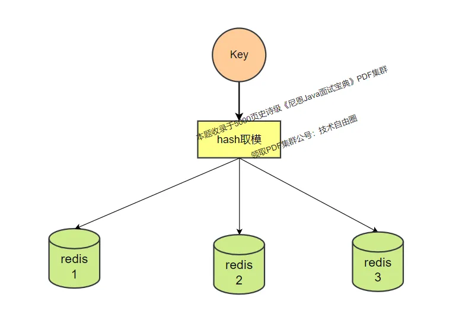

从上面可以看到，经典哈希取模分片，是非常简单的一种分片方式

### 经典哈希取模分片的问题和对策：

哈希取模分片有一个核心问题：对扩容不友好，扩容的时候数据迁移规模太大。

比如，把节点从3个扩展到4个，具体如下：

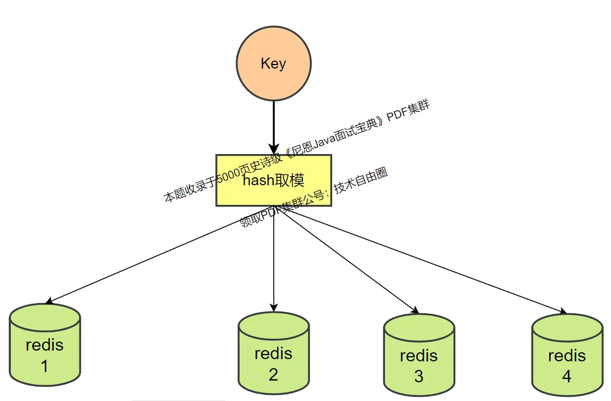

原来的分片路由算法是：hash(key) % 3

现在的分片路由算法是：hash(key) % 4

分片路由算法调整之后，那么，大量的key需要进行节点的迁移。

换句话，即当增加或减少节点时，原来节点中的80%以上的数据，可能会进行迁移操作，对所有数据重新进行分布。

如何应对呢？

规避的措施之一：如果一定要采用哈希取模分片，建议使用多倍扩容的方式，这样只需要适移50%的数据。例如以前用3个节点保存数据，扩容为比以前多一倍的节点即6个节点来保存数据，这样移动50%的数据即可。

规避的措施之一：采用一致性hash分片方法。

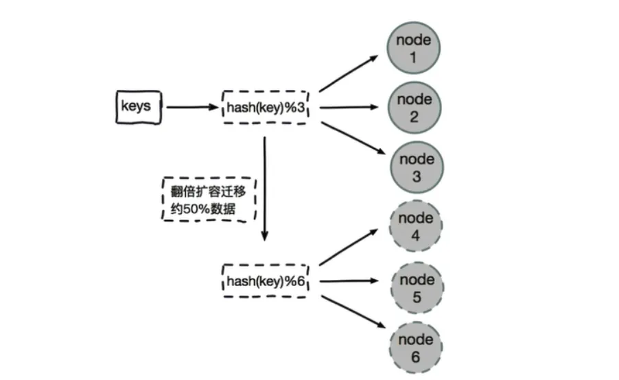

哈希取模分片优点：

-   配置简单：对数据进行哈希，然后取余

哈希取模分片缺点：

-   数据节点伸缩时，导致大量数据迁移
-   迁移数量和添加节点数据有关，建议翻倍扩容

## 一致性hash算法

如果redis使用一致性hash算法进行数据分片，那么核心会涉及到的两个阶段：

-   **第一阶段**，需要完成key到slot槽位之间的映射。
-   **第二阶段**，需要完成slot槽位到 redis node节点之间的映射。

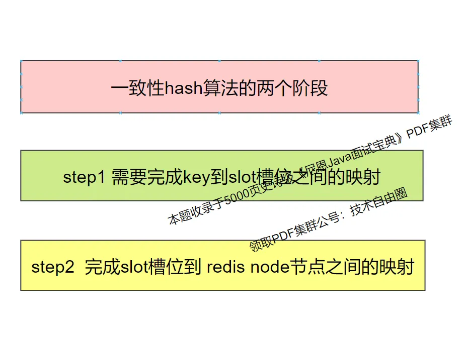

首先看第一阶段。

### 第一阶段，需要完成key到slot槽位之间的映射

**第一阶段**，使用了哈希取模的方式，不同的是:  对 2^32 这个固定的值进行取模运算。

具体如下图所示：

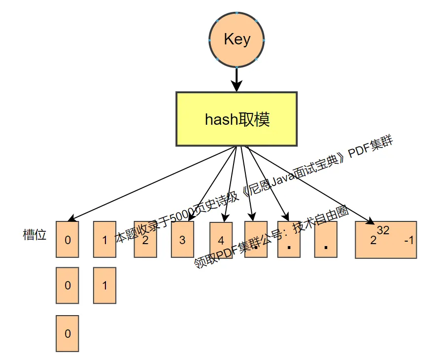

注意，这里的取模的除数，是 2^32，相当于  2^32个槽位，英文是 slot 。

通过这个槽位的计算，可以确定 key => slot 之间的映射关系。

**第二阶段**，需要完成slot槽位到 redis node节点之间的映射。

### 第二阶段，需要完成slot槽位到 redis node节点之间的映射。

如何完成 slot  槽位到node 节点之间的映射呢？

这里，需要 采用一种特殊的结构：Hash槽位环。

#### Hash槽位环

把一致哈希算法是对 2^32  slot 槽位虚拟成一个圆环，环上的对应 0~2^32 刻度，如下图：

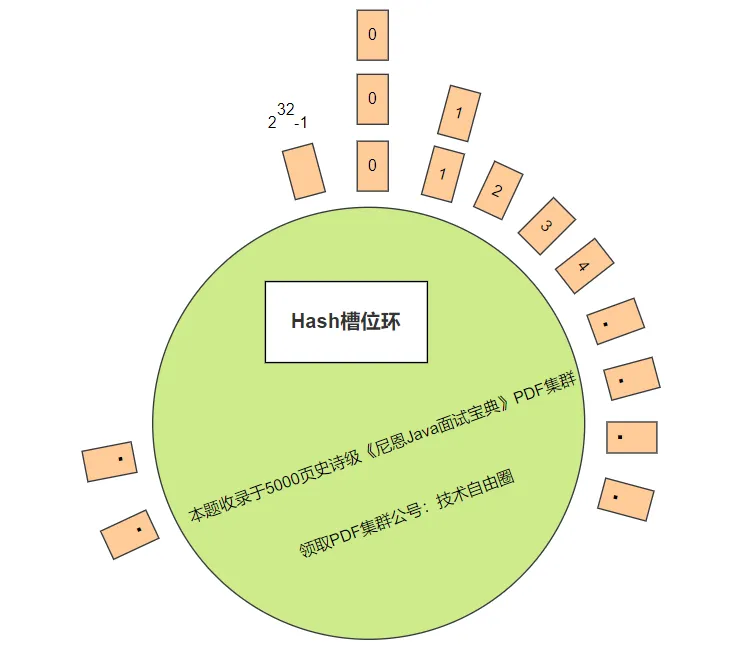

如何完成 slot  槽位到node 节点之间的映射呢？

假设有4个redis 节点，可以把 2^32  slot 槽位环分成4段，每一个redis 节点负责存储一个slot分段

如下图所示：

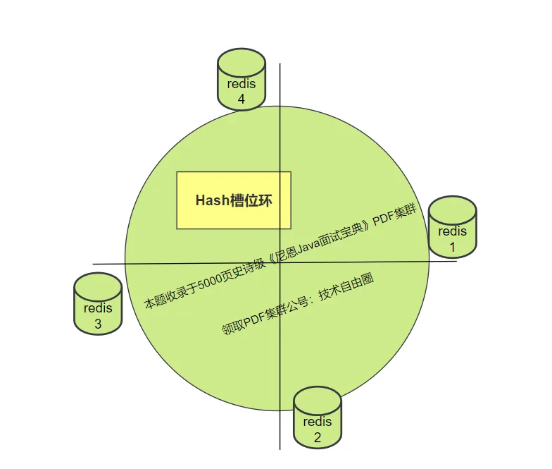

如何对每一个key进行node 路由呢？

**第一步** 进行slot槽位计算：每一个key进行hash运算，被哈希后的结果 2^32  取模，获得slot 槽位、

**第二步** 在hash槽位环上，按顺时针去找最近的redis节点，这个key将会被保存在这个节点上。

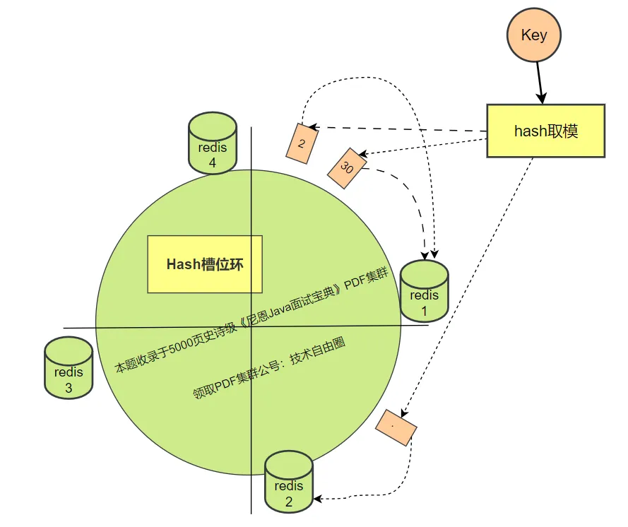

### 一致性哈希原理：

将所有的数据用hash取模，映射到 2^32个槽位。

把2^32个槽位 当做一个环，把N个redis 节点瞬时间放置在槽位环上，从而把槽位环分成N段，每redis 节点负责一个分段。

当key在槽位环上路由的时候，按顺时针去找最近的redis节点，这个key将会被保存在这个节点上。

来看一致性哈希 三个经典场景：

#### 经典场景1：Key入环

下图我们四个key（Key1/Key2/Key3）经过哈希计算，放入下面环中，第一步是进行hash计算，取模后得到slot槽位。

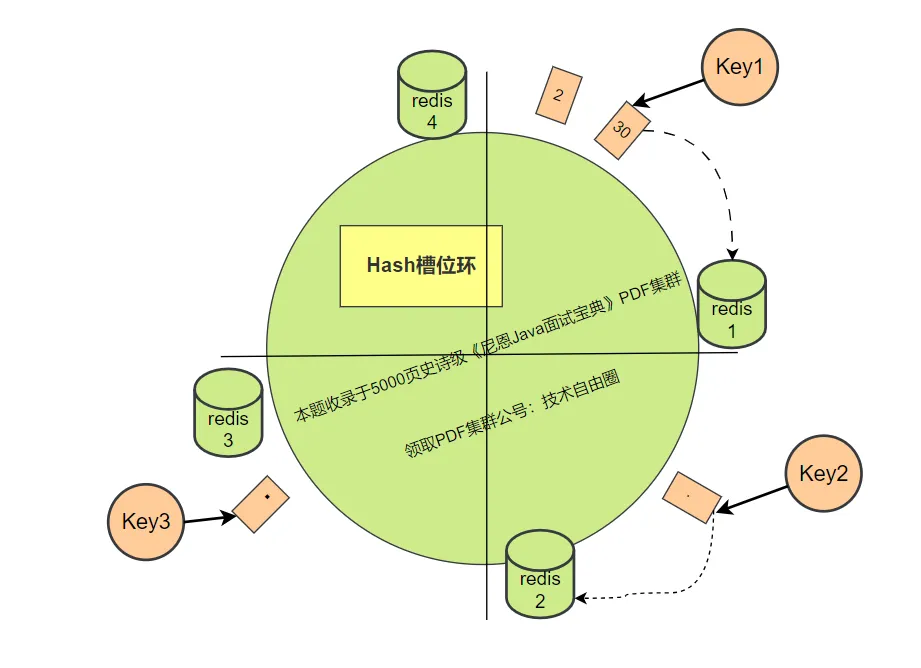

找到了slot槽位，相当于已经成功映射到哈希环上，

然后将槽位按顺时针方向，找到离自己最近的redis节点上，将value存储到那个节点上。

#### 经典场景2：新增redis节点

现在，需要对redis 节点进行扩容，在redis1 和 redis2之间，新增加点redis 5。

具体的操作是：在hash槽位环上，把redis 5节点放置进去，大致如下图所示。

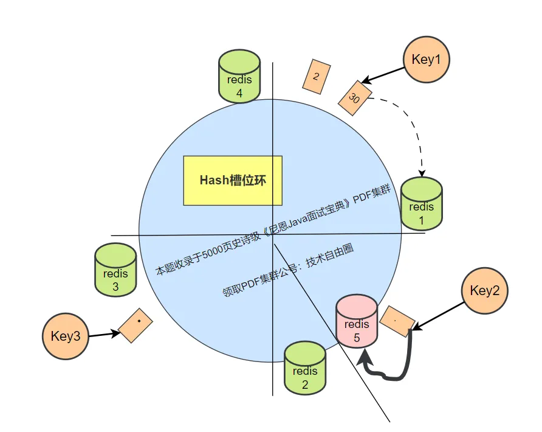

添加了新节点之后，对所有的redis 2上的数据，进行重新的检查。

如果redis 2上的数据，顺时针方式最近的新节点不是redis 2而是 redis 5的话，需要进行迁移，迁移到redis 5。

比如，上图的key2，需要从redis 2迁移 redis 5。

而其他节点上的数据，不受影响。比如redis1、redis3、redis4上的数据不受影响。上图中，key1和key3不受影响

#### 经典场景3：删除redis节点

假设，删除hash环上的节点redis 2，如下图：

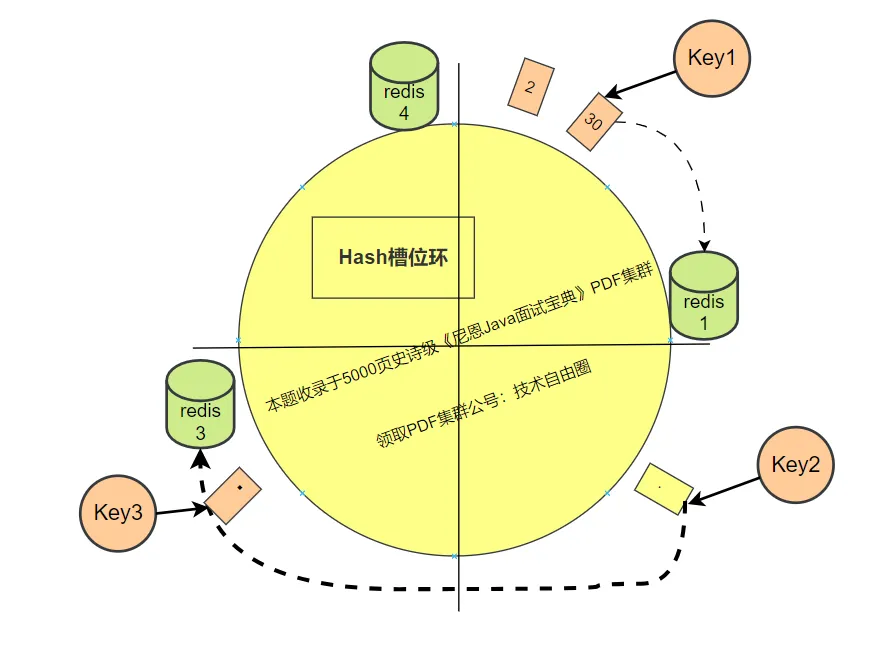

那么存储在redis 2节点上的key2，将会重新映射找到离它最近的节点redis3，如下图

另外，key1、key3不受影响。

## 经典哈希取模与一致性hash的对比：

前面讲到，假设Redis 集群使用经典哈希取模分片，缺点是在数据节点伸缩时，导致大量数据迁移：

-   最少50%的数据要迁移，这个是在翻倍扩容场景
-   一般有80%以上的数据要迁移。

假设Redis 集群使用一致性哈希取模分片，通过上面的一致性哈希取模新增节点、一致性哈希取模删除节点的分析之后，可以得到：

-   一致性hash在伸缩的时候，需要迁移的数据不到25%（假设4个节点）。
-   和普通hash取模分片相比，一致性哈希取模分片需要 迁移的数据规模缩小2倍以上。

## 一致性hash的数据不平衡（数据倾斜）问题

标准的一致性hash，存在一个大的问题：数据不平衡（数据倾斜）问题。

回顾一下，一致性hash算法的两个阶段：

-   **第一阶段**，需要完成key到slot槽位之间的映射。
-   **第二阶段**，需要完成slot槽位到 redis node节点之间的映射。

在这个两阶段中，数据不平衡（数据倾斜）问题的来源在第二阶段：

-   **第一个阶段**，hash算法是均匀的。
-   **第二个阶段**，如果某个节点宕机，那么就会出现节点的不平衡。

比如，下面一个例子，6个key  分布在四个节点：

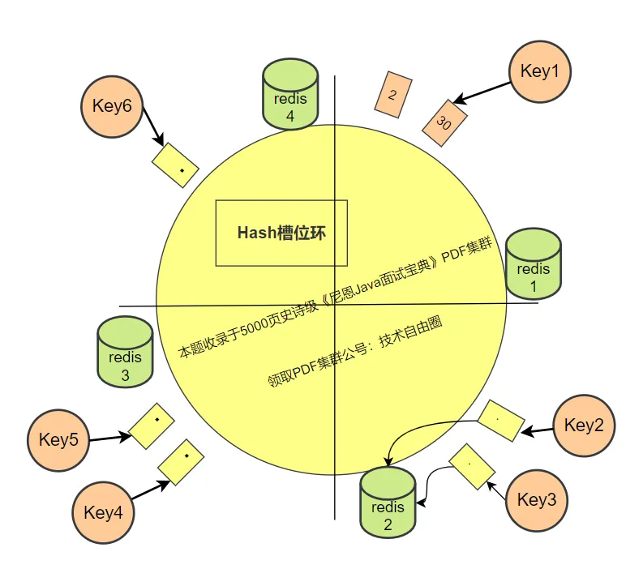

如果，上图的节点redis2 宕机了，那么，key2和key3会迁移到节点redis 3。

迁移之后，发生了 严重的数据倾斜，或者不平衡。Redis 3上4个key，而redis 1、redis 4上只有1个key。

这样，redis2 上的数量很多，此时会导致节点压力陡增。

旱涝不均。

那如何解决这个旱涝不均问题呢？答案是通过 **虚拟节点**。

### 什么是 虚拟节点？

**虚拟节点** 可以理解为逻辑节点，不是物理节点。假设在hash环上，引入 32 个虚拟 reids节点。如下图所示：

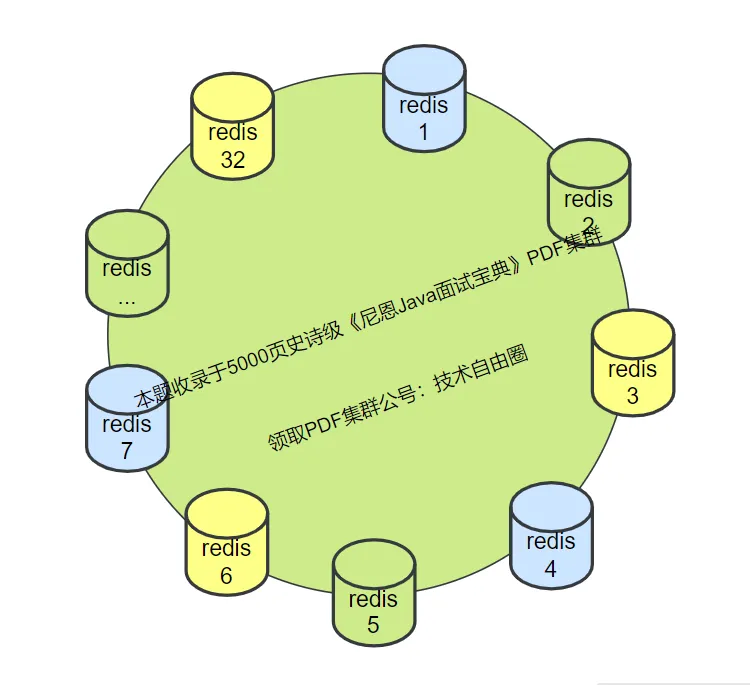

如何找到物理节点呢？ 办法是增加一次映射：虚拟节点到物理节点的映射。

假设加上一层  32 个虚拟 redis节点到 4个  redis 物理节点映射。一种非常简单的map参考映射方案，如下：

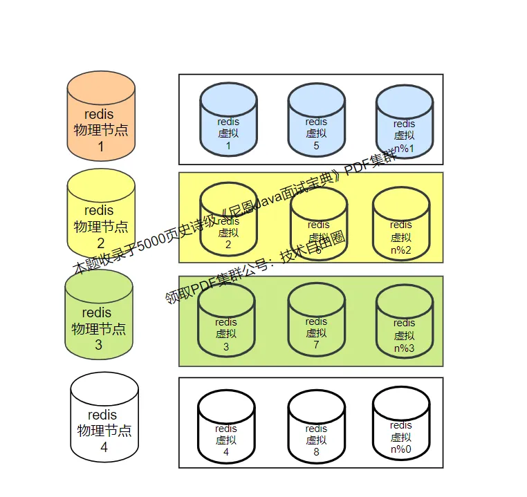

假设物理节点 redis 3被移除，那么，把redis 3负责的逻辑节点，二次分配到其他三个物理节点就行了，大致的思路如下：

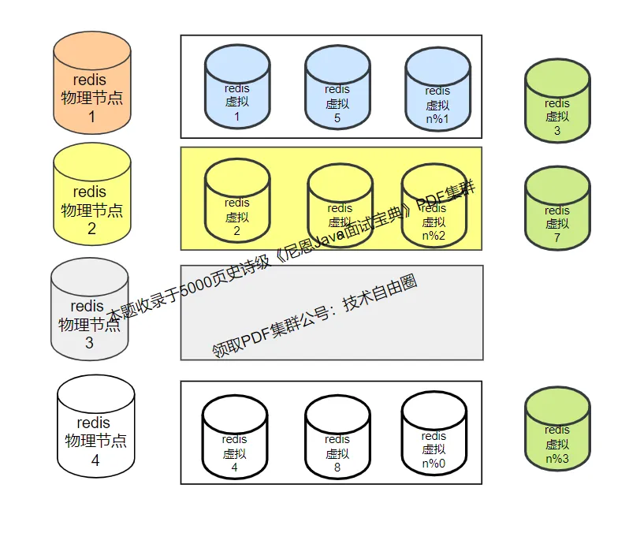

当然，上图例子中只简单列举了一种虚拟节点的简单映射方案，实际代码中会有更多的、更为复杂的方案。

无论如何，通过虚拟节点，就会大大减少了 一致性hash 算法的数据倾斜/数据不平衡。

### 一致性hash的简易实现

可以使用TreeMap 来实现一致性hash，原因有二：

-   TreeMap的key是有序，
-   使用TreeMap的ceilingEntry(K k) 方法，可以返回大于或等于给定参数K的键，这就是映射到的节点。

TreeMap是一个小顶堆，默认是根据key的自然排序来组织（比如integer的大小，String的字典排序）。底层是根据红黑树的数据结构构建的。

这里使用TreeMap的ceilingEntry(K key) 方法，该方法用来返回与该键至少大于或等于给定键，如果不存在这样的键的键 - 值映射，则返回null相关联。

一致性hash的简易实现，参考代码如下：

```
package com.th.treemap;

import java.util.HashMap;
import java.util.Iterator;
import java.util.Map;
import java.util.TreeMap;

public class ConsistentHash {
    /**
     * 假设我们一共初始化有8个节点(可以是ip, 就理解为ip吧);
     * 把 1024个虚拟节点跟 8个资源节点相对应
     */
    public static Map<Integer, String> nodeMap = new HashMap<>();
    public static int V_redisS = 1024; // 假设我们的环上有1024个虚拟节点
    static TreeMap<Integer, String> virtualHashRingMap = new TreeMap<>();
    private static final Integer REAL_redis_COUNT = 8;
    static {
        nodeMap.put(0, "redis_0");
        nodeMap.put(1, "redis_1");
        nodeMap.put(2, "redis_2");
        nodeMap.put(3, "redis_3");
        nodeMap.put(4, "redis_4");
        nodeMap.put(5, "redis_5");
        nodeMap.put(6, "redis_6");
        nodeMap.put(7, "redis_7");


        for (Integer i = 0; i < V_redisS; i++) {
            // 每个虚拟节点跟其取模的余数的 redisMap 中的key相对应；
            // 下面删除虚拟节点的时候, 就可以根据取模规则来删除 TreeMap中的节点了；
            virtualHashRingMap.put(i, nodeMap.get(i % REAL_redis_COUNT));
        }
    }

    /**
     * 输入一个id
     *
     * @param value
     * @return
     */
    public static String getRealServerredis(String value) {
        // 1. 传递来一个字符串, 得到它的hash值
        Integer vredis = value.hashCode() % 1024;
        // 2.找到对应节点最近的key的节点值
        String realredis = virtualHashRingMap.ceilingEntry(vredis).getValue();


        return realredis;
    }

    /**
     * 模拟删掉一个物理可用资源节点, 其他资源可以返回其他节点
     */
    public static void dropBadredis(String redisName) {
        int redisk = -1;
        // 1. 遍历 redisMap 找到故障节点 redisName对应的key;
        for (Map.Entry<Integer, String> entry : nodeMap.entrySet()) {
            if (redisName.equalsIgnoreCase(entry.getValue())) {
                redisk = entry.getKey();
                break;
            }
        }
        if (redisk == -1) {
            System.err.println(redisName + "在真实资源节点中无法找到, 放弃删除虚拟节点!");
            return;
        }

        // 2. 根据故障节点的 key, 对应删除所有 chMap中的虚拟节点
        Iterator<Map.Entry<Integer, String>> iter = virtualHashRingMap.entrySet().iterator();
        while (iter.hasNext()) {
            Map.Entry<Integer, String> entry = iter.next();
            int key = entry.getKey();
            String value = entry.getValue();
            if (key % REAL_redis_COUNT == redisk) {
                System.out.println("删除物理节点对应的虚拟节点: [" + value + " = " + key + "]");
                iter.remove();
            }
        }
    }

    public static void main(String[] args) {
        // 1. 一个字符串请求(比如请求字符串存储到8个节点中的某个实际节点);
        String requestValue = "技术自由圈";
        // 2. 打印虚拟节点和真实节点的对应关系；
        System.out.println(virtualHashRingMap);
        // 3. 核心: 传入请求信息, 返回实际调用的节点信息
        System.out.println(getRealServerredis(requestValue));
        // 4. 删除某个虚拟节点后
        dropBadredis("redis_2");
        System.out.println("==========删除 redis_2 之后: ================");
        System.out.println(getRealServerredis(requestValue));
    }
}
```

>   尼恩提示，一致性hash是面试重点，这段代码，大家一定要跑一下。

### 回顾下一致性 Hash 算法

接下来，简单回顾下一致性 Hash 算法：

为了避免出现数据倾斜问题，一致性 Hash 算法引入了虚拟节点的机制。

虚拟节点和物理节点解耦，引入虚拟节点到物理节点之间的映射，最终每个物理节点在哈希环上会有多个虚拟节点存在，引入了虚拟节点的机制之后，数据定位算法不变，只是多了一步虚拟节点到实际节点的映射，例如定位到“redis-1-1”、“redis-1-2”、“redis-1-3”三个虚拟节点，都能映射到  redis-1 上。

引入虚拟节点，可以大大削弱甚至避免数据倾斜问题。在实际应用中，通常将虚拟节点数设置为32甚至更大。

## Redis为什么使用哈希槽而不用一致性哈希

回到正题，很多小伙伴问尼恩，既然一致性hash那么完美，两大优点：

-   既很少的数据迁移，
-   又很少数据倾斜。

Redis为什么使用哈希槽而不用一致性哈希呢？

这个和redis 集群的架构特点有关系，redis 集群的架构特点，主要有两点：

-   去中心化
-   方便伸缩  （自动伸缩、手动伸缩都可以）

## Redis Cluster集群核心特点一：去中心化

关于分布式集群的设计，一般要考虑以下几个方面：

-   元数据存储，包括 数据分片与存储节点的映射关系等
-   节点间通信，包括信息互通、健康状态等
-   扩缩容，比如 考虑数据迁移情况
-   高可用，当节点出现故障时，能及时自动的进行故障转移

>   尼恩这里重点讨论的是数据分片，而不是高可用和故障转移，有关高可用和故障转移的内容，请参见尼恩视频《视频第21章：6个面试必备 Redis cluster的核心实操》

### 先看分布式集群的设计中的核心：元数据存储  设计。

有两种架构模式：

-   中心化的存储架构
-   去中心化的存储架构

### 中心化的 元数据存储架构

首先，看中心化的 元数据存储架构

常见的中间组件来存储元数据，比如 zk、etcd、nacos 等等；

在客户端看来，先从协调节点获取元数据，然后再负载均衡到某个服务节点，大致如下图所示：

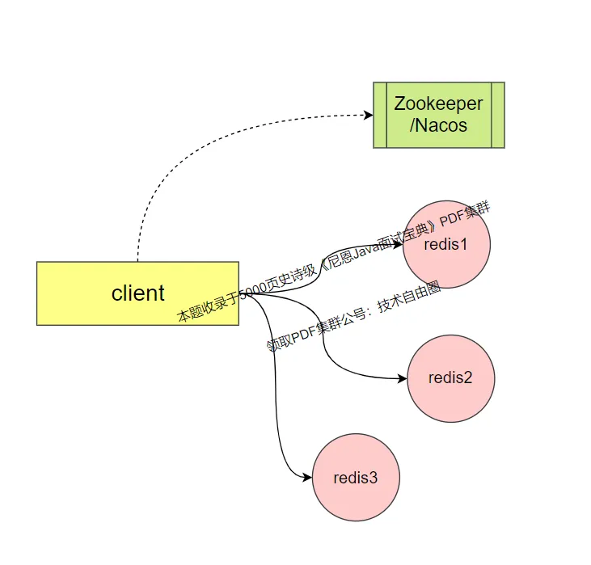

kafka在2.8版本之前，强依赖zookeeper这个分布式服务协调管理工具的进行元数据管理。

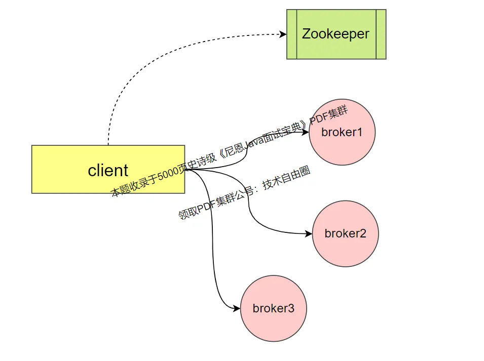

在kafka2.8版本开始尝试从服务架构中去掉zookeeper，到了3.0版本这个工作基本上完成，这是kafka的一个非常重要的里程碑。2.8.0版本将是第一个不需要ZooKeeper就可以运行Kafka的版本，而这也被称为Kafka Raft Metadata mode（Kafka Raft 元数据模式），或许就是一个会被后人铭记的版本。

ZooKeeper是一个独立的软件，但是ZooKeeper使得Kafka整个系统变得复杂，因此官方决定使用内部仲裁控制器来取代ZooKeeper。过去Kafka因为带着ZooKeeper，因此被认为拥有沉重的基础设施，而在移除ZooKeeper之后，Kafka更轻巧更适用于小规模工作负载，轻量级单体程序适合用于边缘以及轻量级硬件解决方案。

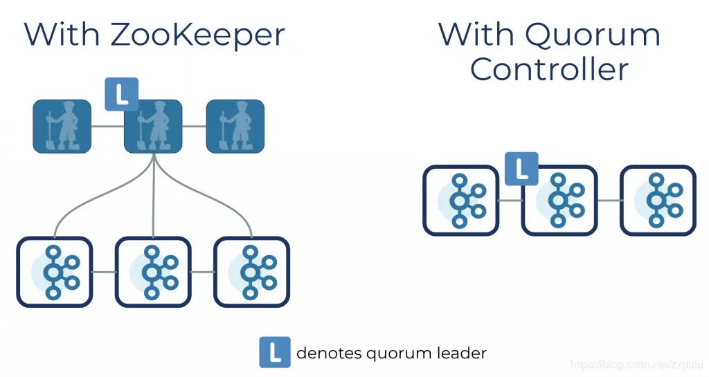KRaft

2.8.0版本之后的Kafka集群，元数据管理，本质上从中心化演进到了去中心化，通过raft协议保证元数据写入的数据一致性。

>   *尼恩备注：raft是工程上使用较为广泛的强一致性、去中心化、高可用的分布式协议*。
>
>   有关Raft 协议的内容，请参见后面的 《附录1：Raft 协议》

2.8版本之前zookeeper-based Kafka集群，集群有唯一的Controller，这个Controller是从所有的broker中选出，负责Watch Zookeeper、partition的replica的集群分配，以及leader切换选举等流程。

2.8.0版本之后with quorum kafka集群将其引入的共识协议称为`Event-driven consensus`，quorum controller不是单个节点，而是一个小的集群，每个 controller 节点内部维护RSM（replicated state machine），不像之前的zookeeper-based，controller 节点不需要首先访问zookeeper获取状态信息。Kafka的元数据会通过raft一致性协议写入quorum，并且系统会定期做snapshot。

`KRaft`中Controller可以被指定为奇数个节点（一般情况下3或5）组成raft quorum。controller节点中有一个active（选为leader），其他的hot standby。这个active controller集群负责管理Kafka集群的元数据，通过raft协议达成共识。因此，每个controller都拥有几乎update-to-date的Metadata，所以controller集群重新选主时恢复时间很短。

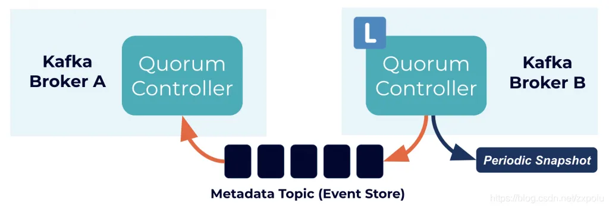event-drive

集群的其他节点通过配置选项`controller.quorum.voters`获取controller。zookeeper-based Kafka集群中，controller发送Metadata给其他的broker。现在broker需要主动向active controller拉取Metadata。一旦broker收到Metadata，它会将其持久化。这个broker持久化Metadata的优化意味着一般情况下active controller不需要向broker发送完整的Metadata，只需要从某个特定的offset发送即可。但如果遇到一个新上线的broker，Controller可以发送snapshot给broker（类似raft的InstallSnapshot RPC）。

>   扯太远了，尼恩就像一个喜欢讲历史故事的老人，喜欢无止境的发散。
>
>   抱歉了，伙计们，咱们得回到正题。
>
>   当然，如果能和面试官扯到这里，面试也会很惊奇的。

### 去中心化的 元数据存储架构

使用去中心化的方式，让每个redis节点、甚至客户端都维护一份元数据信息，大概是这样：

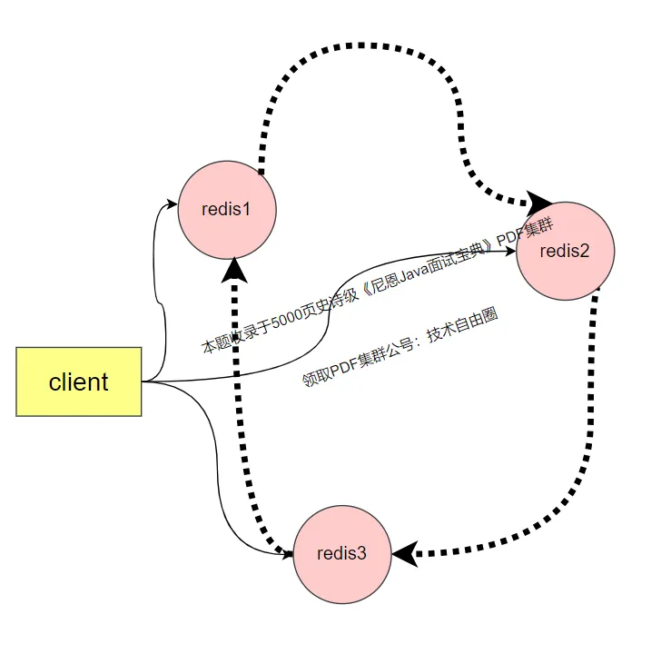

集群间的redis 采用特定的一些通信协议（如raft协议、gossip协议）进行信息交换，以保证集群数据整体一致性。

>   有关Raft 协议的内容，请参见后面的 《附录1：Raft 协议》
>
>   有关gossip协议的内容，请参见后面的 《附录2：gossip 协议》

redis  client客户端请求直连集群任意节点，

当redis client访问任意一个节点，该节点总能定向到正确的节点去处理（即使该请求不归属于它处理，但它知道谁能处理）。

## 去中心化场景如何保证元数据一致?

如果每个redis节点都要存储一份元数据信息（分片与节点的映射关系），那么问题来了？

在数据更新时，必然可能存在一定的数据一致性的延迟，这就要求更高的节点间通信效率。如何保证呢？

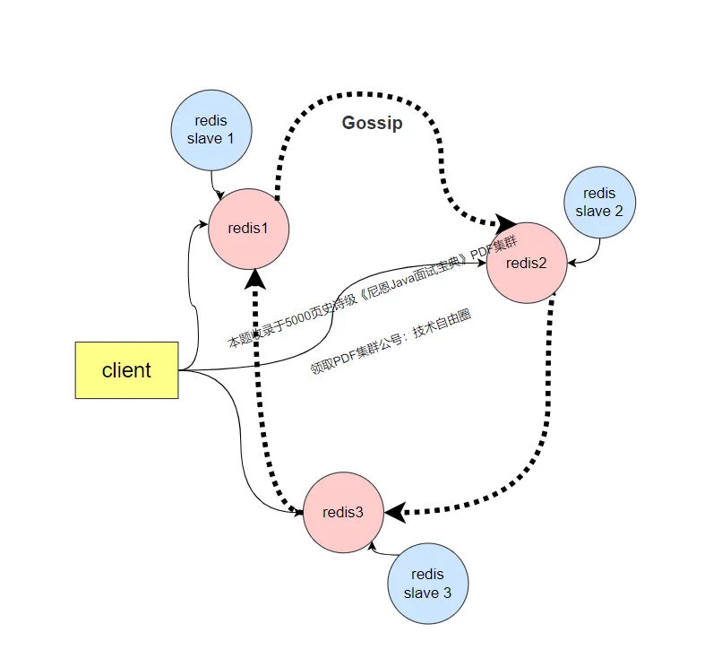

### 问题1：redis 如何进行数据分片的？

redis 集群的元数据信息，核心就是数据分片shard与节点的映射关系。

redis 如何进行数据分片的？redis 本质上也是 hash 之后取模分片。

第一步：hash。hash算法的功效，核心就是保证数据不倾斜，或者说保证分布均匀。那么，redis cluster 的hash算法，采用的是 crc16 哈希算法。

第二步：取模。就是槽位的数量，redis 集群的把数据分为16484 个细粒度分片，或者说 16484 个slot槽位。

redis cluster 采用 crc16 哈希算法，并使用固定长度的模 16384，其中，这 16484 个哈希分片也称之为 哈希槽，然后将这些哈希槽尽可能均匀的分配给不同的服务节点。

#### redis cluster 哈希槽

redis cluster 还是采用hash取模分片，数据落在哪个分片（这里对应到槽位）的算法为

```
 slot = Hash(key) % 16484
```

这里，使用固定长度的模 16384（2^14），这 16484 个哈希分片也称之为 哈希槽，然后将这些哈希槽尽可能均匀的分配给不同的服务节点。具体如下图：

集群将数据划分为 16384 个槽位（哈希槽），每个Redis服务节点分配了一部分槽位。

从hash取模这个角度来说，redis hash 分片和一致性哈希是一样的。

所不同的是：

-   第一：槽位规模不同。redis 集群将数据划分为 16384 （2^14）个槽位（哈希槽），一致性hash有  2^32个槽位。
-   第二：hash slot和node 节点的映射关系不同。一致性hash是哈希环顺时针映射，redis 哈希槽是静态映射。

大家回顾一下，一致性hash 怎么 进行hash slot和node 节点 映射的呢？

一致性hash的映射规则是，每个槽按照顺时针方向找到最近的一个节点便是对应所属的存储服务器，简称为顺时针映射，如下图：

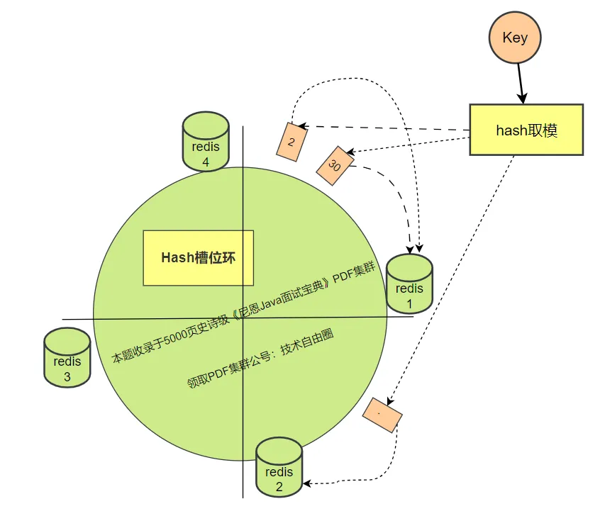

而redis hash 分片，属于静态映射类型。直接把slot槽位静态分配到redis 节点，当然，静态分配的时候需要尽可能保证均匀。

假定我们有三个服务节点，尽可能均匀分配之后，分配关系如下：

-   节点 A 包含哈希槽从 0 到 5460.
-   节点 B 包含哈希槽从  5461 到 10923.
-   节点 C 包含哈希槽从 10924 到 16383.

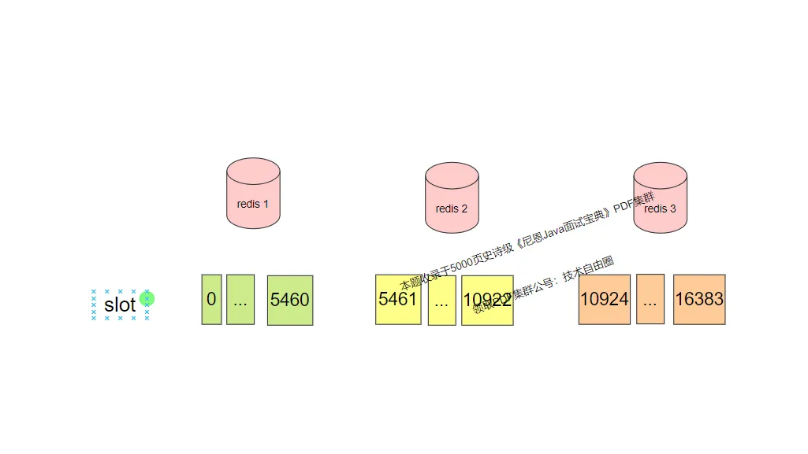

#### 增加节点

还记得我们搞集群的目的是啥？单机容量不足，需要扩容成多机组成的集群，然后将数据尽可能的均分到各个节点。

redis cluster，我们可以很容易的增加或者删除节点，

新增一个节点4，redis cluster的这种做法是从各个节点的前面各拿取一部分slot(槽)到4上。

当我们新增一个节点4 时，节点1、2、3的数据会迁移一部分到节点 4；实现4个节点 数据均匀：

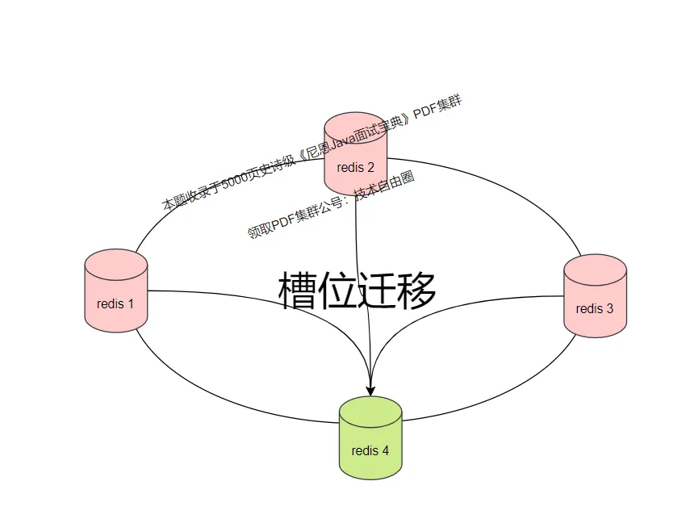

此时服务1、2、3、4通过分配各自有了对应的哈希槽，新增节点后集群会自动进行哈希槽的重新平均分配，比如上图中四个节点中每个节点的槽位数是：18384 / 4 = 4096。

当然，还可以适当调整，或者手动进行分配。

具体来说，可以使用命令 【cluster addslots】为每个节点自定义分配槽的数量，手动调整的场景是：比如有些节点的机器性能好，内存有128G，那就可以配置更多槽位。

#### 减少节点

如果减少一个节点4，redis cluster同样会自动进行槽数量的重新计算。

当我们删除节点 4 时，节点4的slot数据会均匀的迁移到节点 1、节点 2、节点3。

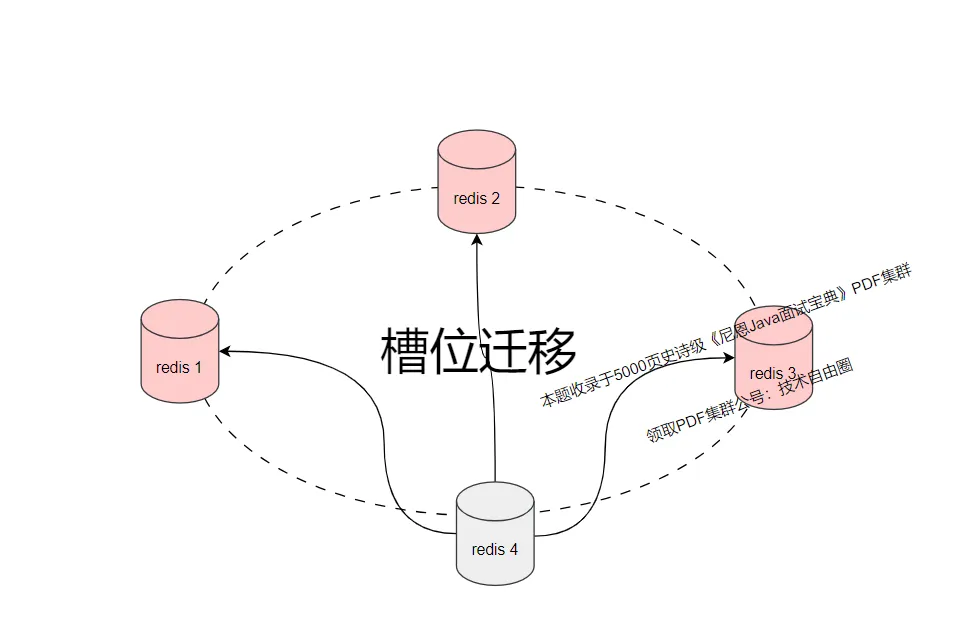

删除节点C之后，此时服务A、B节点中每个节点的槽位数是：18384 / 3 = 6128

和一致性哈希不同的是，redis cluster 集群节点全员参与，目标是达到集群节点间数据尽可能均匀的效果。

对比之前，得到一个结论：

-   一致性哈希 优先考虑的是：如何实现 最少的数据迁移。
-   redis cluster  哈希槽分片 优先考虑的是：如何 实现数据的均匀。

值得注意，`redis 集群数据迁移是以哈希槽位单位`，也就是说，同一个槽的数据只会迁移到一个目的节点。

### 问题2：redis 如何管理元数据的一致性

redis 采用 **流言蜚语** 协议，顾名思义，就像流言、八卦一样，一传十、十传百这样传递下去，直到所有节点的元数据信息达成一致。

>   有关gossip协议的内容，请参见后面的 《附录2：gossip 协议》
>
>   有关Raft 协议的内容，请参见后面的 《附录1：Raft 协议》

#### redis cluster 如何实现 Gossip 协议的？

我们知道，每个集群节点都维护了集群其他节点的信息，其通信名单就是根据该列表来的。

首先，这个工作也是由周期性的时间事件来负责处理，每次从通信名单中随机选择 5 个节点，然后从这批名单中选择最久未通信的节点。然后构造 `PING 请求`，尝试与其进行通信，请求报文中会携带自己负责的那些哈希槽以及部分掌握的其他节点负责的哈希槽信息。

最后是接收 `PONG` 响应报文，该报文和 PING 请求报文基本一致，包含的信息是对方节点处理的哈希槽以及掌握的部分其他节点信息，至于要发送多少其他节点的信息，这个可以通过一些参数来控制。

这样一来一回，双方的信息算是打通了，顺便还打通了双方掌握的集群其他节点的信息。

然后多几个这样的来回，集群信息就基本一致了。

总体来说，Gossip 协议 包括两个部分：

-   第一个部分是通讯报文：槽（slots）数据结构实际上是一个二进制数组，数组长度为 2048 个字节，16384 个二进制位，也就是 2k 大小。这里不包括其他的基础报文数据。
-   第二个部分是报文类型：集群节点通过 PING，PONG 方式（类似心跳报文）来传递集群的元数据信息，PING、PONG 都采用相同的数据结构携带信息，一来一回便知晓了双方的元数据信息，多个来回，整个集群元数据信息就一致了，这便是 `Gossip 协议`。

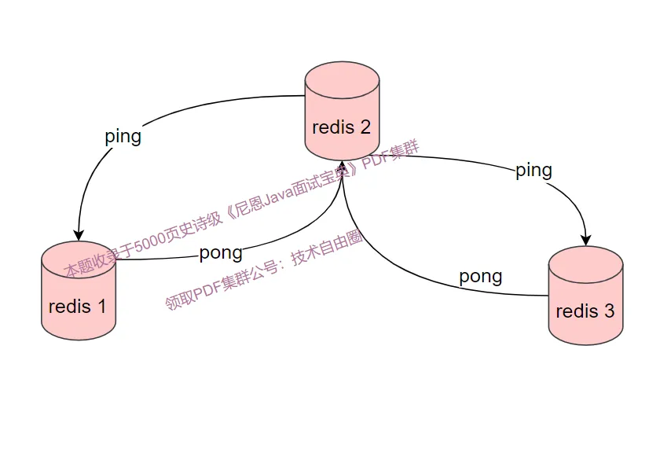

你也注意到了，上面的通信节点是随机选择的，如果某个节点一直未进行通信，节点就无法打通？

没错，redis cluster 也是考虑了这种情况，所以会定期的选择那些长时间没有通信的节点，然后进行上面的流程进行通信。

#### 客户端如何感知槽位？

Redis cluster的主节点各自负责一部分slot，那么客户端的请求的key是如何客户端如何感知槽位？

如何定位到具体的节点，然后返回对应的数据的。

首先，Redis-Cli客户端的会连接到集群中的任何一个节点，比如redis 2节点，如下图：

1.  redis 2节点 收到命令，首先检查当前key是否存在集群中的节点

    具体的计算步骤为：

-   **step1**  hash 槽位：通过CRC16（key）/ 16384计算出slot
-   **step2** 检查slot：检查该slot负责的节点是否本地存储
-   **step3** 如果slot在本地，就直接就直接返回key对应的结果
-   **step4**  如果slot不在本地，那么会 MOVED重定向（包含槽位和目标地址 比如redis 3）给客户端
-   **step5** 客户端转向至正确的节点(比如redis 3)，并再次发送之前执行的命令

具体如下图：

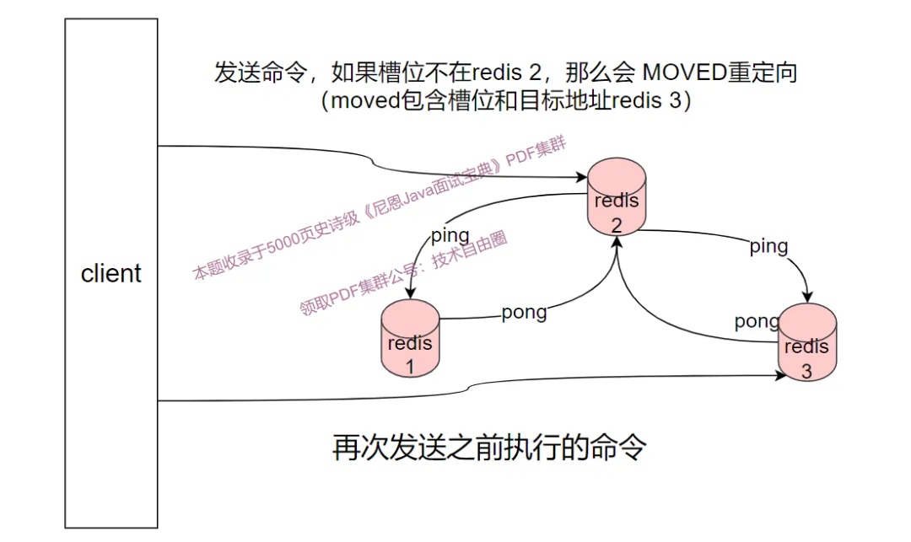

问题：每执行命令前都可能现在Redis节点上进行MOVED重定向才能找到要执行命令的节点，额外增加了IO开销。

怎么提升性能呢？使用加了本地缓存的 smart客户端。

#### smart客户端

不过大多数开发语言的Redis客户端都采用 Smart客户端 支持集群协议，让整个访问就更高效。

smart客户端，加了 元数据的本地缓存。

smart客户端的主要特点：Redis客户端在内部维护哈希槽--节点的映射关系，这样就可以在Smart客户端实现键到节点的查找，避免了再进行MOVED重定向。

本地缓存何时初始化呢？最开始的时候，redis会选择一个运行节点，初始化槽和节点映射关系。

我们看下图：

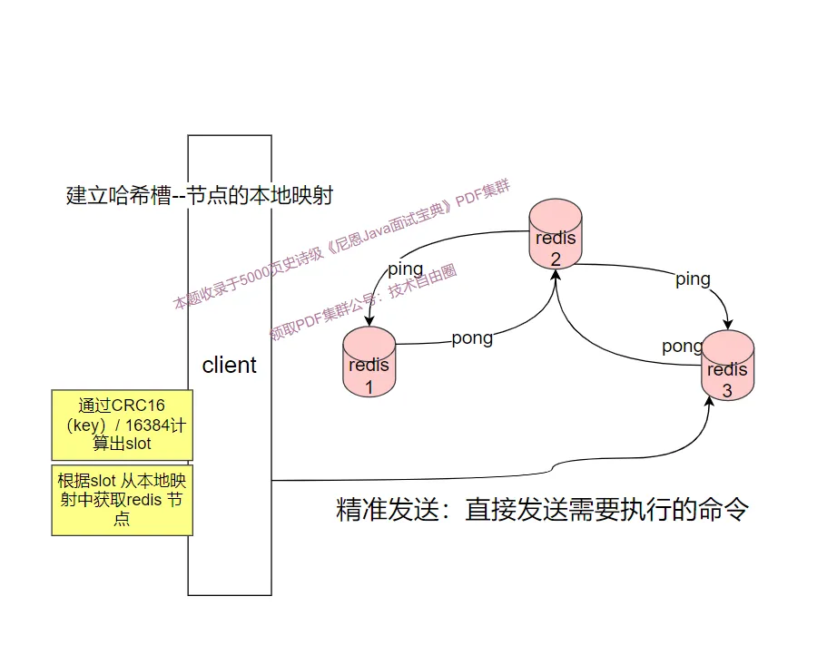

#### smart客户端仍然需要MOVED和ASK命令

不过smart客户端仍然需要MOVED和ASK命令配合，为啥呢？

通常在smart客户端也需要缓存元数据信息（哈希槽与节点的对应关系），实现更加高效的精准定位具体的节点，然而，也很容易发生客户端本地缓存更新不及时的情，仍然需要MOVED和ASK命令。

所以，为了保证客户端不受此类元数据变更带来的影响，cluster 提供了对应的一些指令来处理，比如 MOVED、ASK 等指令。

当客户端收到这些指令后，会做出比如重定向、更新客户端缓存等操作，我们具体来看看：

1）**MOVED**：

当节点发现键所在的槽并非由自己负责处理的时候，节点就会向客户端返回一个 MOVED 错误，指引客户端转向至正在负责槽的节点。

MOVED 错误的格式为：

```
MOVED <slot> <ip>:<port>1.
```

其中 slot 为键所在的槽，而 ip 和 port 则是负责处理槽 slot 的节点的 IP 地址和端口号。

当客户端接收到节点返回的 MOVED 错误时，客户端会根据 MOVED 错误中提供的 IP 地址和端口号，转向至负责处理槽 slot 的节点，并向该节点`重新发送`之前想要执行的命令。

一个集群客户端通常会与集群中的多个节点创建套接字连接，而所谓的节点转向实际上就是换一个套接字来发送命令。

如果客户端尚未与想要转向的节点创建套接字连接，那么客户端会先根据 MOVED 错误提供的 IP 地址和端口号来连接节点，然后再进行转向。

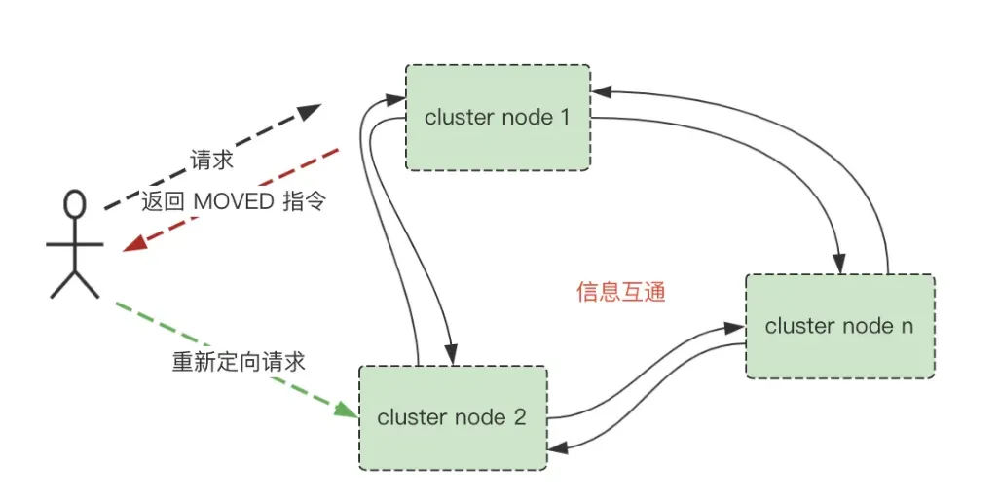

2）**ASK**：

在进行重新分片期间，源节点向目标节点迁移一个槽的过程中，可能会出现这样一种特殊情况：被迁槽的一部分key还在源节点，而另一部分key则迁移到目标节点。

当客户端向源节点发送一个与数据库键有关的命令，并且命令要处理的数据库键恰好就属于正在被迁移的槽时：

-   源节点会先在本地查找指定的键，如果找到的话，就直接执行客户端发送的命令。
-   如果源节点本地没找到，那么这个键已经被迁移到了目标节点，源节点将向客户端返回一个 ASK 响应，指引客户端转向正在导入槽的目标节点，
-   客户端收到ASK响应，再次发送之前想要执行的命令。

客户端将收到如下ASK 响应：

```
ASK <slot> <ip>:<port>1.
```

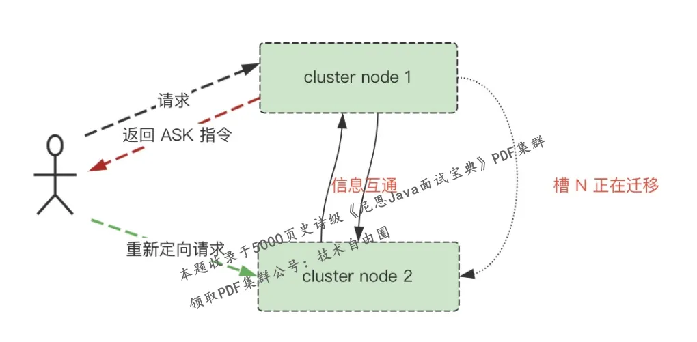

ASK 和 MOVED 都会导致客户端转向，它们有哪些区别？

-   MOVED 代表槽的负责权已经完成从一个节点转移到了另一个节点，在客户端收到关于槽 i 的MOVED 之后，客户端槽位映射关系缓存关系也会刷新，客户端本地的槽位映射关系刷新之后，后面节点关于槽 i 的请求可以直接发往 MOVED 所指向的节点。
-   ASK 只是两个节点在迁移槽的过程中使用的一种临时措施：在客户端收到关于槽 i 的 ASK 之后，客户端只会在接下来的一次命令请求中，将命令请求发送至 ASK 所指示的节点；客户端槽位映射关系缓存关系不会刷新，因此，流程上还是会走「原节点 -> ASK 重定向目标节点」这一流程。

### 问题3：为什么Redis Cluster哈希槽数量是16384 (16K)？

前面讲到 redis 哈希与一致性hash所不同的是：

-   第一：槽位规模不同。

    redis 集群将数据划分为 16384 个槽位（哈希槽），一致性hash有  2^32 个槽位。

-   第二：hash slot和node 节点的映射关系不同。

    一致性hash是哈希环顺时针映射，redis 哈希槽是静态映射。

问题是：一致性哈希算法是对2的32次方取模，而哈希槽是对2的14次方取模。为啥Redis 不设置 2的32次方 个槽位呢？

为啥 16384 (16K) 个槽位，redis 给出的主要原因是：

-   1：网络带宽的因素：

    Redis节点间通信时，心跳包会携带节点的所有槽信息，通过这些槽位元数据来更新配置。

    所以，槽位数量不能太多，如果太多，那么通讯的报文就太大了。reids 采用 16384 个插槽，一个槽位占用一个二进制为，16384  (16384/8=2048）占通讯报文空间 2KB;  反过来，如果采用 65536 个插槽，占空间 8KB (65536/8)。

-   2：当集群扩展到1000个节点时，也能确保每个master节点有足够的插槽，每个节点16384 /1024=16个槽位，也足够了

-   3：Redis Cluster 不太可能扩展到超过 1000 个主节点，太多可能导致网络拥堵。

    在实际应用中，一个redis cluster集群不超过200个节点，超过200个节点就会有大量的gossip 协议的报文，很容易出现网络拥塞。

关于这个问题，Redis作者的回答在这里：why redis-cluster use 16384 slots? · Issue #2576 · redis/redis

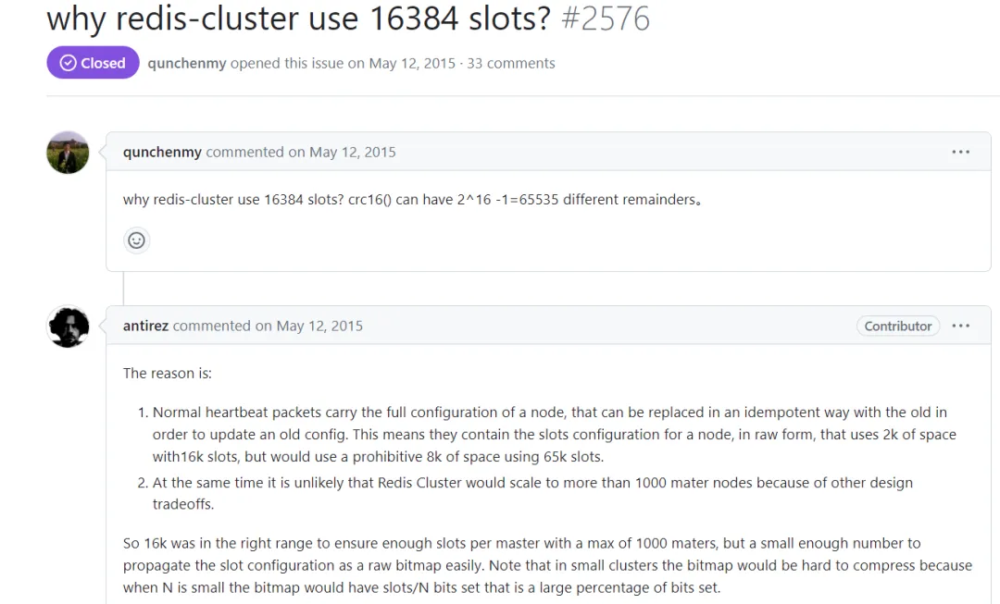

## 为什么Redis是使用哈希槽而不是一致性哈希呢？

>   尼恩提示：给面试官嘚啵嘚、嘚啵嘚  讲到这里，已经10多分钟过去了。
>
>   面试已经了解到了你的强大的技术实力，基本已经佛了。
>
>   估计已经被你的超强内功，迷得神魂颠倒了。

接下来，我们再总结一下，为什么Redis是使用哈希槽而不是一致性哈希呢？

首先，Redis哈希槽和一致性哈希，总体的流程都是差不多的，都是两个阶段：

-   第一阶段是：hash 取模
-   第二阶段是：node 映射

**第一阶段都是 hash 之后取模分片。**分为两步：

-   第一步：hash。hash算法的功效，核心就是保证数据不倾斜，或者说保证分布均匀。redis cluster 的hash算法，采用的是 crc16 哈希算法。
-   第二步：取模。就是槽位的数量，redis 集群的把数据分为16484 （16K）个slot槽位。一致性哈希是 2的32次方个槽位。

为啥redis cluster 不设置 2的32次方个槽位呢？主要是考虑节点数在1000的规模一下，而是使用gossip 去中心一致性协议，数据包不能太大，16K 个二进制位 2K字节已经很大了。

**第二阶段是：node 映射。**

-   一致性hash是哈希环顺时针映射，
-   redis 哈希槽是静态映射。

通过前面的对比，得到一个结论：

-   一致性hash 哈希环顺时针映射 优先考虑的是：如何实现 最少的节点数据发生数据迁移。

    一致性hash 哈希环上面，只有被干掉的节点顺时针方向最近的那一个节点涉及到数据迁移；其他间隔较远的节点，不涉及到数据迁移。

-   redis cluster  哈希槽静态映射 优先考虑的是：如何 实现数据的均匀。

    redis cluster 各个节点都会参与数据迁移，优先保证各个redis节点承担同样的访问压力。

-   同时，redis cluster  哈希槽静态映射还有一个优点，手动迁移。

    redis cluster  可以自动分配，也可以根据节点的性能（比如Memory大小） 手动的调整slot的分配。

## 附录1：Raft 协议

>   尼恩的宗旨是，写的文章一定要方便大家好懂。对于Raft 协议，尼恩也在这加点附录。

Raft协议对标Paxos，容错性和性能都是一致的，但是Raft比Paxos更易理解和实施。系统分为几种角色：Leader（发出提案）、Follower（参与决策）、Candidate（Leader选举中的临时角色）。

刚开始所有节点都是Follower状态，然后进行Leader选举。成功后Leader接受所有客户端的请求，然后把日志entry发送给所有Follower，当收到过半的节点的回复（而不是全部节点）时就给客户端返回成功并把commitIndex设置为该entry的index，所以是满足最终一致性的。

Leader同时还会周期性地发送心跳给所有的Follower（会通过心跳同步提交的序号commitIndex），Follower收到后就保持Follower状态（并应用commitIndex及其之前对应的日志entry），如果Follower等待心跳超时了，则开始新的Leader选举：首先把当前term计数加1，自己成为Candidate，然后给自己投票并向其它结点发投票请求。直到以下三种情况：

-   它赢得选举；
-   另一个节点成为Leader；
-   一段时间没有节点成为Leader。

在选举期间，Candidate可能收到来自其它自称为Leader的写请求，如果该Leader的term不小于Candidate的当前term，那么Candidate承认它是一个合法的Leader并回到Follower状态，否则拒绝请求。

如果出现两个Candidate得票一样多，则它们都无法获取超过半数投票，这种情况会持续到超时，然后进行新一轮的选举，这时同时的概率就很低了，那么首先发出投票请求的的Candidate就会得到大多数同意，成为Leader。

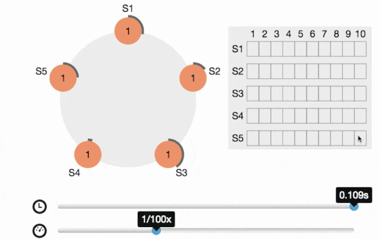

在Raft协议出来之前，Paxos是分布式领域的事实标准，但是Raft的出现打破了这一个现状（raft作者也是这么想的，请看论文），Raft协议把Leader选举、日志复制、安全性等功能分离并模块化，使其更易理解和工程实现，将来发展怎样我们拭目以待（挺看好）。

Raft协议目前被用于 cockrouchDB，TiKV等项目中，据我听的一些报告来看，一些大厂自己造的分布式数据库也在使用Raft协议。

## 附录2：Gossip 协议

>   尼恩的宗旨是，写的文章一定要方便大家好懂。对于Gossip 协议，尼恩也在这加点附录。

Gossip协议与raft协议最大的区别就是它是彻底的去中心化的，

Gossip 协议也叫 Epidemic Protocol（流行病协议），主要用于消息传播，是一种一致性算法。

协议也非常好理解，正如协议的名称，如流行病一样靠“感染”节点进行持续传播。

使用 Gossip 协议的有：Redis Cluster、Consul、Apache Cassandra等。

Gossip协议基本思想就是：一个节点想要分享一些信息给网络中的其他的节点，于是随机选择一些节点进行信息传递。这些收到信息的节点接下来把这些信息传递给其他一些随机选择的节点。

Gossip 整体过程描述如下。

1.  Gossip 是周期性的散播消息
2.  被感染节点随机选择 k 个邻接节点（fan-out）散播消息，假设把 fan-out 设置为2，每次最多往2个节点散播
3.  每次散播消息都选择尚未发送过的节点进行散播
4.  收到消息的节点不再往发送节点散播，比如 A -> B，那么 B 进行散播的时候，不再发给 A

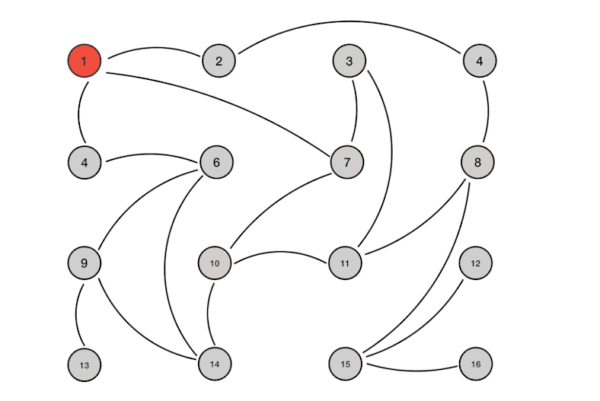

前面的raft协议虽然去中心化，但是还是要选出一个类似于Leader的角色来统筹安排事务的响应、提交与中断，

但是Gossip协议中就没有Leader，也不选举leader每个节点都是平等的。

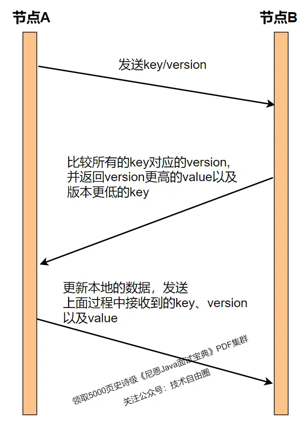

Gossip 协议 每个节点存放了一个key,value,version构成的列表，每隔一定的时间，节点都会主动挑选一个在线节点进行上图的过程（不在线的也会挑一个尝试），两个节点各自修改自己较为落后的数据，最终数据达成一致并且都较新。节点加入或退出都很容易。

### Gossip 协议优点

-   扩展性

Gossip 协议的可扩展性极好，一般只需要 O(LogN) 轮就可以将信息传播到所有的节点，其中 N 代表节点的个数。即使集群节点的数量增加，每个节点的负载也不会增加很多，几乎是恒定的。这就允许集群管理的节点规模能横向扩展到几千几万个，集群内的消息通信成本却不会增加很多。

-   容错

网络中任何节点的宕机和重启都不会影响 Gossip 消息的传播，Gossip 协议具有天然的分布式系统容错特性。

-   健壮性

Gossip 协议是去中心化的协议，所以集群中的所有节点都是对等的，任何节点出现问题都不会阻止其他节点继续发送消息。任何节点都可以随时加入或离开，而不会影响系统的整体服务质量。

-   最终一致性

消息传播是指数级的快速传播，因此当有新信息传播时，消息可以快速地发送到全局节点。

系统状态的不一致可以在很快的时间内收敛到一致。

### Gossip 协议缺点

-   消息延迟

节点随机向少数几个节点发送消息，消息最终是通过多个轮次的传播而到达全网，不可避免的造成消息延迟。不适合于对实时性要求较高的场景。

-   消息冗余

节点会定期随机选择周围节点发送消息，而收到消息的节点也会重复该步骤，因此就不可避免的存在消息重复发送给同一节点的情况，造成了消息的冗余，同时也增加了收到消息的节点的处理压力。
