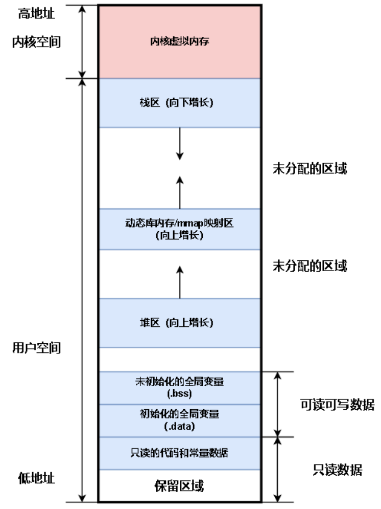
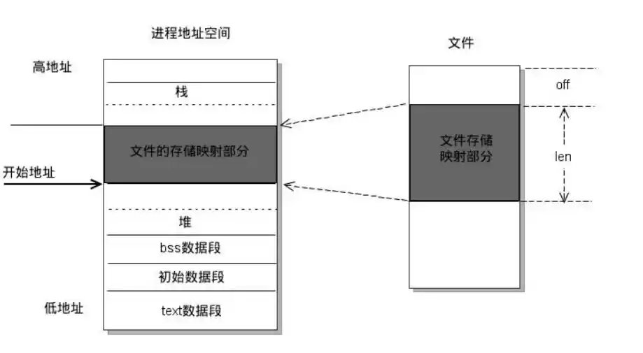
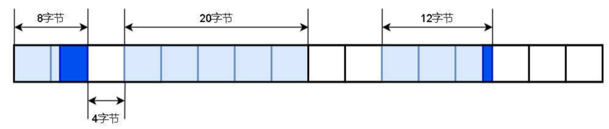

# 内存相关

## 简述进程内存分区

-   **内核空间**：存放操作系统代码和数据
-   **栈区**：存放局部变量、函数的参数值等，该区域由操作系统控制
-   **动态库/共享内存映射区**：可执行程序运行依赖的动态库加载在该区域；mmap映射的共享内存也在该区域
-   **堆区**：提供给程序员自行操作的内存区域，malloc/free和new/delete操作的就是这块内存
-   **可读写数据区**：
    -   `.bss`段：存储未初始化的、初始化为0的全局变量和静态变量。
    -   `.data`段：存储初始化不为0的全局变量和静态变量、const型常量。

-   **只读数据区**：存放二进制代码、一些const修饰变量、字符串常量等

## 内存映射的原理？

（1）虚拟内存与地址空间

操作系统为每个进程分配独立的虚拟地址空间，使进程可使用的内存空间大于实际物理内存。虚拟地址空间由页组成，每页固定大小，如4KB。

（2）页表与地址转换

系统使用页表实现虚拟地址到物理地址的转换。页表记录虚拟页与物理页的映射关系，进程访问虚拟地址时，CPU的内存管理单元（MMU）会查询页表，将虚拟地址转换为物理地址。

（3）内存映射的实现

文件映射：进程通过系统调用请求将文件映射到虚拟地址空间，操作系统在虚拟地址空间分配区域，建立文件与虚拟地址的映射关系。

读取映射区域时，若对应页不在物理内存，触发缺页中断，操作系统从文件读取数据到物理内存并更新页表。写入映射区域时，数据先写入缓存，由操作系统适时将修改写回文件。

共享内存映射：多个进程可通过共享内存映射访问同一块物理内存区域实现通信。操作系统创建共享内存对象，在各进程虚拟地址空间建立映射，使不同进程虚拟地址指向同一物理内存，进程对共享内存的读写能被其他进程看到。

## 内存映射文件、页交换文件原理与区别？

虚拟内存是现代操作系统的一项核心技术，它为每个进程提供了一个独立的、连续的、私有的地址空间，使得程序认为自己拥有比实际物理内存大得多的内存。

虚拟内存通过将程序的逻辑地址（虚拟地址）映射到物理内存地址来实现，并利用磁盘空间作为物理内存的扩展。

虚拟内存的实现依赖于内存管理单元（MMU）和页表（Page Table）。当程序访问一个虚拟地址时，MMU会查找页表，将虚拟地址转换为物理地址。如果虚拟地址对应的页面不在物理内存中，就会触发缺页中断，操作系统会介入处理，将所需的页面从磁盘加载到物理内存中。

在虚拟内存体系中，内存映射文件和页交换文件是两种重要的机制，它们都利用磁盘空间来扩展内存，但目的和工作原理有所不同。

### 内存映射文件

原理：内存映射文件是一种将文件内容直接映射到进程虚拟地址空间的技术。一旦文件被映射，程序就可以像访问内存数组一样直接读写文件内容，而无需使用传统的 `read()` 或 `write()` 系统调用。操作系统负责在需要时将文件的部分内容（页面）从磁盘加载到物理内存，并在修改后写回磁盘。

特点：

-   高效I/O：避免了传统文件I/O中数据在用户缓冲区和内核缓冲区之间的多次复制，直接通过页表映射实现数据传输，提高了I/O效率。
-   简化编程：程序可以直接通过指针操作文件内容，简化了文件I/O的编程模型。
-   进程间通信（IPC）：多个进程可以将同一个文件映射到各自的地址空间，从而实现共享内存式的进程间通信。对映射区域的修改会反映到所有映射该文件的进程中。
-   延迟加载：只有当程序实际访问映射区域的某个页面时，操作系统才会将该页面从磁盘加载到物理内存中（按需加载）。
-   持久性：对映射区域的修改可以直接反映到磁盘上的文件中，实现数据的持久化。

应用场景：

-   大文件处理：处理远大于物理内存的大文件，无需一次性加载整个文件。
-   高性能文件I/O：数据库系统、日志系统等需要频繁读写文件的应用。
-   进程间通信：在同一台机器上实现高效的数据共享。
-   加载动态链接库：操作系统通常将可执行文件和动态链接库映射到进程的地址空间。

### 页交换文件

原理：页交换文件（在Windows中称为“页面文件”，在Linux中称为“交换空间”或“交换文件/分区”）是操作系统在磁盘上预留的一块特殊区域，用于作为物理内存的后备存储。当物理内存不足时，操作系统会将物理内存中不经常使用或优先级较低的页面暂时写入到页交换文件中，从而释放出物理内存供其他更活跃的进程或页面使用。这个过程称为页面置换或换出。

当程序再次访问被换出的页面时，会触发缺页中断，操作系统会从页交换文件中将该页面重新加载到物理内存中，这个过程称为换入。

特点：

-   物理内存扩展：作为物理内存的逻辑扩展，使得系统可以运行的程序总大小超过实际物理内存。
-   透明性：对于应用程序来说，页交换过程是完全透明的，应用程序无需关心页面是否在物理内存中。
-   性能瓶颈：磁盘I/O速度远低于内存访问速度，频繁的页面换入换出（称为“颠簸”或“抖动”，Thrashing）会导致系统性能急剧下降。
-   非持久性：页交换文件中的数据通常是临时性的，用于保存内存页面的副本，系统关闭后通常会被清空或重置。

应用场景：

-   内存不足时的应急措施：当物理内存紧张时，提供额外的虚拟内存容量，防止程序因内存不足而崩溃。
-   不活跃页面的存储：将长时间不被访问的页面换出到磁盘，释放物理内存给更活跃的进程。

### 内存映射文件与页交换文件的区别

| 特性     | 内存映射文件                                       | 页交换文件                                           |
| :------- | :------------------------------------------------- | :--------------------------------------------------- |
| 目的     | 将文件内容映射到虚拟地址空间，实现高效文件I/O和IPC | 作为物理内存的扩展，用于页面置换，缓解内存压力       |
| 数据来源 | 磁盘上的实际文件                                   | 物理内存中被换出的页面副本                           |
| 持久性   | 对映射区域的修改会反映到原始文件，数据持久化       | 数据通常是临时的，系统关闭后清空或重置               |
| 主动性   | 应用程序主动请求映射文件                           | 操作系统在物理内存不足时自动进行页面置换             |
| 共享性   | 多个进程可以映射同一个文件，实现共享内存           | 通常是进程私有的内存页面的副本，不直接用于进程间共享 |
| I/O模式  | 像访问内存一样访问文件内容                         | 操作系统在后台进行页面换入换出                       |
| 典型用途 | 大文件处理、IPC、程序加载                          | 缓解内存不足、支持更多并发进程                       |

## 内存分配的方式

-   **分页存储管理**：优点是不需要连续的内存空间，且内存利用率高（只有很小的页内碎片）；缺点是不易于实现内存共享与保护。
-   **分段存储管理**：优点是易于实现段内存共享和保护；缺点是每段都需要连续的内存空间，且内存利用率较低（会产生外部碎片）。
-   **段页式存储管理**：优点是不需要连续的内存空间，内存利用率高（只有很小的页内碎片），且易于实现段内存共享和保护；缺点是管理软件复杂性较高，需要的硬件以及占用的内存也有所增加，使得执行速度下降。

## 内存碎片

内存碎片是指堆空间剩余很多离散的空闲内存，但不能满足malloc的分配请求。内存碎片分为外部碎片和内部碎片。下图描述了部分堆空间的内存分配情况，将堆空间以4字节为单位划分为许多分配块，白色块表示空闲内存，浅蓝色和深蓝色块表示已分配的内存。 

假设内存分配的最小单位是一个分配块（4字节）。

1.  **外部碎片**：由于堆空间中不存在连续4个分配块大小的空闲内存（白色块），但有许多离散的、小于4个分配块大小的空闲内存。所以当malloc(16)申请16字节时会分配失败，原因是没有连续4个分配块的空闲内存，但有小于4个分配块的空闲内存，这些内存称为外部碎片
2.  **内部碎片**：由于分配内存的最小单位是一个分配块(4字节)，所以当malloc(5)申请5字节时，堆空间分配两个空闲块共8字节，但程序只需要5字节，剩余的3字节(深蓝色)没有用到，这3字节内存称为内部碎片

