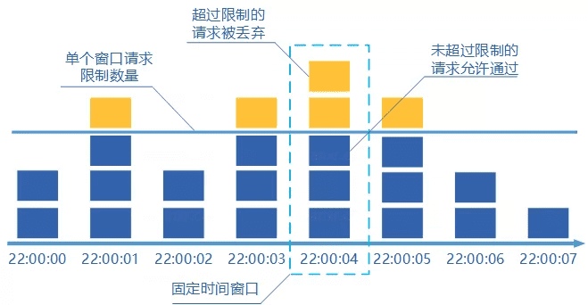
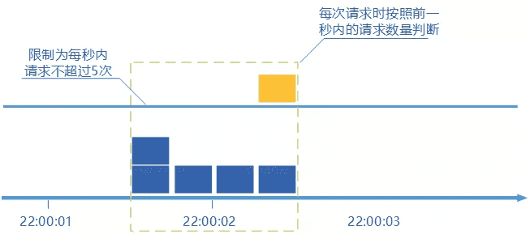
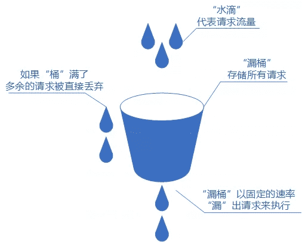
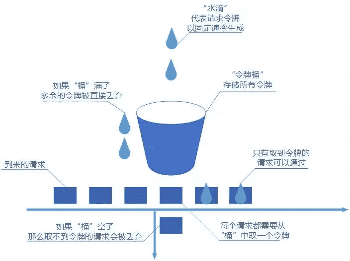

# 服务限流详解

针对软件系统来说，限流就是对请求的速率进行限制，避免瞬时的大量请求击垮软件系统。毕竟，软件系统的处理能力是有限的。如果说超过了其处理能力的范围，软件系统可能直接就挂掉了。

限流可能会导致用户的请求无法被正确处理或者无法立即被处理，不过，这往往也是权衡了软件系统的稳定性之后得到的最优解。

## 常见限流算法有哪些？

### 固定窗口计数器算法

固定窗口其实就是时间窗口，其原理是将时间划分为固定大小的窗口，在每个窗口内限制请求的数量或速率，即固定窗口计数器算法规定了系统单位时间处理的请求数量。

假如我们规定系统中某个接口 1 分钟只能被访问 33 次的话，使用固定窗口计数器算法的实现思路如下：

- 将时间划分固定大小窗口，这里是 1 分钟一个窗口。
- 给定一个变量 `counter` 来记录当前接口处理的请求数量，初始值为 0（代表接口当前 1 分钟内还未处理请求）。
- 1 分钟之内每处理一个请求之后就将 `counter+1`，当 `counter=33` 之后（也就是说在这 1 分钟内接口已经被访问 33 次的话），后续的请求就会被全部拒绝。
- 等到 1 分钟结束后，将 `counter` 重置 0，重新开始计数。



优点：固定窗口算法非常简单，易于实现和理解。

缺点：

- 限流不够平滑。例如，我们限制某个接口每分钟只能访问 30 次，假设前 30 秒就有 30 个请求到达的话，那后续 30 秒将无法处理请求，这是不可取的，用户体验极差！
- 无法保证限流速率，因而无法应对突然激增的流量。例如，我们限制某个接口 1 分钟只能访问 1000 次，该接口的 QPS 为 500，前 55s 这个接口 1 个请求没有接收，后 1s 突然接收了 1000 个请求。然后，在当前场景下，这 1000 个请求在 1s 内是没办法被处理的，系统直接就被瞬时的大量请求给击垮了。

伪代码实现：

```java
   public static Integer counter = 0;  //统计请求数
   public static long lastAcquireTime =  0L;
   public static final Long windowUnit = 1000L ; //假设固定时间窗口是1000ms
   public static final Integer threshold = 10; // 窗口阀值是10

    /**
     * 固定窗口时间算法
     * @return
     */
    public synchronized boolean fixedWindowsTryAcquire() {
        long currentTime = System.currentTimeMillis();  //获取系统当前时间
        if (currentTime - lastAcquireTime > windowUnit) {  //检查是否在时间窗口内
            counter = 0;  // 计数器清0
            lastAcquireTime = currentTime;  //开启新的时间窗口
        }
        if (counter < threshold) {  // 小于阀值
            counter++;  //计数统计器加1
            return true;
        }

        return false;
    }
```

### 滑动窗口计数器算法

**滑动窗口计数器算法** 算的上是固定窗口计数器算法的升级版，限流的颗粒度更小。

滑动窗口计数器算法相比于固定窗口计数器算法的优化在于：**它把时间以一定比例分片** 。

例如我们的接口限流每分钟处理 60 个请求，我们可以把 1 分钟分为 60 个窗口。每隔 1 秒移动一次，每个窗口一秒只能处理不大于 `60(请求数)/60（窗口数）` 的请求，如果当前窗口的请求计数总和超过了限制的数量的话就不再处理其他请求。

很显然，**当滑动窗口的格子划分的越多，滑动窗口的滚动就越平滑，限流的统计就会越精确。**



优点：

- 简单易懂
- 相比于固定窗口算法，滑动窗口计数器算法可以应对突然激增的流量。
- 相比于固定窗口算法，滑动窗口计数器算法的颗粒度更小，可以提供更精确的限流控制。
- 可扩展性强（可以非常容易地与其他限流算法结合使用）

缺点：

- 与固定窗口计数器算法类似，滑动窗口计数器算法依然存在限流不够平滑的问题。
- 相比较于固定窗口计数器算法，滑动窗口计数器算法实现和理解起来更复杂一些。
- 突发流量无法处理（无法应对短时间内的大量请求，因为一旦到达限流后，请求都会直接暴力被拒绝。这样就会损失一部分请求，这其实对于产品来说，并不太友好），需要合理调整时间窗口大小。

伪代码实现：

```java
 /**
     * 单位时间划分的小周期（单位时间是1分钟，10s一个小格子窗口，一共6个格子）
     */
    private int SUB_CYCLE = 10;

    /**
     * 每分钟限流请求数
     */
    private int thresholdPerMin = 100;

    /**
     * 计数器, k-为当前窗口的开始时间值秒，value为当前窗口的计数
     */
    private final TreeMap<Long, Integer> counters = new TreeMap<>();

   /**
     * 滑动窗口时间算法实现
     */
     public synchronized boolean slidingWindowsTryAcquire() {
        long currentWindowTime = LocalDateTime.now().toEpochSecond(ZoneOffset.UTC) / SUB_CYCLE * SUB_CYCLE; //获取当前时间在哪个小周期窗口
        int currentWindowNum = countCurrentWindow(currentWindowTime); //当前窗口总请求数

        //超过阀值限流
        if (currentWindowNum >= thresholdPerMin) {
            return false;
        }

        //计数器+1
        counters.get(currentWindowTime)++;
        return true;
    }

   /**
    * 统计当前窗口的请求数
    */
    private synchronized int countCurrentWindow(long currentWindowTime) {
        //计算窗口开始位置
        long startTime = currentWindowTime - SUB_CYCLE* (60s/SUB_CYCLE-1);
        int count = 0;

        //遍历存储的计数器
        Iterator<Map.Entry<Long, Integer>> iterator = counters.entrySet().iterator();
        while (iterator.hasNext()) {
            Map.Entry<Long, Integer> entry = iterator.next();
            // 删除无效过期的子窗口计数器
            if (entry.getKey() < startTime) {
                iterator.remove();
            } else {
                //累加当前窗口的所有计数器之和
                count =count + entry.getValue();
            }
        }
        return count;
    }
```

### 漏桶算法

>   漏桶限流算法（Leaky Bucket Algorithm）是一种流量控制算法，用于控制流入网络的数据速率，以防止网络拥塞。它的思想是将数据包看作是水滴，漏桶看作是一个固定容量的水桶，数据包像水滴一样从桶的顶部流入桶中，并通过桶底的一个小孔以一定的速度流出，从而限制了数据包的流量。
>

我们可以把发请求的动作比作成注水到桶中，我们处理请求的过程可以比喻为漏桶漏水。我们往桶中以任意速率流入水，以一定速率流出水。当水超过桶流量则丢弃，因为桶容量是不变的，保证了整体的速率。

如果想要实现这个算法的话也很简单，准备一个队列用来保存请求，然后我们定期从队列中拿请求来执行就好了（和消息队列削峰/限流的思想是一样的）。



>   漏桶限流算法的基本工作原理是：对于每个到来的数据包，都将其加入到漏桶中，并检查漏桶中当前的水量是否超过了漏桶的容量。如果超过了容量，就将多余的数据包丢弃。如果漏桶中还有水，就以一定的速率从桶底输出数据包，保证输出的速率不超过预设的速率，从而达到限流的目的。
>
>   1.  流入的水滴，可以看作是访问系统的请求，这个流入速率是不确定的。
>   2.  桶的容量一般表示系统所能处理的请求数。
>   3.  如果桶的容量满了，就达到限流的阀值，就会丢弃水滴（拒绝请求）
>   4.  流出的水滴，是恒定过滤的，对应服务按照固定的速率处理请求。

优点：

- 实现简单，易于理解。
- 可以控制限流速率，避免网络拥塞和系统过载。
- 可以平滑限制请求的处理速度，避免瞬间请求过多导致系统崩溃或者雪崩。
- 可以控制请求的处理速度，使得系统可以适应不同的流量需求，避免过载或者过度闲置。

- 可以通过调整桶的大小和漏出速率来满足不同的限流需求，可以灵活地适应不同的场景。

缺点：

- 无法应对突然激增的流量，因为只能以固定的速率处理请求，对系统资源利用不够友好。
- 桶流入水（发请求）的速率如果一直大于桶流出水（处理请求）的速率的话，那么桶会一直是满的，一部分新的请求会被丢弃，导致服务质量下降。

- 需要对请求进行缓存，会增加服务器的内存消耗。

- 对于流量波动比较大的场景，需要较为灵活的参数配置才能达到较好的效果。

- 但是**面对突发流量**的时候，漏桶算法还是循规蹈矩地处理请求。因为流量变突发时，肯定希望系统尽量快点处理请求，提升用户体验。

实际业务场景中，基本不会使用漏桶算法。

伪代码实现：

```java
 /**
 * LeakyBucket 类表示一个漏桶,
 * 包含了桶的容量和漏桶出水速率等参数，
 * 以及当前桶中的水量和上次漏水时间戳等状态。
 */
public class LeakyBucket {
    private final long capacity;    // 桶的容量
    private final long rate;        // 漏桶出水速率
    private long water;             // 当前桶中的水量
    private long lastLeakTimestamp; // 上次漏水时间戳

    public LeakyBucket(long capacity, long rate) {
        this.capacity = capacity;
        this.rate = rate;
        this.water = 0;
        this.lastLeakTimestamp = System.currentTimeMillis();
    }

    /**
     * tryConsume() 方法用于尝试向桶中放入一定量的水，如果桶中还有足够的空间，则返回 true，否则返回 false。
     * @param waterRequested
     * @return
     */
    public synchronized boolean tryConsume(long waterRequested) {
        leak();
        if (water + waterRequested <= capacity) {
            water += waterRequested;
            return true;
        } else {
            return false;
        }
    }

    /**
     * leak() 方法用于漏水，根据当前时间和上次漏水时间戳计算出应该漏出的水量，然后更新桶中的水量和漏水时间戳等状态。
     */
    private void leak() {
        long now = System.currentTimeMillis();
        long elapsedTime = now - lastLeakTimestamp;
        long leakedWater = elapsedTime * rate / 1000;
        if (leakedWater > 0) {
            water = Math.max(0, water - leakedWater);
            lastLeakTimestamp = now;
        }
    }
}
// 注意: tryConsume() 和 leak() 方法中，都需要对桶的状态进行同步，以保证线程安全性。
```

### 令牌桶算法

令牌桶算法是一种常用的限流算法，可以用于限制单位时间内请求的数量。该算法维护一个固定容量的令牌桶，每秒钟会向令牌桶中放入一定数量的令牌。当有请求到来时，如果令牌桶中有足够的令牌，则请求被允许通过并从令牌桶中消耗一个令牌，否则请求被拒绝。

我们根据限流大小，按照一定的速率往桶里添加令牌。如果桶装满了，就不能继续往里面继续添加令牌了。



优点：

- 稳定性高：令牌桶算法可以控制请求的处理速度，可以使系统的负载变得稳定。

- 精度高：令牌桶算法可以根据实际情况动态调整生成令牌的速率，可以实现较高精度的限流。

- 弹性好：令牌桶算法可以处理突发流量，可以在短时间内提供更多的处理能力，以处理突发流量。

缺点：

- 实现复杂：相对于固定窗口算法等其他限流算法，令牌桶算法的实现较为复杂。
    -   对短时请求难以处理：在短时间内有大量请求到来时，可能会导致令牌桶中的令牌被快速消耗完，从而限流。这种情况下，可以考虑使用漏桶算法。
    -   如果令牌产生速率和桶的容量设置不合理，可能会出现问题比如大量的请求被丢弃、系统过载。
- 时间精度要求高：令牌桶算法需要在固定的时间间隔内生成令牌，因此要求时间精度较高，如果系统时间不准确，可能会导致限流效果不理想。

总体来说，令牌桶算法具有较高的稳定性和精度，但实现相对复杂，适用于对稳定性和精度要求较高的场景。

伪代码实现：

```java
/**
 * TokenBucket 类表示一个令牌桶
 */
public class TokenBucket {

    private final int capacity;     // 令牌桶容量
    private final int rate;         // 令牌生成速率，单位：令牌/秒
    private int tokens;             // 当前令牌数量
    private long lastRefillTimestamp;  // 上次令牌生成时间戳

    /**
     * 构造函数中传入令牌桶的容量和令牌生成速率。
     * @param capacity
     * @param rate
     */
    public TokenBucket(int capacity, int rate) {
        this.capacity = capacity;
        this.rate = rate;
        this.tokens = capacity;
        this.lastRefillTimestamp = System.currentTimeMillis();
    }

    /**
     * allowRequest() 方法表示一个请求是否允许通过，该方法使用 synchronized 关键字进行同步，以保证线程安全。
     * @return
     */
    public synchronized boolean allowRequest() {
        refill();
        if (tokens > 0) {
            tokens--;
            return true;
        } else {
            return false;
        }
    }

    /**
     * refill() 方法用于生成令牌，其中计算令牌数量的逻辑是按照令牌生成速率每秒钟生成一定数量的令牌，
     * tokens 变量表示当前令牌数量，
     * lastRefillTimestamp 变量表示上次令牌生成的时间戳。
     */
    private void refill() {
        long now = System.currentTimeMillis();
        if (now > lastRefillTimestamp) {
            int generatedTokens = (int) ((now - lastRefillTimestamp) / 1000 * rate);
            tokens = Math.min(tokens + generatedTokens, capacity);
            lastRefillTimestamp = now;
        }
    }
}
```

## 针对什么来进行限流？

实际项目中，还需要确定限流对象，也就是针对什么来进行限流。常见的限流对象如下：

- IP ：针对 IP 进行限流，适用面较广，简单粗暴。
- 业务 ID：挑选唯一的业务 ID 以实现更针对性地限流。例如，基于用户 ID 进行限流。
- 个性化：根据用户的属性或行为，进行不同的限流策略。例如，VIP 用户不限流，而普通用户限流。根据系统的运行指标（如 QPS、并发调用数、系统负载等），动态调整限流策略。例如，当系统负载较高的时候，控制每秒通过的请求减少。

针对 IP 进行限流是目前比较常用的一个方案。不过，实际应用中需要注意用户真实 IP 地址的正确获取。常用的真实 IP 获取方法有 X-Forwarded-For 和 TCP Options 字段承载真实源 IP 信息。虽然 X-Forwarded-For 字段可能会被伪造，但因为其实现简单方便，很多项目还是直接用的这种方法。

除了我上面介绍到的限流对象之外，还有一些其他较为复杂的限流对象策略，比如阿里的 Sentinel 还支持 [基于调用关系的限流](https://github.com/alibaba/Sentinel/wiki/流量控制#基于调用关系的流量控制)（包括基于调用方限流、基于调用链入口限流、关联流量限流等）以及更细维度的 [热点参数限流](https://github.com/alibaba/Sentinel/wiki/热点参数限流)（实时的统计热点参数并针对热点参数的资源调用进行流量控制）。

另外，一个项目可以根据具体的业务需求选择多种不同的限流对象搭配使用。

## 单机限流怎么做？

单机限流针对的是单体架构应用。一般情况下，为了保证系统的高可用，项目的限流和熔断都是要一起做的。

## 分布式限流怎么做？

分布式限流针对的分布式/微服务应用架构应用，在这种架构下，单机限流就不适用了，因为会存在多种服务，并且一种服务也可能会被部署多份。

分布式限流常见的方案：

- **借助中间件限流**：可以借助 Sentinel 或者使用 Redis 来自己实现对应的限流逻辑。
- **网关层限流**：比较常用的一种方案，直接在网关层把限流给安排上了。不过，通常网关层限流通常也需要借助到中间件/框架。

如果你要基于 Redis 来手动实现限流逻辑的话，建议配合 Lua 脚本来做。

**为什么建议 Redis+Lua 的方式？** 主要有两点原因：

- **减少了网络开销**：我们可以利用 Lua 脚本来批量执行多条 Redis 命令，这些 Redis 命令会被提交到 Redis 服务器一次性执行完成，大幅减小了网络开销。
- **原子性**：一段 Lua 脚本可以视作一条命令执行，一段 Lua 脚本执行过程中不会有其他脚本或 Redis 命令同时执行，保证了操作不会被其他指令插入或打扰。

我这里就不放具体的限流脚本代码了，网上也有很多现成的优秀的限流脚本供你参考，就比如 Apache 网关项目 [ShenYu](https://github.com/apache/shenyu) 的 RateLimiter 限流插件就基于 Redis + Lua 实现了令牌桶算法/并发令牌桶算法、漏桶算法、滑动窗口算法。

另外，如果不想自己写 Lua 脚本的话，也可以直接利用 Redisson 中的 `RRateLimiter` 来实现分布式限流，其底层实现就是基于 Lua 代码+令牌桶算法。

## 单机限流和分布式限流

本质上单机限流和分布式限流的区别其实就在于“阈值” 存放的位置,

单机限流就上面所说的算法直接在单台服务器上实现就好了，而往往我们的服务是集群部署的。
因此需要多台机器协同提供限流功能。

像上述的计数器或者时间窗口的算法，可以将计数器存放至 Redis 等分布式 K-V 存储中。

例如滑动窗口的每个请求的时间记录可以利用 Redis的 zset存储，利用 ZREMRANGEBYSCORE删除时间窗口之外的数据，再用 ZCARD 计数。

像令牌桶也可以将令牌数量放到 Redis 中。不过这样的方式等于每一个请求我们都需要去 Redis 判断一下能不能通过，在性能上有一定的损耗。所以有个优化点就是**批量获取**，每次取令牌不是一个一取，而是取一批，不够了再去取一批，这样可以减少对 Redis 的请求。

不过要注意一点，批量获取会导致一定范围内的限流误差。比如你取了10 个此时不用，等下一秒再用，那同一时刻集群机器总处理量可能会超过阈值其实「批量」这个优化点太常见了，不论是 MySQL的批量刷盘，还是Kafka 消息的批量发送还是分布式 ID 的高性能发号，都包含了「批量」的思想

当然，分布式限流还有一种思想是平分，假设之前单机限流 500，现在集群部署了5台，那就让每台继续限流 500呗，即在总的入口做总的限流限制，然后每台机子再自己实现限流。

## 限流的难点

可以看到，每个限流都有个阈值，这个阈值如何定是个难点。

定大了服务器可能顶不住，定小了就“误杀”了，没有资源利用最大化，对用户体验不好。我能想到的就是限流上线之后先预估个大概的阈值，然后不执行真正的限流操作，而是采取日志记录方式，对日志进行分析查看限流的效果，然后调整阈值，推算出集群总的处理能力，和每台机子的处理能力(方便扩缩容)，然后将线上的流量进行重放，测试真正的限流效果，最终值确定，然后上线。

或者基于TCP拥塞控制的思想，根据请求响应在一个时间段的响应时间P90或者P99值来确定此时服务器的健康状况，来进行动态限流。在 Ease Gateway产品中实现了这套算法，有兴趣的同学可以自行搜索；

其实真实的业务场景很复杂，需要限流的条件和资源很多，每个资源限流要求还不一样

## 限流组件

一般而言，我们不需要自己实现限流算法来达到限流的目的，不管是接入层限流还是细粒度的接口限流，都有现成的轮子使用，其实现也是用了上述我们所说的限流算法。

比如 Google Guava 提供的限流工县类 Ratelimiter，是基于令牌桶实现的，并目扩展了算法，支持预热功能。

阿里开源的限流框架 sentinel中的匀速排队限流策略，就采用了漏桶算法。

Nginx 中的限流模块 Limit_reg_zone，采用了漏桶算法，还有 OpenResty 中的 resty.limit.reg 库等等

具体的使用还是很简单的，有兴趣的同学可以自行搜索，对内部实现感兴趣的同学可以下个源码看看，学习下生产级别的限流是如何实现的。

## 参考

- [分布式限流方案的探索与实践](https://mp.weixin.qq.com/s/MJbEQROGlThrHSwCjYB_4Q)

