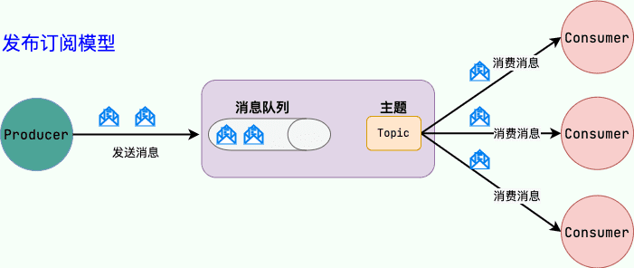
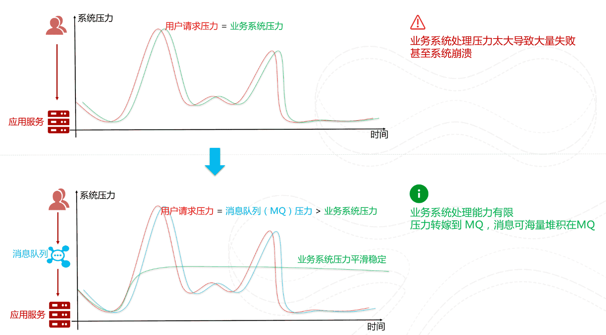

# 分布式消息队列基础知识总结

## 什么是消息队列？

我们可以把消息队列看作是一个存放消息的容器，当我们需要使用消息的时候，直接从容器中取出消息供自己使用即可。由于队列 Queue 是一种先进先出的数据结构，所以消费消息时也是按照顺序来消费的。

参与消息传递的双方称为 **生产者** 和 **消费者**，生产者负责发送消息，消费者负责处理消息。

>   操作系统中的进程通信的一种很重要的方式就是消息队列。我们这里提到的消息队列稍微有点区别，更多指的是各个服务以及系统内部各个组件/模块之前的通信，属于一种**中间件** 。

随着分布式和微服务系统的发展，消息队列在系统设计中有了更大的发挥空间，使用消息队列可以降低系统耦合性、实现任务异步、有效地进行流量削峰，是分布式和微服务系统中重要的组件之一。

## 消息队列有什么用？

通常来说，使用消息队列主要能为我们的系统带来下面三点好处：

1. 异步处理
2. 削峰/限流
3. 降低系统耦合性

除了这三点之外，消息队列还有其他的一些应用场景，例如实现分布式事务、顺序保证和数据流处理。

### 异步处理

将用户请求中包含的耗时操作，通过消息队列实现异步处理，将对应的消息发送到消息队列之后就立即返回结果，减少响应时间，提高用户体验。随后，系统再对消息进行消费。

因为用户请求数据写入消息队列之后就立即返回给用户了，但是请求数据在后续的业务校验、写数据库等操作中可能失败。因此，**使用消息队列进行异步处理之后，需要适当修改业务流程进行配合**，比如用户在提交订单之后，订单数据写入消息队列，不能立即返回用户订单提交成功，需要在消息队列的订单消费者进程真正处理完该订单之后，甚至出库后，再通过电子邮件或短信通知用户订单成功，以免交易纠纷。这就类似我们平时手机订火车票和电影票。

### 削峰/限流

先将短时间高并发产生的事务消息存储在消息队列中，然后后端服务再慢慢根据自己的能力去消费这些消息，这样就避免直接把后端服务打垮掉。

举例：在电子商务一些秒杀、促销活动中，合理使用消息队列可以有效抵御促销活动刚开始大量订单涌入对系统的冲击。如下图所示：

### 降低系统耦合性

使用消息队列还可以降低系统耦合性。如果模块之间不存在直接调用，那么新增模块或者修改模块就对其他模块影响较小，这样系统的可扩展性无疑更好一些。

生产者（客户端）发送消息到消息队列中去，消费者（服务端）处理消息，需要消费的系统直接去消息队列取消息进行消费即可而不需要和其他系统有耦合，这显然也提高了系统的扩展性。

消息队列使用发布-订阅模式工作，消息发送者（生产者）发布消息，一个或多个消息接受者（消费者）订阅消息。从上图可以看到消息发送者（生产者）和消息接受者（消费者）之间没有直接耦合，消息发送者将消息发送至分布式消息队列即结束对消息的处理，消息接受者从分布式消息队列获取该消息后进行后续处理，并不需要知道该消息从何而来。对新增业务，只要对该类消息感兴趣，即可订阅该消息，对原有系统和业务没有任何影响，从而实现网站业务的可扩展性设计。

例如，我们商城系统分为用户、订单、财务、仓储、消息通知、物流、风控等多个服务。用户在完成下单后，需要调用财务（扣款）、仓储（库存管理）、物流（发货）、消息通知（通知用户发货）、风控（风险评估）等服务。使用消息队列后，下单操作和后续的扣款、发货、通知等操作就解耦了，下单完成发送一个消息到消息队列，需要用到的地方去订阅这个消息进行消息即可。

另外，为了避免消息队列服务器宕机造成消息丢失，会将成功发送到消息队列的消息存储在消息生产者服务器上，等消息真正被消费者服务器处理后才删除消息。在消息队列服务器宕机后，生产者服务器会选择分布式消息队列服务器集群中的其他服务器发布消息。

>   **备注：**不要认为消息队列只能利用发布-订阅模式工作，只不过在解耦这个特定业务环境下是使用发布-订阅模式的。除了发布-订阅模式，还有点对点订阅模式（一个消息只有一个消费者），我们比较常用的是发布-订阅模式。另外，这两种消息模型是 JMS 提供的，AMQP 协议还提供了另外 5 种消息模型。

### 实现分布式事务

分布式事务的解决方案之一就是 MQ 事务。

RocketMQ、Kafka、Pulsar、QMQ 都提供了事务相关的功能。事务允许事件流应用将消费，处理，生产消息整个过程定义为一个原子操作。

### 顺序保证

在很多应用场景中，处理数据的顺序至关重要。消息队列保证数据按照特定的顺序被处理，适用于那些对数据顺序有严格要求的场景。大部分消息队列，例如 RocketMQ、RabbitMQ、Pulsar、Kafka，都支持顺序消息。

### 延时/定时处理

消息发送后不会立即被消费，而是指定一个时间，到时间后再消费。大部分消息队列，例如 RocketMQ、RabbitMQ、Pulsar、Kafka，都支持定时/延时消息。

### 即时通讯

MQTT（消息队列遥测传输协议）是一种轻量级的通讯协议，采用发布/订阅模式，非常适合于物联网（IoT）等需要在低带宽、高延迟或不可靠网络环境下工作的应用。它支持即时消息传递，即使在网络条件较差的情况下也能保持通信的稳定性。

### 数据流处理

针对分布式系统产生的海量数据流，如业务日志、监控数据、用户行为等，消息队列可以实时或批量收集这些数据，并将其导入到大数据处理引擎中，实现高效的数据流管理和处理。

## 使用消息队列会带来哪些问题？

- **系统可用性降低：**系统可用性在某种程度上降低，为什么这样说呢？在加入 MQ 之前，你不用考虑消息丢失或者说 MQ 挂掉等等的情况，但是，引入 MQ 之后你就需要去考虑了！
- **系统复杂性提高：**加入 MQ 之后，你需要保证消息没有被重复消费、处理消息丢失的情况、保证消息传递的顺序性等等问题！
- **一致性问题：**消息队列可以实现异步，消息队列带来的异步确实可以提高系统响应速度。但是，万一消息的真正消费者并没有正确消费消息怎么办？这样就会导致数据不一致的情况了!

## RPC 和消息队列的区别

RPC 和消息队列都是分布式微服务系统中重要的组件之一，下面我们来简单对比一下两者：

- **从用途来看**：RPC 主要用来解决两个服务的远程通信问题，不需要了解底层网络的通信机制。通过 RPC 可以帮助我们调用远程计算机上某个服务的方法，这个过程就像调用本地方法一样简单。消息队列主要用来降低系统耦合性、实现任务异步、有效地进行流量削峰。
- **从通信方式来看**：RPC 是双向直接网络通讯，消息队列是单向引入中间载体的网络通讯。
- **从架构上来看**：消息队列需要把消息存储起来，RPC 则没有这个要求，因为 RPC 是双向直接网络通讯。
- **从请求处理的时效性来看**：通过 RPC 发出的调用一般会立即被处理，存放在消息队列中的消息并不一定会立即被处理。

RPC 和消息队列本质上是网络通讯的两种不同的实现机制，两者的用途不同，万不可将两者混为一谈。

## 分布式消息队列技术选型

### 常见的消息队列有哪些？

#### Kafka

Kafka 是 LinkedIn 开源的一个分布式流式处理平台，已经成为 Apache 顶级项目，早期被用来用于处理海量的日志，后面才慢慢发展成了一款功能全面的高性能消息队列。

流式处理平台具有三个关键功能：

1. **消息队列**：发布和订阅消息流，这个功能类似于消息队列，这也是 Kafka 也被归类为消息队列的原因。
2. **容错的持久方式存储记录消息流**：Kafka 会把消息持久化到磁盘，有效避免了消息丢失的风险。
3. **流式处理平台：** 在消息发布的时候进行处理，Kafka 提供了一个完整的流式处理类库。

Kafka 是一个分布式系统，由通过高性能 TCP 网络协议进行通信的服务器和客户端组成，可以部署在在本地和云环境中的裸机硬件、虚拟机和容器上。

#### RocketMQ

RocketMQ 是阿里开源的一款云原生“消息、事件、流”实时数据处理平台，借鉴了 Kafka，已经成为 Apache 顶级项目。

RocketMQ 的核心特性（摘自 RocketMQ 官网）：

- 云原生：生与云，长与云，无限弹性扩缩，K8s 友好
- 高吞吐：万亿级吞吐保证，同时满足微服务与大数据场景。
- 流处理：提供轻量、高扩展、高性能和丰富功能的流计算引擎。
- 金融级：金融级的稳定性，广泛用于交易核心链路。
- 架构极简：零外部依赖，Shared-nothing 架构。
- 生态友好：无缝对接微服务、实时计算、数据湖等周边生态。

根据官网介绍：

> Apache RocketMQ 自诞生以来，因其架构简单、业务功能丰富、具备极强可扩展性等特点被众多企业开发者以及云厂商广泛采用。历经十余年的大规模场景打磨，RocketMQ 已经成为业内共识的金融级可靠业务消息首选方案，被广泛应用于互联网、大数据、移动互联网、物联网等领域的业务场景。

RocketMQ 官网：https://rocketmq.apache.org/ （文档很详细，推荐阅读）

RocketMQ 更新记录（可以直观看到项目是否还在维护）：https://github.com/apache/rocketmq/releases

#### RabbitMQ

RabbitMQ 是采用 Erlang 语言实现 AMQP(Advanced Message Queuing Protocol，高级消息队列协议）的消息中间件，它最初起源于金融系统，用于在分布式系统中存储转发消息。

RabbitMQ 发展到今天，被越来越多的人认可，这和它在易用性、扩展性、可靠性和高可用性等方面的卓著表现是分不开的。RabbitMQ 的具体特点可以概括为以下几点：

- **可靠性：**RabbitMQ 使用一些机制来保证消息的可靠性，如持久化、传输确认及发布确认等。
- **灵活的路由：**在消息进入队列之前，通过交换器来路由消息。对于典型的路由功能，RabbitMQ 己经提供了一些内置的交换器来实现。针对更复杂的路由功能，可以将多个交换器绑定在一起，也可以通过插件机制来实现自己的交换器。
- **扩展性：** 多个 RabbitMQ 节点可以组成一个集群，也可以根据实际业务情况动态地扩展集群中节点。
- **高可用性：** 队列可以在集群中的机器上设置镜像，使得在部分节点出现问题的情况下队列仍然可用。
- **支持多种协议：** RabbitMQ 除了原生支持 AMQP 协议，还支持 STOMP、MQTT 等多种消息中间件协议。
- **多语言客户端：** RabbitMQ 几乎支持所有常用语言，比如 Java、Python、Ruby、PHP、C#、JavaScript 等。
- **易用的管理界面：** RabbitMQ 提供了一个易用的用户界面，使得用户可以监控和管理消息、集群中的节点等。在安装 RabbitMQ 的时候会介绍到，安装好 RabbitMQ 就自带管理界面。
- **插件机制：** RabbitMQ 提供了许多插件，以实现从多方面进行扩展，当然也可以编写自己的插件。感觉这个有点类似 Dubbo 的 SPI 机制

RabbitMQ 官网：<https://www.rabbitmq.com/> 。

RabbitMQ 更新记录（可以直观看到项目是否还在维护）：<https://www.rabbitmq.com/news.html>

#### Pulsar

Pulsar 是下一代云原生分布式消息流平台，最初由 Yahoo 开发，已经成为 Apache 顶级项目。

Pulsar 集消息、存储、轻量化函数式计算为一体，采用计算与存储分离架构设计，支持多租户、持久化存储、多机房跨区域数据复制，具有强一致性、高吞吐、低延时及高可扩展性等流数据存储特性，被看作是云原生时代实时消息流传输、存储和计算最佳解决方案。

Pulsar 的关键特性如下（摘自官网）：

- 是下一代云原生分布式消息流平台。
- Pulsar 的单个实例原生支持多个集群，可跨机房在集群间无缝地完成消息复制。
- 极低的发布延迟和端到端延迟。
- 可无缝扩展到超过一百万个 topic。
- 简单的客户端 API，支持 Java、Go、Python 和 C++。
- 主题的多种订阅模式（独占、共享和故障转移）。
- 通过 Apache BookKeeper 提供的持久化消息存储机制保证消息传递 。
- 由轻量级的 serverless 计算框架 Pulsar Functions 实现流原生的数据处理。
- 基于 Pulsar Functions 的 serverless connector 框架 Pulsar IO 使得数据更易移入、移出 Apache Pulsar。
- 分层式存储可在数据陈旧时，将数据从热存储卸载到冷/长期存储（如 S3、GCS）中。

Pulsar 官网：https://pulsar.apache.org/

Pulsar 更新记录（可以直观看到项目是否还在维护）：https://github.com/apache/pulsar/releases

#### ActiveMQ

目前已经被淘汰，不推荐使用，不建议学习。

### 如何选择？

| 对比方向 | 概要                                                                                                                                                                            |
| -------- | ------------------------------------------------------------------------------------------------------------------------------------------------------------------------------- |
| 吞吐量   | 万级的 ActiveMQ 和 RabbitMQ 的吞吐量（ActiveMQ 的性能最差）要比十万级甚至是百万级的 RocketMQ 和 Kafka 低一个数量级。                                                            |
| 可用性   | 都可以实现高可用。ActiveMQ 和 RabbitMQ 都是基于主从架构实现高可用性。RocketMQ 基于分布式架构。 Kafka 也是分布式的，一个数据多个副本，少数机器宕机，不会丢失数据，不会导致不可用 |
| 时效性   | RabbitMQ 基于 Erlang 开发，所以并发能力很强，性能极其好，延时很低，达到微秒级，其他几个都是 ms 级。                                                                             |
| 功能支持 | Pulsar 的功能更全面，支持多租户、多种消费模式和持久性模式等功能，是下一代云原生分布式消息流平台。                                                                               |
| 消息丢失 | ActiveMQ 和 RabbitMQ 丢失的可能性非常低， Kafka、RocketMQ 和 Pulsar 理论上可以做到 0 丢失。                                                                                     |

**总结：**

- ActiveMQ 的社区算是比较成熟，但是较目前来说，ActiveMQ 的性能比较差，而且版本迭代很慢，不推荐使用，已经被淘汰了。
- RabbitMQ 在吞吐量方面虽然稍逊于 Kafka、RocketMQ 和 Pulsar，但是由于它基于 Erlang 开发，所以并发能力很强，性能极其好，延时很低，达到微秒级。但是也因为 RabbitMQ 基于 Erlang 开发，所以国内很少有公司有实力做 Erlang 源码级别的研究和定制。如果业务场景对并发量要求不是太高（十万级、百万级），那这几种消息队列中，RabbitMQ 或许是你的首选。
- RocketMQ 和 Pulsar 支持强一致性，对消息一致性要求比较高的场景可以使用。
- RocketMQ 阿里出品，Java 系开源项目，源代码我们可以直接阅读，然后可以定制自己公司的 MQ，并且 RocketMQ 有阿里巴巴的实际业务场景的实战考验。
- Kafka 的特点其实很明显，就是仅仅提供较少的核心功能，但是提供超高的吞吐量，ms 级的延迟，极高的可用性以及可靠性，而且分布式可以任意扩展。同时 Kafka 最好是支撑较少的 topic 数量即可，保证其超高吞吐量。Kafka 唯一的一点劣势是有可能消息重复消费，那么对数据准确性会造成极其轻微的影响，在大数据领域中以及日志采集中，这点轻微影响可以忽略这个特性天然适合大数据实时计算以及日志收集。如果是大数据领域的实时计算、日志采集等场景，用 Kafka 是业内标准的，绝对没问题，社区活跃度很高，绝对不会黄，何况几乎是全世界这个领域的事实性规范。

## 参考

- 《大型网站技术架构 》
- [消息队列的使用场景是什么样的？](https://mp.weixin.qq.com/s/4V1jI6RylJr7Jr9JsQe73A)

