# 接口性能优化

## 防御性设计：验证

### 业务场景

在日常开发中，尤其是在 web 应用开发中，我们经常需要对数据的合法性进行验证。为了实现这一目的，我们通常会对参数进行一些前置验证。这些验证规则可以包括必填项、范围、格式、正则表达式、安全性以及自定义规则等。

通常，为简化业务逻辑，我们会借助一些第三方工具来进行这些通用性的检测。

### 小结

防御性设计是考虑使用者可能会错误使用的情况，从设计上避免错误使用，或是降低错误使用的机会。防御性设计可以让软件更安全、可靠，更方便地找到使用者的错误。

## 批量思想：解决 N+1 问题

### 业务场景

`N+1` 查询问题指的是当查询一个对象的列表数据的时候，会首先查询列表中的对象的 `ID`，然后循环生成单独的 `SQL/RPC` 去查询对象的详细数据。这会导致 `SQL/RPC` 查询过多问题。

在一个循环内多次执行 `RPC` 调用或者数据库操作。数据量小的时候问题不大，能跑起来。随着业务的发展，数据量越来越大，或者要查询的 `id` 越来越多（特别是未加限制的时候），耗时部题可想而知，长尾会越来越多。

### 案例

⓵ 循环中的 RPC

读取多条记录时在 `for` 循环中去分别读取单行。

```go
for _, id := range ids
{    record := GetDetail(id)
	// do something ...
}
```

解决方案：改批量（一次从存储中取出所有 id 的结果）

```
records := GetDetails(ids)
// do something ...
```

### 小结

上述场景是一个典型的 `N+1` 问题，不限于读取，写入亦然。它可能导致性能问题和增加数据库负载。

为了解决 `N+1` 问题，开发人员可以使用一些技术，如批量加载（batch loading)、批量更新（Bulk Updates），从而减少请求次数。通过优化数据库查询和加载策略，开发人员可以避免 `N+1` 问题，并提高应用程序的效率。

## 异步思想：解决长耗时问题

异步思想是一种解决长耗时问题的方法，它通过将耗时的操作放在后台进行，不阻塞主线程或其他任务的执行，从而提高系统的响应性能和并发处理能力。

### 业务场景

在处理一些复杂的业务场景时，对于部分操作考虑使用异步，可以大幅降低接口耗时。

比如，在做服务性能优化时，可以将如数据上报、流水日志等做异步处理，以降低接口时延。用户上传图片后的审核，音视频的合成等等。

### 小结

一些常见的异步编程方式有：

-   消息队列
-   事件驱动
-   回调函数
-   多线程/进程

需要注意的是，异步并没有缩短整体的响应时间，反而可能有所增加。异步编程有优点也有缺点，可根据自身业务选型：

优点：

1.  提高系统的响应性能：异步编程可以避免长耗时操作阻塞主线程或其他任务的执行，从而提高系统的响应速度和用户体验。通过将耗时操作放在后台进行，主线程可以继续执行其他任务，不必等待操作的完成。
2.  提高并发处理能力：异步编程可以与其他任务并发执行，充分利用系统资源，提高系统的并发处理能力。通过将多个任务同时进行，可以减少总体的处理时间，提高系统的吞吐量。
3.  节省资源消耗：异步编程可以减少不必要的资源消耗。通过将耗时操作放在后台进行，可以避免占用过多的 CPU 时间和内存资源，提高系统的资源利用率。
4.  提高代码的可读性和维护性：异步编程可以使代码更加简洁和易于理解。通过使用异步/等待或 Promise 等编程模式，可以以同步的方式编写异步代码，提高代码的可读性和维护性。
5.  支持并行计算和分布式处理：异步编程可以支持并行计算和分布式处理。通过将任务分解为多个子任务，并使用多线程、分布式计算或 GPU 并行计算等技术，可以实现高效的并行计算和数据处理。
6.  提高系统的可扩展性：异步编程可以提高系统的可扩展性。通过将任务分发给多个处理单元或节点进行并行处理，可以实现分布式的并发处理和负载均衡，提高系统的可扩展性和性能。

缺点：

1.  复杂性增加：异步编程涉及到回调函数、Promise、异步/等待等概念和技术，对于初学者来说可能会增加学习和理解的难度。
2.  错误处理复杂：异步编程中的错误处理可能会更加复杂，需要处理回调函数中的错误、Promise 链中的异常等情况，增加了代码的复杂性。
3.  可能引发竞态条件：在并发环境下，异步编程可能会引发竞态条件（Race Condition）和数据一致性的问题，需要额外的并发控制和数据同步机制来解决。
4.  调试困难：由于异步编程中任务的执行顺序和时间不确定，调试异步代码可能会更加困难，需要使用适当的调试工具和技术。
5.  可能导致回调地狱：在复杂的异步操作中，使用回调函数可能会导致回调地狱（Callback Hell），使代码难以理解和维护。这可以通过使用 Promise、异步/等待等技术来缓解。

综上所述，异步编程具有许多优点，可以提高系统的性能和响应能力。然而，它也存在一些缺点，需要在设计和实现中注意解决相关的问题。合理地应用异步编程，可以最大程度地发挥其优点，减少其缺点的影响。

## 并行思想：提升处理效率

### 业务场景

并行思想是一种同时执行多个任务或操作的方法，以提高系统的处理能力和效率。在并行思想中，任务被分解为多个子任务，并且这些子任务可以同时执行，充分利用多核处理器或分布式系统的资源。

### 小结

在现代操作系统中，我们可以很方便地编写出多进程的程序。并发这个概念由来已久，主要思想是使多个任务可以在同一个时间段内执行，以便能够更快地得到结果。

## 空间换时间思想：降低耗时

### 业务场景

空间换时间思想是一种常见的优化策略，它通过增加额外的空间（内存、缓存等）来减少程序的执行时间。这种思想的基本原理是通过预先计算、缓存或索引等方式，将计算或数据存储在更快的存储介质中，以减少访问时间和计算时间。这样可以避免重复计算或频繁的磁盘访问，从而提高程序的执行效率。

### 小结

使用缓存虽然可以提升服务端性能和用户体验，但是也会带来其他问题，如数据一致性问题。还有缓存雪崩、缓存穿透、缓存并发、缓存无底洞、缓存淘汰等问题。

对于缓存的应用，可以根据自身的业务场景和系统架构进行选择和组合。以解决业务主要矛盾，不引入新问题为要。

## 连接池：资源复用

### 业务场景

连接池（Connection Pool）是创建和管理连接的缓冲池技术。

连接池的原理是通过预先创建一定数量的连接对象，并将其保存在池中。当需要使用连接时，从池中获取一个可用的连接对象，使用完毕后归还给池，而不是每次都创建和销毁连接对象。这样可以避免频繁地创建和销毁连接对象，提高系统性能和资源利用率。

常见的连接池有：数据库连接池（go-redis 连接池、go-orm 连接池）、线程池（Go 协程池 ants）、HTTP 连接池等。

通常，连接池包含以下几个关键组件：

1.  连接池管理器：负责创建、初始化和管理连接池。
2.  连接对象池：保存连接对象的容器，提供获取和归还连接对象的方法。
3.  连接对象：表示与资源（如数据库、线程、HTTP 服务器）的连接。

连接池的工作流程如下：

1.  初始化连接池：创建一定数量的连接对象，并将其保存在连接对象池中。
2.  获取连接：当需要使用连接时，从连接对象池中获取一个可用的连接对象。
3.  使用连接：使用获取到的连接对象进行相应的操作，如执行数据库查询、执行线程任务、发送 HTTP 请求等。
4.  归还连接：使用完毕后，将连接对象归还给连接对象池，使其可供其他请求使用。
5.  销毁连接：当连接池不再需要时，可以销毁连接对象，释放资源。

### 案例

⓵ go-redis 连接池

总览下连接池的核心代码结构，go-redis 的连接池实现分为如下几个部分：

1.  连接池初始化、管理连接；
2.  建立与关闭连接；
3.  获取与放回连接，核心实现 Get、Put；
4.  监控统计 && 连接保活配置；

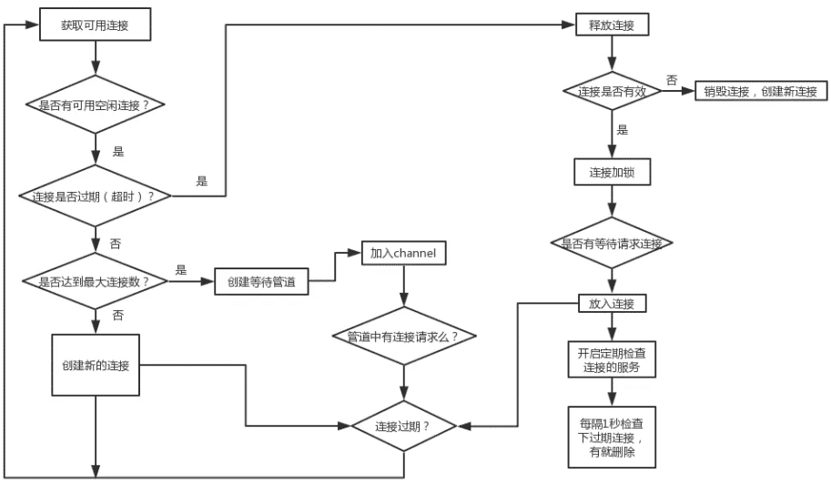

### 小结

总的来说，连接池是一种有效管理和复用连接的技术，它可以提高性能、节省资源、控制连接数、提高可靠性，并简化应用程序的编程。在高并发的场景下，使用连接池是一种常见的优化手段。

## 安全思想

### 业务场景

安全思想是指在设计、开发和维护计算机系统和网络时，将安全性作为首要考虑的原则和理念。它强调在整个系统生命周期中，从设计阶段到实施和运行阶段，都要考虑安全性，并采取相应的措施来保护系统免受恶意攻击和数据泄露的威胁。

### 案例

⓵ Go 安全编码实践指南

采用安全编码实践，可以提高应用程序的安全性，减少潜在的安全风险，并为用户提供更可靠和安全的体验。

本节内容摘自 OWASP 的 [Go-安全编码实践指南](http://www.owasp.org.cn/OWASP-CHINA/go-webapp-scp-cn.pdf)

其他：

-   [OWASP安全编码规范快速参考指](http://www.owasp.org.cn/OWASP-CHINA/owasp-project/download/OWASP_SCP_Quick_Reference_Guide-Chinese.pdf)

-   [十大关键 API 安全风险](http://www.owasp.org.cn/OWASP-CHINA/owasp-project/OWASPAPITop102019.pdf)

-   [CSRF 防御手册](https://cheatsheetseries.owasp.org/cheatsheets/Cross-Site_Request_Forgery_Prevention_Cheat_Sheet.html)

-   [re2](https://github.com/google/re2)

-   [OWASP-TOP10-2021中文版V1.0发布.pdf](http://www.owasp.org.cn/OWASP-CHINA/owasp-project/OWASP-TOP10-2021中文版V1.0发布.pdf)

### 小结

谚云：防患于未然

安全思想和漏洞防护是保护计算机系统和网络安全的重要方面。通过将安全性纳入系统设计和开发的早期阶段，并采取相应的漏洞防护措施，可以降低系统遭受攻击的风险，保护用户的数据和隐私，确保系统的正常运行。

## 压缩算法

### 业务场景

在数据量稍大些的场景中，传输时间往往占耗时的大头。压缩算法在数据存储、数据传输和用户体验等方面都具有重要的作用，可以提高效率、节省资源和改善用户体验。

### 案例

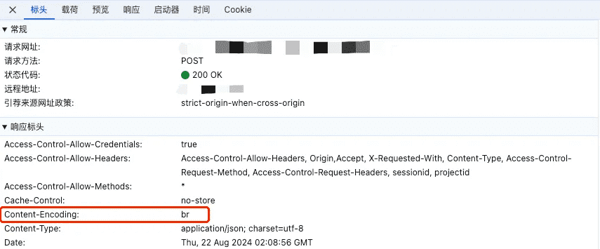

Content-Encoding 是 HTTP 协议中的一个头部字段，用于指示服务器对响应内容进行了何种类型的编码压缩。它的作用是告知客户端如何解码和还原服务器返回的压缩内容。

Content-Encoding 的作用包括：

1.  压缩传输：通过使用 Content-Encoding 头部字段，服务器可以对响应内容进行压缩，减小数据的大小，从而减少传输的数据量和网络带宽消耗。这可以提高网络传输的效率，加快数据的传输速度。
2.  节省带宽：通过压缩响应内容，Content-Encoding 可以减少数据的大小，从而节省网络带宽。这对于网络流量较大的网站和应用程序来说，可以降低服务器和网络的负载，提高整体性能和响应速度。
3.  客户端解压缩：客户端在收到带有 Content-Encoding 头部字段的响应时，可以根据指定的压缩算法对内容进行解压缩。这样客户端就能够还原压缩前的原始内容，以便正确处理和显示。

常见的 Content-Encoding 值包括：Gzip、Deflate、Br 等算法。

对于 REST API 的开发者来说，资源表示压缩是一项非常重要的技术，可以帮助我们提高 API 的性能，减少响应大小，提升用户体验。

优劣分析总结：

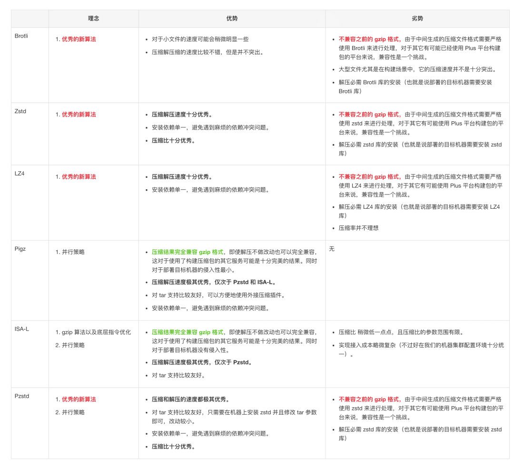

在测试案例对比中，时间耗时的顺序为 Pzstd < ISA-L < Pigz < LZ 4 < Zstd < Brotli < Gzip （排名越靠前越好），其中压缩和解压缩的时间在整体的耗时上占比较大，因此备选策略为 Pzstd、ISA-L、Pigz。

### 小结

谚云：没有最好，只有最适合

压缩算法的衡量指标包括：压缩比、压缩/解压速度、CPU/内存占用等。这些指标通常是相互关联的，不同的压缩算法在不同的数据类型和压缩设置下可能表现出不同的性能。选择合适的压缩算法应综合考虑这些指标，并根据具体的应用需求进行权衡。

## 解耦：消息队列

### 业务场景

消息队列是重要的分布式系统组件，在高性能、高可用、低耦合等系统架构中扮演着重要作用。可用于异步通信、削峰填谷、解耦系统、数据缓存等多种业务场景。


常用的消息队列实现有：Kafka、RabbitMQ、RocketMQ、Pulsar、ActiveMQ 等等。

### 案例

⓵ 解耦系统

以电商系 IT 架构为例。在传统的紧耦架构中，客户下单后，订单系统收到请求后，调用库存系统减库存。这种模式有如下缺点：

-   订单系统与库存系统强耦合，可能是服务内 RPC 调用；
-   遇到突发流量时，库存系统负载（查询、修改）。

引用 MQ 后的方案：

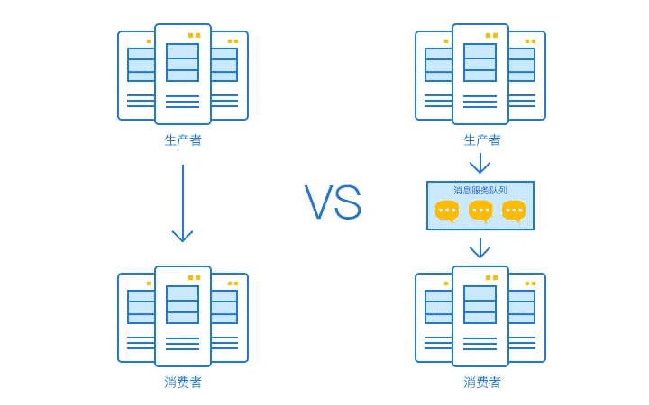

引入 MQ 后，订单系统和库存系分别工作，解除了强耦合性。即便在下单时库存系统宕机了，也不影响正常下单（待库存系统恢复后，从 MQ 取出订单保证最终成功）。

>   电商网站中，新的用户注册时，需要将用户的信息保存到数据库中，同时还需要额外发送注册的邮件通知、以及短信注册码给用户。

⓶ 异步通信

电商网站中，新的用户注册时，需要将用户的信息保存到数据库中，同时还需要额外发送注册的邮件通知、以及短信注册码给用户。

传统的做法有两种：串行的方式、并行的方式。

串行的方式：

将注册信息写入数据库后，先发送邮件通知，再发送短信提醒。以上三个任务全部完成后，返回给客户端。

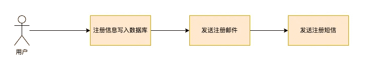

并行的方式：

将注册信息写入数据库成功后，发送注册邮件的同时，发送注册短信。以上三个过程完成后，返回给客户端。与串行的差别是并行的方式可以缩短处理时间。

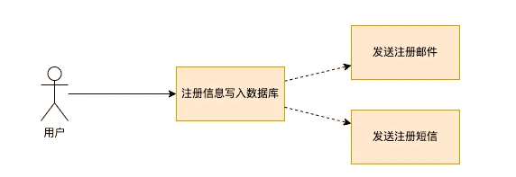

消息队列：

引入消息队列后，非关键路径（通知部分）就可以异步处理了，从而实现快速响应：

-   注册信息写入数据库成功后，再把发送注册邮件、注册短信的消息写入消息队列，返回给客户端；
-   然后，服务端订阅消息队列（保证最终成功），分别发送注册邮件、注册短信。

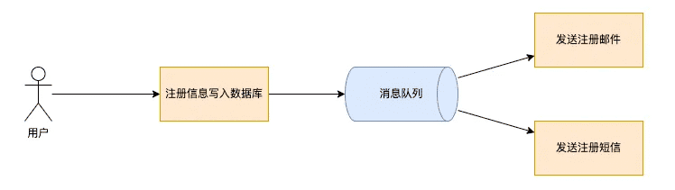

⓷ 削峰填谷

像双十一、手机预约抢购等对 IO 时延敏感的业务场景，当外部请求超过系统负载时，如果系统没有过载保护策略，很可能会被短时的峰值流量冲垮。

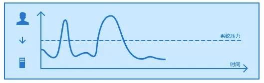

针对这种洪峰流量，引入消息队列，将非即时处理的业务逻辑进行异步化，处理成功后通知用户（邮件、短信等）。这种削弱峰值流量延缓处理的方式，相当于给系统做了一层缓冲。

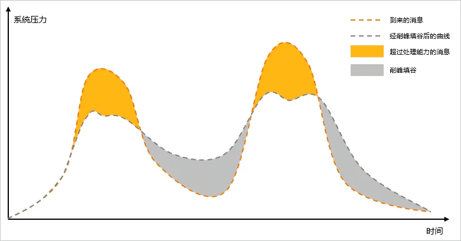

上图中，黄色的部分代表超出消息处理能力的部分。把黄色部分的消息平均到之后的空闲时间去处理，这样既可以保证系统负载处在一个稳定的水位，又可以尽可能地处理更多消息。通过配置流控规则，可以达到消息匀速处理的效果。

⓸ 广播

假如，客户购买商品后，子系统会有以下动作：

-   积分系统累积成长积分；
-   赠品系统给客户发赠品；
-   推荐系统推送商品周边；
-   …

凡此种种，这些子系统之间没有依赖关系。引入 MQ 可以大大简化业务逻辑：

-   降低交易系统的复杂度，仅生产交易消息；
-   解除系统间依赖，生产一次数据，可被不同子系统同时消费，多次复用；
-   可以根据业务特性，延迟处理。

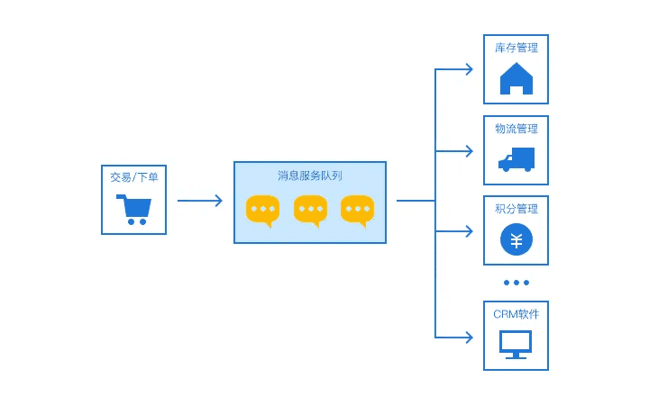

⓹ 延时队列

消息队列可以实现一些延时操作，如定时调度、超时处理等。

分布式定时调度：

在需要精细化调度场景中，如每 2 分钟触发一次消息推送。传统基于数据库的定时调度方案在分布式场景下（特别是数据量大的时候），性能不高，实现复杂。基于消息队列（如 RocketMQ）可以封装出定时触发器。

任务超时处理：

以购买火车票为例，我们在 12306 下单后暂未支付，订单是不会被取消的。而是等待一段时间后（如 30 min），系统才会关闭未支付的订单。可以使用消息队列实现超时任务检查：

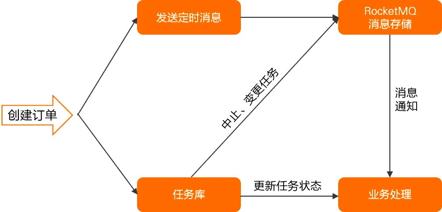

基于定时消息的超时任务处理有如下优势：

-   精度高、开发门槛低：基于消息通知方式不存在定时阶梯间隔。可以轻松实现任意精度事件触发，无需业务去重。
-   高性能可扩展：传统的数据库扫描方式较为复杂，需要频繁调用接口扫描，容易产生性能瓶颈。消息队列具有高并发和水平扩展的能力。

其他：

延迟消息的使用场景很多，比如异常检测重试、订单超时取消等，例如：

-   服务请求异常，需要将异常请求放到单独的队列，隔 5 分钟后进行重试；
-   用户购买商品，但一直处于未支付状态，需要定期提醒用户支付，超时则关闭订单；
-   面试或者会议预约，在面试或者会议开始前半小时，发送通知再次提醒。

### 小结

谚云：All problems in computer science can be solved by another level of indirection.

>   计算机科学中的所有问题都可以通过另一个中间层来解决。

