# 浅谈高性能高并发高可用

整个软件的发展历程是一部软件复杂性对抗史，软件的复杂性分为技术复杂性和业务复杂性，业务复杂性主要是建模和抽象设计，技术复杂性主要是三高（高性能，高并发，高可用）的应对，C端的业务一般以技术复杂性为主，业务复杂性为辅，而B端或者M端的业务通常以业务复杂性为主，技术复杂性为辅。

## 高性能

个人理解三高系统的核心在于高性能，系统的性能高，系统的处理速度快，吞吐量自然高，此时系统能够应对高并发的流量；系统的性能高，我们系统的对外承诺的TP99, TP999就比较低，超时等影响可用率的情况自然减少，系统的可用性也会提高，所以三高系统建设的出发点可以从系统的性能如何优化进行建设，高性能篇从系统的读写两个维度谈下系统的性能优化方法论及实践。

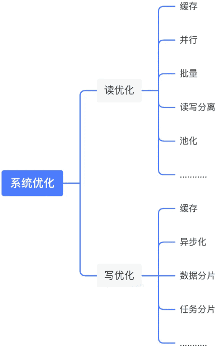

首先我们要清楚知道影响系统性能的因素有那些，通常有以下三方面的因素：计算（computation），通信（communication），存储（storage）。计算层面：系统本身的计算逻辑复杂，Fullgc；通信层面：依赖的下游耗时比较高；存储层面：大库大表，慢sql，ES集群的数据节点，索引，分片，分片大小设置的不合理；针对这些问题，我们可以从读写两个维度针对性能问题进行优化，下图是我工作中解决性能问题的一些方法。

### 读多写少的系统

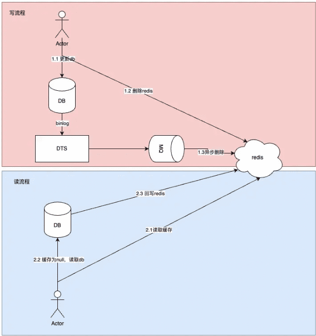

### 写多读少的系统：

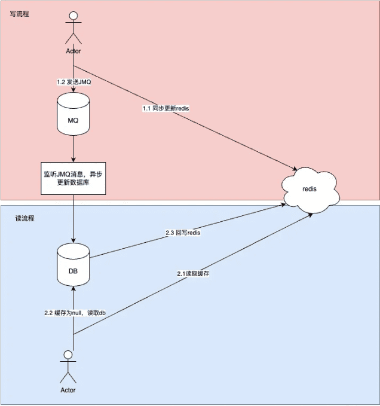

### 写优化：秒杀场景下的异步化

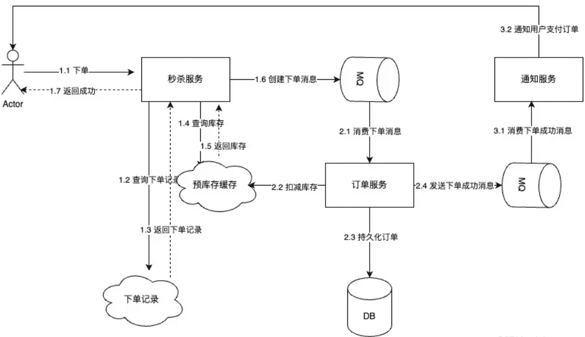

## 高并发

提到高并发我们想到的是高吞吐，流量洪峰；如何提高高并发我们可以从单机的性能优化，和集群的扩展来进行提高我们系统的并发能力，其实系统的高性能直接就提高了系统的高并发，上面的高性能篇主要是从单机的维度提高处理的速度来提高单机的并发处理能力，本章主要从集群的维度通过扩展：水平扩展，纵向扩展，垂直扩展三维立体来提高系统的并发能力。

### 方法论

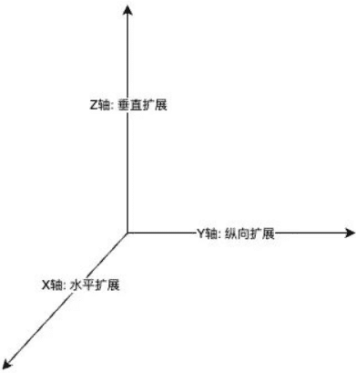

#### X轴：水平扩展

水平扩展就是扩容，是我们采用最多的抗并发的措施：加机器，扩分片，每年大促时，这是我们的常规操作，现有分组下的机器处理能力有限，我们通过扩容来应对大促的流量，扩容我们分为应用层和存储层，应用层都是无状态的服务，我们可以通过公司部署平台行云快速的扩容增加机器，存储层的扩容相对比较麻烦，新增分片后，还涉及到数据的迁移以及分片规则的调整。

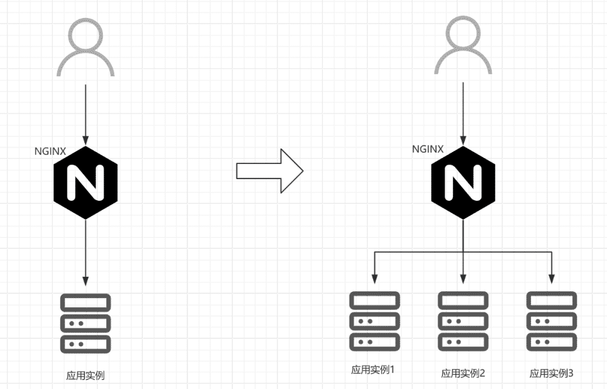

#### Y轴：纵向扩展

整个软件应用的架构经历单体应用，SOA，微服务，服务网格的演进。早期的架构风格所有的服务功能都融合在单体应用中，通过单体服务来抗所有的流量，后来随着业务的复杂性和用户的增多以及我们基于对业务的深入理解采用DDD（领域驱动设计）来指导我们按照领域划分服务，进行微服务建设，下图是一个电商的单体应用到按照DDD进行微服务划分的一个演进过程。

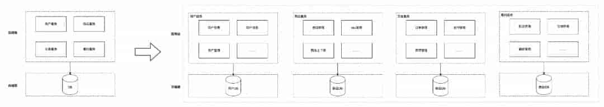

#### Z轴：垂直扩展

当我们在应用层进行水平扩展时，每增加一台机器都会增加数据库的访问链接，数据库的连接数属于宝贵资源，达到上限后，应用层再扩容就会出现连接数耗尽的异常，此时存储层成了整个系统高并发的瓶颈，针对数据库我们一般采用分片（分而治之）的思想：分库分表，通过增加库实例来增加访问的连接数，下图是订单进行分库分表的架构。

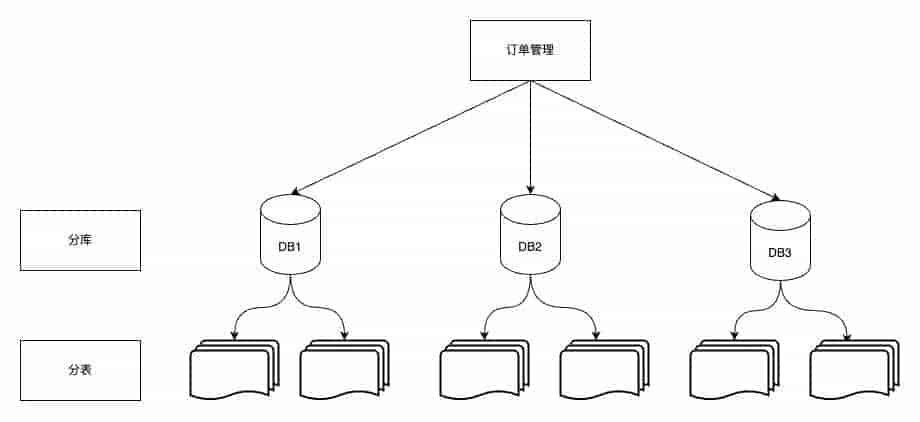

集群中数据库的主从库数量是有限制的的，达到最大限制后，一个机房的数据库集群成了系统的瓶颈，解决方案是进行单元化建设，系统的流量和数据闭环在一个单元，这个单元分布在全国甚至全世界不同的地域，而不是集中在某个机房某个地域，北京的系统单元为北京用户提供服务，上海的系统单元为上海用户提供服务，就类似于京东物流的仓库一样，建在离用户最近的地方，北京仓服务北京用户，上海仓服务上海用户。大家可以看到系统的建设和业务的发展底层的思想都是统一的，中国的头部互联网还都是业务驱动，所以技术要服务好业务。总之我们可以看到通过分库分表和单元化这种垂直扩展提高并发的同时也增强了系统的可用性，下图是我们进行单元化建设的过程。

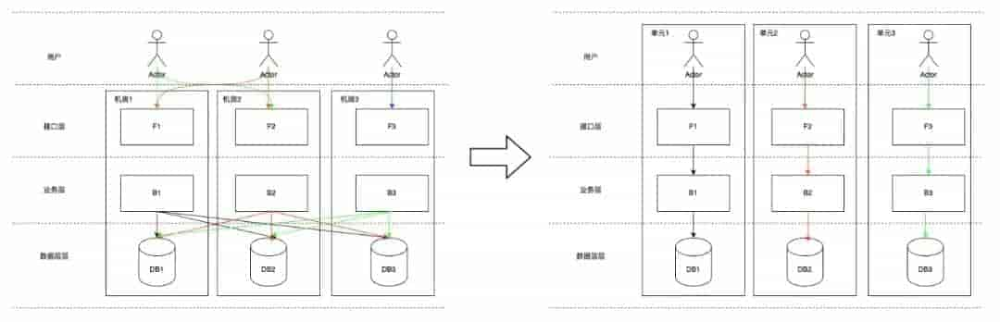

## 高可用

保证系统的可用性是系统建设中的重中之重，如果没有可用性，高性能和高并发也无从谈起，高可用的建设通常是通过保护系统和冗余的方法来进行容错保证系统的可用性。本篇主要从三个维度：应用层，存储层，部署层谈下可用性的建设

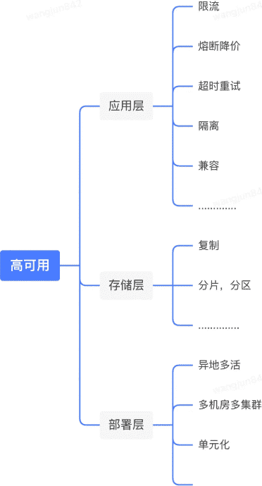

### 应用层

#### 限流

限流一般是从服务提供者provider的视角提供的针对自我保护的能力，对于流量负载超过系统的处理能力，限流策略可以防止系统被激增的流量打垮。下面是这些限流算法的优缺点对比。

|                  | 优点                                                         | 缺点                                                         |
| ---------------- | ------------------------------------------------------------ | ------------------------------------------------------------ |
| 流量计数器算法   | 简单好理解                                                   | 单位时间很难把控，不平滑                                     |
| 滑动时间窗口算法 | 时间好把控                                                   | 1 超过窗口时间的流量就丢弃或降级 2 没有办法削峰填谷       |
| 漏桶算法         | 削峰填谷                                                     | 1 漏桶大小的控制，太大给服务端造成压力，太小大量请求被丢弃 2 漏桶给下游发送请求的速率固定 |
| 令牌桶算法       | 1 削峰填谷 2 动态控制令牌桶的大小，从而控制向下游发送请求的速率 | 1 实现相对复杂 2 只能预先设计不适配突发                  |

#### 熔断降级

熔断和降级是两件事情，但是他们一般是结合在一起使用的。

-   熔断是防止我们的系统被下游系统拖垮，比如下游系统接口性能严重变差，甚至下游系统挂了；这个时候会导致大量的线程堆积，不能释放占用的CPU，内存等资源，这种情况下不仅影响该接口的性能，还会影响其他接口的性能，严重的情况会将我们的系统拖垮，造成雪崩效应，通过打开熔断器，流量不再请求到有问题的系统，可以保护我们的系统不被拖垮。
-   降级是一种有损操作，我们作为服务提供者，需要将这种损失尽可能降到最低，无论是返回友好的提示，还是返回可接受的降级数据。降级细分的话又分为人工降级，自动降级。
    -   人工降级：人工降级一般采用降级开关来控制，公司内部一般采用配置中心Ducc来做开关降级，开关的修改也是线上操作，这块也需要做好监控；
    -   自动降级：自动降级是采用自动化的中间件例如Hystrix，公司的小盾龙等；如果采用自动降级的话；我们必须要对降级的条件非常的明确，比如失败的调用次数等。

#### 超时设置

分布式系统中的难点之一：不可靠的网络，京东物流现有的微服务架构下，服务之间都是通过JSF网络交互进行同步通信，我们探测下游依赖服务是否可用的最快捷的方式是设置超时时间。超时的设置可以让系统快速失败，进行自我保护，避免无限等待下游依赖系统，将系统的线程耗尽，系统拖垮；

超时时间如何设置也是一门学问，如何设置一个合理的超时时间也是一个逐步迭代的过程，比如下游新开发的接口，一般会基于压测提供一个TP99的耗时，我们会基于此配置超时时间；老接口的话，会基于线上的TP99耗时来配置超时时间。

超时时间在设置的时候需要遵循漏斗原则，从上游系统到下游系统设置的超时时间要逐渐减少，如下图所示。为什么要满足漏斗原则，假设不满足漏斗原则，比如服务A调取服务B的超时时间设置成500ms，而服务B调取服务C的超时时间设置成800ms，这个时候回导致服务A调取服务B大量的超时从而导致可用率降低，而此时服务B从自身角度看是可用的。

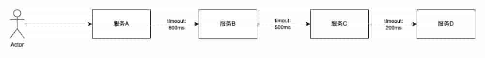

#### 重试

分布式系统中性能的影响主要是通信，无论是在分布式系统中还是垮团队沟通，communication是最昂贵的；比如我们研发都知道需求的交付有一半以上甚至更多的时间花在跨团队的沟通上，真正写代码的时间是很少的；分布式系统中我们查看调用链路，其实我们系统本身计算的耗时是很少的，主要来自于外部系统的网络交互，无论是下游的业务系统，还是中间件：Mysql, redis, es等等；所以在和外部系统的一次请求交互中，我们系统是希望尽最大努力得到想要的结果，但往往事与愿违，由于不可靠网络的原因，我们在和下游系统交互时，都会配置超时重试次数，希望在可接受的SLA范围内一次请求拿到结果，但重试不是无限的重试，我们一般都是配置重试次数的限制，偶尔抖动的重试可以提高我们系统的可用率，如果下游服务故障挂掉，重试反而会增加下游系统的负载，从而增加故障的严重程度。在一次请求调用中，我们要知道对外提供的API，后面是有多少个service在提供服务，如果调用链路比较长，服务之间rpc交互都设置了重试次数，这个时候我们需要警惕重试风暴。如下图service D 出现问题，重试风暴会加重service D的故障严重程度。对于API的重试，我们还要区分该接口是读接口还是写接口，如果是读接口重试一般没什么影响，写接口重试一定要做好接口的幂等性。

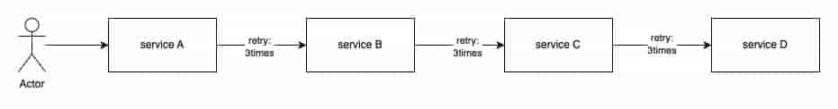

#### 隔离

隔离是将故障爆炸半径最小化的有效手段，我们通过不同层面的隔离来控制影响范围，保证系统的高可用：

##### 系统建设层面隔离

我们知道系统的分类可以分为：在线的系统，离线系统（批处理系统），近实时系统（流处理系统），如下是这些系统的定义：

-   在线系统：服务端等待请求的到达，接收到请求后，服务尽可能快的处理，然后返回给客户端一个响应，响应时间通常是在线服务性能的主要衡量指标。我们生活中在手机使用的APP大部分都是在线系统；
-   离线系统：或称批处理系统，接收大量的输入数据，运行一个作业来处理数据，并产出输出数据，作业往往需要定时，定期运行一段时间，比如从几分钟到几天，所以用户通常不会等待作业完成，吞吐量是离线系统的主要衡量指标。例如我们看到的报表数据：日订单量，月订单量，日活跃用户数，月活跃用户数都是批处理系统运算一段时间得到的；
-   近实时系统：或者称流处理系统，其介于在线系统和离线系统之间，流处理系统一般会有触发源：用户的行为操作，数据库的写操作，传感器等，触发源作为消息会通过消息代理中间件：JMQ、KAFKA等进行传递，消费者消费到消息后再做其他的操作，例如构建缓存，索引，通知用户等；

以上三种系统是需要进行隔离建设的，因为他们的衡量指标及对资源的使用情况完全不一样的，比如我们小组会将在线系统作为一个服务单独部署：jdl-uep-main，离线系统和近实时系统作为一个服务单独部署：jdl-uep-worker；

##### 环境的隔离

从研发到上线阶段我们会使用不同的环境，比如业界常见的环境分为：开发，测试，预发和线上环境；研发人员在开发环境进行开发和联调，测试人员在测试环境进行测试，运营和产品在预发环境进行UAT，最终交付的产品部署到线上环境提供给用户使用。在研发流程中，我们部署时要遵循从应用层到中间件层再到存储层，都要在一个环境，严禁垮环境的调用，比如测试环境调用线上，预发环境调用线上等。

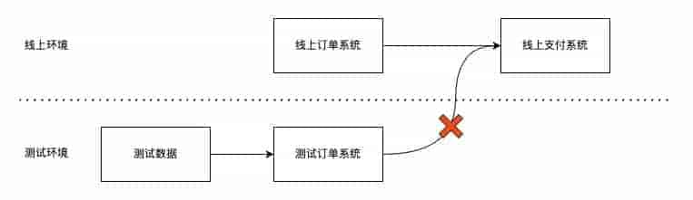

##### 数据隔离

随着业务的发展，我们对外提供的服务往往会支撑多业务、多租户，所以这个时候我们会按照业务进行数据隔离；比如我们组产生的物流订单数据业务方就包含京东零售，其他电商平台，ISV等，为了避免彼此的影响我们需要在存储层对数据进行隔离，数据的隔离可以按照不同粒度，第一种是通过租户id字段进行区分，所有的数据存储在一张表中，另外一个是库粒度的区分，不同的租户单独分配对应的数据库。

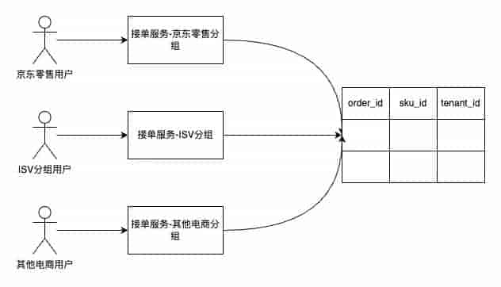

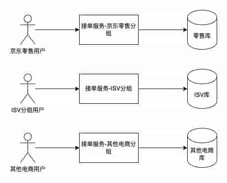

数据的隔离除了按照业务进行隔离外，还有按照环境进行隔离的，比如我们的数据库分为测试库，预发库，线上库，全链路压测时，我们为了模拟线上的环境，同时避免污染线上的数据，往往会创建影子库，影子表等。根据数据的访问频次进行隔离，我们将经常访问的数据称为热数据，不经常访问的数据称为冷数据；将经常访问的数据缓存到缓存，提高系统的性能。不经常访问的数据持久化到数据库或者将不使用的数据结转归档到OSS，避免大库大表。

##### 核心/非核心流程隔离

我们知道应用是分级的，京东内部针对应用的重要程度会将应用分为0，1，2，3级应用。业务的流程也分为黄金流程和非黄金流程。在业务流程中，针对不同级别的应用交互，需要将核心和非核心的流程进行隔离。例如在交易业务过程中，会涉及到订单系统，支付系统，通知系统，那这个过程中核心系统是订单系统和支付系统，而通知相对来说重要性不是那么高，所以我们会投入更多的资源到订单系统和支付系统，优先保证这两个系统的稳定性，通知系统可以采用异步的方式与其他两个系统解耦隔离，避免对其他另外两个系统的影响。

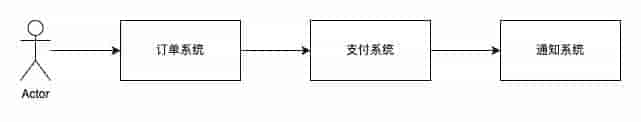

##### 读写隔离

应用层面，领域驱动设计（DDD）中最著名的CQRS（Command Query Responsibility Segregation）将写服务和读服务进行隔离。写服务主要处理来自客户端的command写命令，而读服务处理来自客户端的query读请求，这样从应用层面进行读写隔离，不仅可以提高系统的可扩展性，同时也会提高系统的可维护性，应用层面我们都采用微服务架构，应用层都是无状态服务，可以扩容加机器随意扩展，存储层需要持久化，扩展就比较费劲。除了应用层面的CQRS，在存储层面，我们也会进行读写隔离，例如数据库都会采用一主多从的架构，读请求可以路由到从库从而分担主库的压力，提高系统的性能和吞吐量。所以应用层面通过读写隔离主要解决可扩展问题，存储层面主要解决性能和吞吐量的问题。

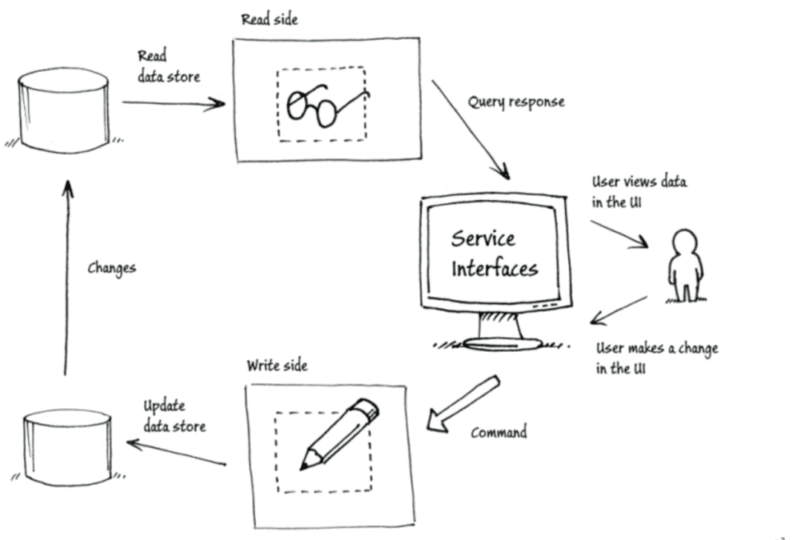

##### 线程池隔离

线程是昂贵的资源，为了提高线程的使用效率，复用线程，避免创建和销毁的消耗，我们采用了池化技术，线程池，但是在使用线程的过程中，我们也做好线程池的隔离，避免多个API接口复用同一个线程。

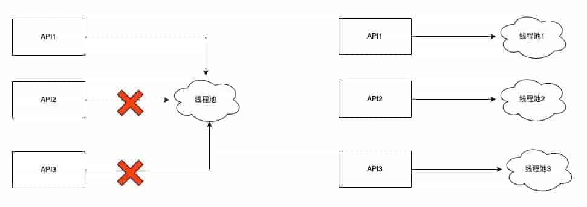

#### 兼容

我们在对老系统，老功能进行重构迭代的时候，一定要做好兼容，否则上线后会出现重大的线上问题，公司内外有大量因为没有做好兼容性，而导致资损的情况。兼容分为：向前兼容性和向后兼容性，需要好好的区分他们，如下是他们的定义：

-   向前兼容性：向前兼容性指的是旧版本的软件或硬件能够与将来推出的新版本兼容的特性，简而言之旧版本软件或系统兼容新的数据和流量。
-   向后兼容性：向后兼容性则是指新版本的软件或硬件能够与之前版本的系统或组件兼容的特性，简而言之新版本软件或系统兼容老的数据和流量。

根据新老系统和新老数据我们可以将系统划分为四个象限：第一象限：新系统和新数据是我们系统改造上线后的状态，第三象限：老系统和老数据是我们系统改造上线前的状态，第一象限和第三象限的问题我们在研发和测试阶段一般都能发现排除掉，线上故障的高发期往往出现在第二和第四象限，第二象限是因为没有做好向前兼容性，例如上线过程中，发现问题进行了代码回滚，但是在上线过程中产生了新数据，回滚后的老系统不能处理上线过程中新产生的数据，导致线上故障。第四象限是因为没有做好向后兼容性，上线后新系统影响了老流程。针对第二象限的问题，我们可以构造新的数据去验证老的系统，针对第四象限的问题，我们可以通过流量的录制回放解决，录制线上的老流量，对新功能进行验证。

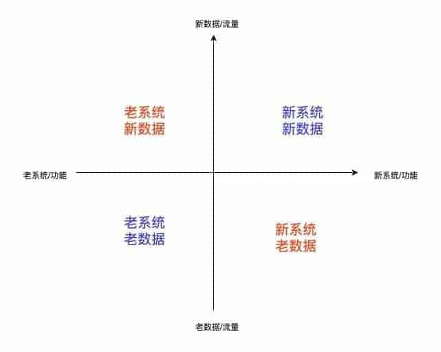

### 存储层

存储层主要通过复制和分片来保证存储层的高可用，复制主要是通过副本（主从节点，主从副本）来保证高可用，分片是将数据分散到不同的节点上来保证高可用（鸡蛋不要放在同一个篮子中）。复制和分片在保证高可用的情况下，其实也提高了系统的高性能和高并发，复制和分片的思想在Mysql，Redis，ElasticSearch, kafka中都进行了采用。

#### 复制

复制技术是一份数据的完整的拷贝，思想是通过冗余保证高可用。复制又可以分为：主从复制，多主复制，无主复制。

-   主从复制：客户端将所有写入操作发送到单个节点（主库），该节点将数据更改事件流发送到其他副本（从库）。读取可以在任何副本上执行，但从库的读取结果可能是陈旧的。
-   多主复制：客户端将每个写入发送到几个主库节点之一，其中任何一个主库都可以接受写入。主库将数据更改事件流发送给彼此以及任何从库节点。
-   无主复制：客户端将每个写入发送到几个节点，并从多个节点并行读取，以检测和纠正具有陈旧数据的节点。

#### 分区

分区也称为分片，对于非常大的数据集在单节点进行存储时，一方面可用性比较低（鸡蛋放在同一个篮子中），另一方面也会遇到存储和性能的瓶颈，我们需要将大的数据集通过负载均衡分片到不同的节点上，每条数据（每条记录，每行或每个文档）属于且仅属于一个分区，每个分区都是自己的小型数据库。分区我们分为键范围分区，散列分区。

-   键范围分区：其中键是有序的，并且分区拥有从某个最小值到某个最大值的所有键。排序的优势在于可以进行有效的范围查询，但是如果应用程序经常访问相邻的键，则存在热点的风险。在这种方法中，当分区变得太大时，通常将分区分成两个子分区来动态地重新平衡分区。
-   散列分区：散列函数应用于每个键，分区拥有一定范围的散列。这种方法破坏了键的排序，使得范围查询效率低下，但可以更均匀地分配负载。通过散列进行分区时，通常先提前创建固定数量的分区，为每个节点分配多个分区，并在添加或删除节点时将整个分区从一个节点移动到另一个节点。也可以使用动态分区。

#### Redis 的复制和分片

redis cluster集群中，我们会划分16384个槽，key 通过散列哈希算法会映射到相应的槽中，这些槽分配到不同的分片上，每个分片有主节点和从节点，主节点对外提供读写服务，从节点对外提供读服务。当某个分片的主节点挂掉，其他分片的主节点会从挂掉分片的从节点选择一个作为主节点继续对外提供服务。整体的架构如下图所示。

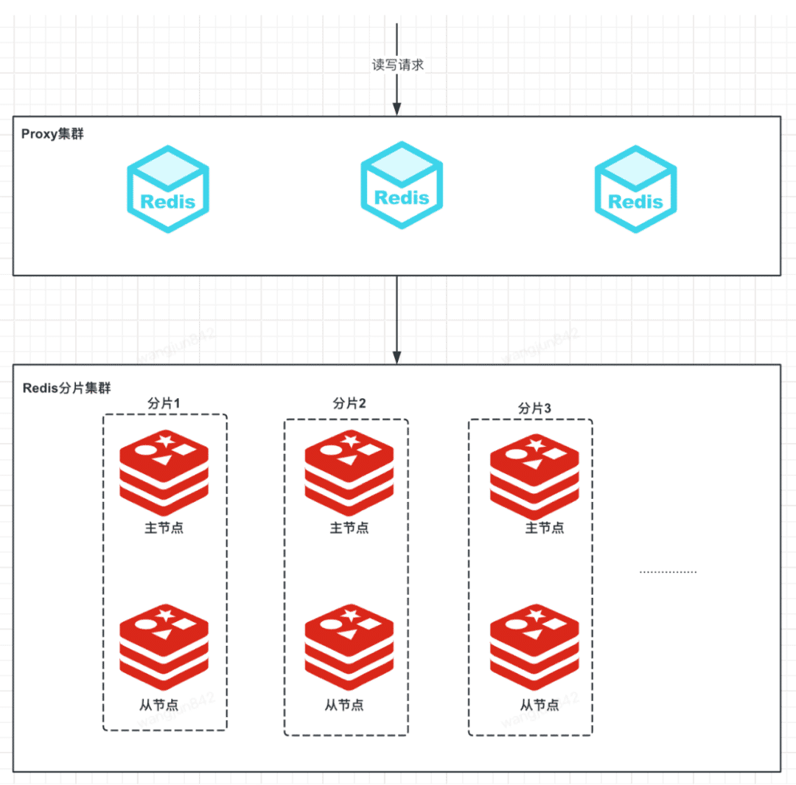

#### ES索引的复制和分片

我们在创建ES索引时，会指定分片的数量和副本的数量，分片的数量确定后是不允许修改的，副本的数量允许修改，分片的数量一般和数据节点的数量保持一致，这样能将索引的数据分配到每个数据节点上，每个数据节点都存储索引的部分数据，Primary分片可以对外提供读写服务，Replica分片对外提供读服务的同时作为备份节点保证可用性，ES索引的不同分片在不同数据节点的分布如下图所示。

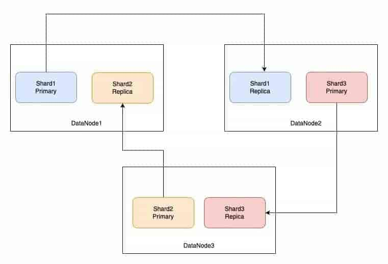

#### Kafka topic的复制和分区

kafka的topic为了提高可用性及高吞吐，引入了topic的分区，每个分区为了提高可用性，分区分为Leader partition 和 Follower partition，Leader partition对外提供读写服务，Follower partition作为灾备提高可用性，整体的架构如下图。

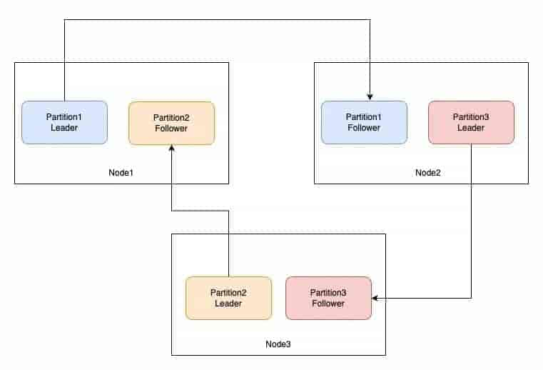

### 部署层

#### 业界部署架构的演进

部署层是通过不断突破单机器，单机房，单地域，做到机器级别，机房级别，地域级别的容灾来保证系统的高可用。核心思想是通过冗余以及负载均衡进行容灾保证高可用。

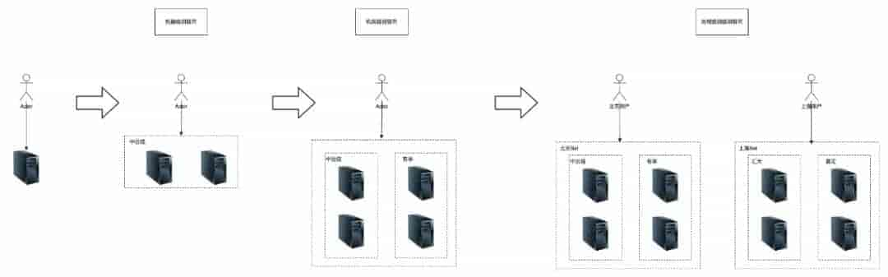

#### 我们部署架构现状

目前我们的应用都是采用多机房多分组Docker容器化部署，会根据业务方的重要程度及流量大小设置不同的别名，隔离到不同的分组中对外提供服务。

应用容器机房为：中云信，有孚，廊坊，宿迁等；

数据库Mysql双机房部署：中云信，有孚；

缓存Redis双机房部署：中云信，有孚；

ES单机房部署：有孚。

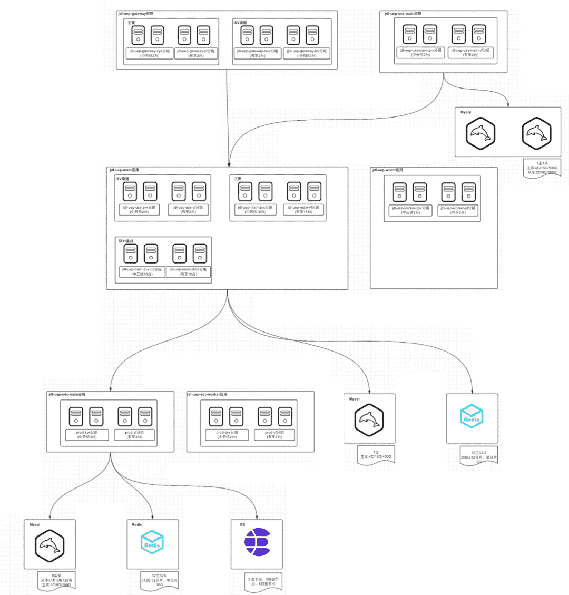
