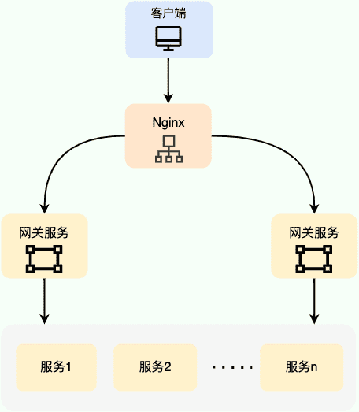
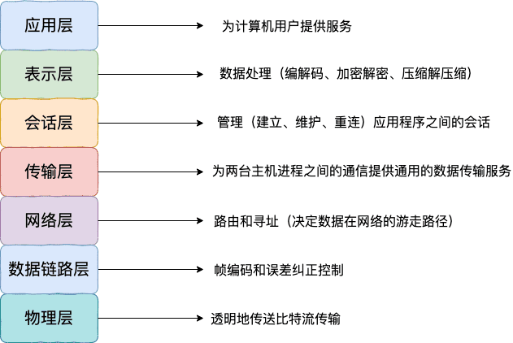

# 负载均衡原理及算法详解

## 什么是负载均衡？

**负载均衡**指的是将用户请求分摊到不同的服务器上处理，以提高系统整体的并发处理能力以及可靠性。负载均衡服务可以有由专门的软件或者硬件来完成，一般情况下，硬件的性能更好，软件的价格更便宜。

负载均衡是一种比较常用且实施起来较为简单的提高系统并发能力和可靠性的手段，不论是单体架构的系统还是微服务架构的系统几乎都会用到。

## 负载均衡分为哪几种？

负载均衡可以简单分为 **服务端负载均衡** 和 **客户端负载均衡** 这两种。

### 服务端负载均衡

**服务端负载均衡** 主要应用在 **系统外部请求** 和 **网关层** 之间，可以使用 **软件** 或者 **硬件** 实现。

下图是我画的一个简单的基于 Nginx 的服务端负载均衡示意图：



**硬件负载均衡** 通过专门的硬件设备（比如 **F5、A10、Array** ）实现负载均衡功能。

硬件负载均衡的优势是性能很强且稳定，缺点就是实在是太贵了。像基础款的 F5 最低也要 20 多万，绝大部分公司是根本负担不起的，业务量不大的话，真没必要非要去弄个硬件来做负载均衡，用软件负载均衡就足够了！

在我们日常开发中，一般很难接触到硬件负载均衡，接触的比较多的还是 **软件负载均衡** 。软件负载均衡通过软件（比如LVS、Nginx、HAproxy）实现负载均衡功能，性能虽然差一些，但价格便宜啊！像基础款的 Linux 服务器也就几千，性能好一点的 2~3 万的就很不错了。

根据 OSI 模型，服务端负载均衡还可以分为：

- 二层负载均衡
- 三层负载均衡
- 四层负载均衡
- 七层负载均衡

最常见的是四层和七层负载均衡，因此，本文也是重点介绍这两种负载均衡。

> Nginx 官网对四层负载和七层负载均衡均衡做了详细介绍，感兴趣的可以看看。
>
> - [What Is Layer 4 Load Balancing?](https://www.nginx.com/resources/glossary/layer-4-load-balancing/)
> - [What Is Layer 7 Load Balancing?](https://www.nginx.com/resources/glossary/layer-7-load-balancing/)



- **四层负载均衡** 工作在 OSI 模型第四层，也就是传输层，这一层的主要协议是 TCP/UDP，负载均衡器在这一层能够看到数据包里的源端口地址以及目的端口地址，会基于这些信息通过一定的负载均衡算法将数据包转发到后端真实服务器。也就是说，四层负载均衡的核心就是 IP+端口层面的负载均衡，不涉及具体的报文内容。
- **七层负载均衡** 工作在 OSI 模型第七层，也就是应用层，这一层的主要协议是 HTTP 。这一层的负载均衡比四层负载均衡路由网络请求的方式更加复杂，它会读取报文的数据部分（比如说我们的 HTTP 部分的报文），然后根据读取到的数据内容（如 URL、Cookie）做出负载均衡决策。也就是说，七层负载均衡器的核心是报文内容（如 URL、Cookie）层面的负载均衡，执行第七层负载均衡的设备通常被称为 **反向代理服务器** 。

七层负载均衡比四层负载均衡会消耗更多的性能，不过，也相对更加灵活，能够更加智能地路由网络请求，比如说你可以根据请求的内容进行优化如缓存、压缩、加密。

简单来说，**四层负载均衡性能很强，七层负载均衡功能更强！** 不过，对于绝大部分业务场景来说，四层负载均衡和七层负载均衡的性能差异基本可以忽略不计的。

下面这段话摘自 Nginx 官网的 [What Is Layer 4 Load Balancing?](https://www.nginx.com/resources/glossary/layer-4-load-balancing/) 这篇文章。

> Layer 4 load balancing was a popular architectural approach to traffic handling when commodity hardware was not as powerful as it is now, and the interaction between clients and application servers was much less complex. It requires less computation than more sophisticated load balancing methods (such as Layer 7), but CPU and memory are now sufficiently fast and cheap that the performance advantage for Layer 4 load balancing has become negligible or irrelevant in most situations.
>
> 4 层负载平衡是一种流行的流量处理体系结构方法，当时商用硬件没有现在这么强大，客户端和应用程序服务器之间的交互也不那么复杂。它比更复杂的负载平衡方法(如第 7 层)需要更少的计算量，但是 CPU 和内存现在足够快和便宜，在大多数情况下，第 4 层负载平衡的性能优势已经变得微不足道或无关紧要。

在工作中，我们通常会使用 **Nginx** 来做七层负载均衡，LVS(Linux Virtual Server 虚拟服务器，Linux 内核的 4 层负载均衡)来做四层负载均衡。

不过，LVS 这个绝大部分公司真用不上，像阿里、百度、腾讯、eBay 等大厂才会使用到，用的最多的还是 Nginx。

### 客户端负载均衡

**客户端负载均衡** 主要应用于系统内部的不同的服务之间，可以使用现成的负载均衡组件来实现。

在客户端负载均衡中，客户端会自己维护一份服务器的地址列表，发送请求之前，客户端会根据对应的负载均衡算法来选择具体某一台服务器处理请求。

客户端负载均衡器和服务运行在同一个进程里，不存在额外的网络开销。不过，客户端负载均衡的实现会受到编程语言的限制，比如说 Spring Cloud Load Balancer 就只能用于 Java 语言。

## 负载均衡常见的算法有哪些？

### 随机法

**随机法**是最简单粗暴的负载均衡算法。

-   随机法(Random)：通过系统的随机算法，根据后端服务器的列表大小值来随机选取其中的一台服务器进行访问。由概率统计理论可以得知，随着客户端调用服务端的次数增多，其实际效果越来越接近于平均分配调用量到后端的每一台服务器，也就是轮询的结果。
-   加权随机法(Weight Random)：加权随机法根据后端机器的配置，系统的负载分配不同的权重。不同的是，它是按照权重随机请求后端服务器，而非顺序。

如果没有配置权重的话，所有的服务器被访问到的概率都是相同的。如果配置权重的话，权重越高的服务器被访问的概率就越大。

未加权重的随机算法适合于服务器性能相近的集群，其中每个服务器承载相同的负载。加权随机算法适合于服务器性能不等的集群，权重的存在可以使请求分配更加合理化。

不过，随机算法有一个比较明显的缺陷：部分机器在一段时间之内无法被随机到，毕竟是概率算法，就算是大家权重一样，也可能会出现这种情况。

于是，**轮询法** 来了！

### 轮询法

-   轮询法(Round Robin)是挨个轮询服务器处理，也可以设置权重。将请求按顺序轮流地分配到后端服务器上，它均衡地对待后端的每一台服务器，而不关心服务器实际的连接数和当前的系统负载。
-   加权轮询法(Weight Round Robin)不同的后端服务器可能机器的配置和当前系统的负载并不相同，因此它们的抗压能力也不相同。给配置高、负载低的机器配置更高的权重，让其处理更多的请；而配置低、负载高的机器，给其分配较低的权重，降低其系统负载，加权轮询能很好地处理这一问题，并将请求顺序且按照权重分配到后端。

如果没有配置权重的话，每个请求按时间顺序逐一分配到不同的服务器处理。如果配置权重的话，权重越高的服务器被访问的次数就越多。

未加权重的轮询算法适合于服务器性能相近的集群，其中每个服务器承载相同的负载。加权轮询算法适合于服务器性能不等的集群，权重的存在可以使请求分配更加合理化。

在加权轮询的基础上，还有进一步改进得到的负载均衡算法，比如平滑的加权轮训算法。

### 两次随机法

两次随机法在随机法的基础上多增加了一次随机，多选出一个服务器。随后再根据两台服务器的负载等情况，从其中选择出一个最合适的服务器。

两次随机法的好处是可以动态地调节后端节点的负载，使其更加均衡。如果只使用一次随机法，可能会导致某些服务器过载，而某些服务器空闲。

### 哈希法

将请求的参数信息通过哈希函数转换成一个哈希值，然后根据哈希值来决定请求被哪一台服务器处理。

在服务器数量不变的情况下，相同参数的请求总是发到同一台服务器处理，比如同个 IP 的请求、同一个用户的请求。

### 一致性 Hash 法

和哈希法类似，一致性 Hash 法也可以让相同参数的请求总是发到同一台服务器处理。不过，它解决了哈希法存在的一些问题。

常规哈希法在服务器数量变化时，哈希值会重新落在不同的服务器上，这明显违背了使用哈希法的本意。而一致性哈希法的核心思想是将数据和节点都映射到一个哈希环上，然后根据哈希值的顺序来确定数据属于哪个节点。当服务器增加或删除时，只影响该服务器的哈希，而不会导致整个服务集群的哈希键值重新分布。

### 最小连接法

**最小连接数法(Least Connections)算法**比较灵活和智能，由于后端服务器的配置不尽相同，对于请求的处理有快有慢，它是根据后端服务器当前的连接情况，动态地选取其中当前积压连接数最少的一台服务器来处理当前的请求，尽可能地提高后端服务的利用效率，将负责合理地分流到每一台服务器。

当有新的请求出现时，遍历服务器节点列表并选取其中连接数最小的一台服务器来响应当前请求。相同连接的情况下，可以进行加权随机。

最少连接数基于一个服务器连接数越多，负载就越高这一理想假设。然而，实际情况是连接数并不能代表服务器的实际负载，有些连接耗费系统资源更多，有些连接不怎么耗费系统资源。

### 最少活跃法

最少活跃法和最小连接法类似，但要更科学一些。最少活跃法以活动连接数为标准，活动连接数可以理解为当前正在处理的请求数。活跃数越低，说明处理能力越强，这样就可以使处理能力强的服务器处理更多请求。相同活跃数的情况下，可以进行加权随机。

### 最快响应时间法

不同于最小连接法和最少活跃法，最快响应时间法以响应时间为标准来选择具体是哪一台服务器处理。客户端会维持每个服务器的响应时间，每次请求挑选响应时间最短的。相同响应时间的情况下，可以进行加权随机。

这种算法可以使得请求被更快处理，但可能会造成流量过于集中于高性能服务器的问题。

## 七层负载均衡可以怎么做？

简单介绍两种项目中常用的七层负载均衡解决方案：DNS 解析和反向代理。

除了我介绍的这两种解决方案之外，HTTP 重定向等手段也可以用来实现负载均衡，不过，相对来说，还是 DNS 解析和反向代理用的更多一些，也更推荐一些。

### DNS 解析

DNS 解析是比较早期的七层负载均衡实现方式，非常简单。

DNS 解析实现负载均衡的原理是这样的：在 DNS 服务器中为同一个主机记录配置多个 IP 地址，这些 IP 地址对应不同的服务器。当用户请求域名的时候，DNS 服务器采用轮询算法返回 IP 地址，这样就实现了轮询版负载均衡。

### 反向代理

客户端将请求发送到反向代理服务器，由反向代理服务器去选择目标服务器，获取数据后再返回给客户端。对外暴露的是反向代理服务器地址，隐藏了真实服务器 IP 地址。反向代理“代理”的是目标服务器，这一个过程对于客户端而言是透明的。

Nginx 就是最常用的反向代理服务器，它可以将接收到的客户端请求以一定的规则（负载均衡策略）均匀地分配到这个服务器集群中所有的服务器上。

>   反向代理负载均衡同样属于七层负载均衡。
>

## Nginx的5种负载均衡算法

### 轮询法(Round Robin)(默认)

每个请求按时间顺序逐一分配到不同的后端服务器，如果后端服务器down掉，能自动剔除。

### 加权轮询法(Weight Round Robin)- weight

指定轮询几率，weight和访问比率成正比，用于后端服务器性能不均的情况。

例如：

```c++
upstream bakend {
    server 192.168.0.14 weight=10;
    server 192.168.0.15 weight=10;
```

### 源地址哈希法(Hash)- ip_hash

每个请求按访问ip的hash结果分配，这样每个访客固定访问一个后端服务器，可以解决session的问题。

例如：

```c++
upstream bakend {
    ip_hash;
    server 192.168.0.14:88;
    server 192.168.0.15:80;
}
```

### fair(第三方)

按后端服务器的响应时间来分配请求，响应时间短的优先分配。

```c++
upstream backend {
    server server1;
    server server2;
    fair;
}
```

### url_hash(第三方)

按访问url的hash结果来分配请求，使每个url定向到同一个后端服务器，后端服务器为缓存时比较有效。

例：在upstream中加入hash语句，server语句中不能写入weight等其他的参数，hash_method是使用的hash算法。

```c++
upstream backend {
    server squid1:3128;
    server squid2:3128;
    hash $request_uri;
    hash_method crc32;
}
```

tips:

```c++
upstream bakend{#定义负载均衡设备的Ip及设备状态
    ip_hash;
    server 127.0.0.1:9090 down;
    server 127.0.0.1:8080 weight=2;
    server 127.0.0.1:6060;
    server 127.0.0.1:7070 backup;
}
```

在需要使用负载均衡的server中增加

```c++
proxy_pass http://bakend/;
```

每个设备的状态设置为：

- down：表示单前的server暂时不参与负载

- weigh：默认为weight越大，负载的权重就越大。

- max_fails：允许请求失败的次数默认为1.当超过最大次数时，返回proxy_next_upstream 模块定义的错误

- fail_timeout：max_fails次失败后，暂停的时间。

- backup：其它所有的非backup机器down或者忙的时候，请求backup机器。所以这台机器压力会最轻。

nginx支持同时设置多组的负载均衡，用来给不用的server来使用。

- client_body_in_file_only：设置为On，可以讲client post过来的数据记录到文件中用来做debug。

- client_body_temp_path：设置记录文件的目录，可以设置最多3层目录。

- location：对URL进行匹配，可以进行重定向或者进行新的代理，负载均衡

## 参考

- [eBay的4层软件负载均衡实现](https://mp.weixin.qq.com/s/bZMxLTECOK3mjdgiLbHj-g)
- [HTTP Load Balancing](https://docs.nginx.com/nginx/admin-guide/load-balancer/http-load-balancer/)
- [深入浅出负载均衡](https://www.cnblogs.com/vivotech/p/14859041.html)

